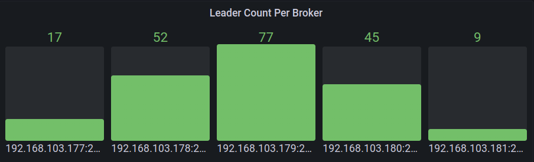
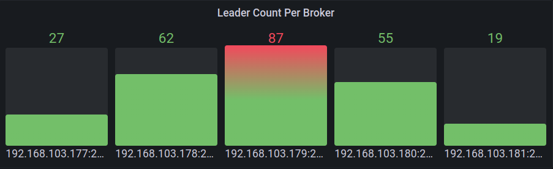
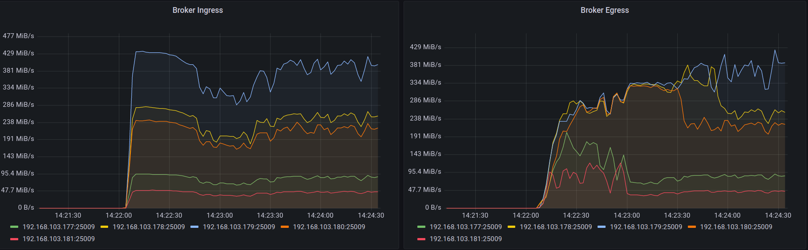
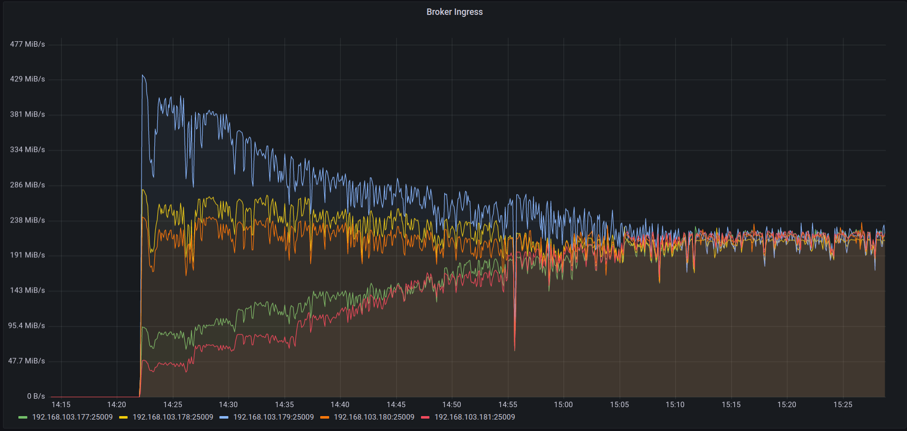
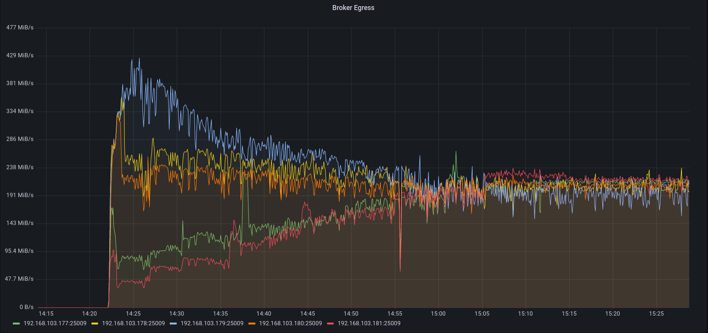
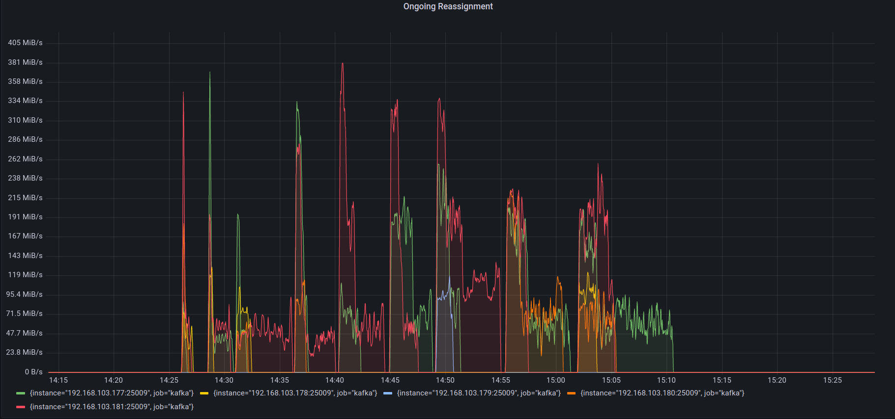

# Astraea Balancer 測試 #1

這個測試展示目前的 Astraea Balancer [(5883c0d)](https://github.com/skiptests/astraea/commit/5883c0d5fbfb178714a4b3ab375d264ffcf7408d) 
能在特定的系統環境中，平衡每個節點的 leader 數。

在這次實驗中，Astraea Balancer 得到了以下結果：

* 執行前節點的 Leader 數量最大最小分別為 83 和 17，執行後所有節點都服務 50 個 leader，達到完全平衡。
* 執行前節點流量最大最小為 372 MiB/s 和 33.3 MiB/s，執行後各節點流量都控制在 210 MiB/s 附近。

## 測試情境

我們透過專案內的 [WebAPI](https://github.com/skiptests/astraea/blob/5883c0d5fbfb178714a4b3ab375d264ffcf7408d/docs/web_server/web_api_topics_chinese.md#%E5%BB%BA%E7%AB%8B-topic)
工具來對測試叢集產生一個 Leader 數量不平衡的情境。WebAPI 在建立 topic 時能夠透過特定參數來以 Binomial Distribution 營造 topic logs 
在叢集內分佈不均的情況。這最終形成的分佈類似於對生產環境 Kafka 叢集不斷加減 topics/partitions/nodes 所導致的資料配置不均勻狀態。

> 由於 Binomial Distribution 本身沒有 Uniform Distribution 這種非常平衡&理想的分佈狀況，因此我們可以預期最終會有一些 Kafka 節點承受
> 相對多的 Leader。由於預設的 Kafka 參數會使讀取和寫入都發生在 Leader 身上，服務越多 Leader 的節點有機會承受較大網路負載和責任。

## 叢集硬體環境

下圖為網路示意圖：

```
                               [500 Mbits Router]
                              ┌──────────────────┐
         [10 Gbits Switch]    │                  │
   ┌─────┬─────┬─────┬─────┬──┴──┐               │
   B1    B2    B3    B4    B5    P1           Balancer
```

每個機器負責執行的軟體：

* B1: Kafka Broker, Zookeeper, Prometheus, Node Exporter
* B2: Kafka Broker, Node Exporter
* B3: Kafka Broker, Node Exporter
* B4: Kafka Broker, Node Exporter
* B5: Kafka Broker, Node Exporter
* P1: Performance Tool, Node Exporter
* Balancer: 執行 Astraea Balancer 的機器

下表為 B1, B2, B3, B4, B5, P1 的硬體規格：

| 硬體項目 | 型號                                                         |
| -------- | ------------------------------------------------------------ |
| CPU      | Intel i9-12900K CPU 3.2G(5.2G)/30M/UHD770/125W               |
| 主機板   | 華碩 ROG STRIX Z690-G GAMING WIFI(M-ATX/1H1P/Intel 2.5G+Wi-Fi 6E)14+1相數位供電 |
| 記憶體   | 美光Micron Crucial 32GB DDR5 4800                            |
| 硬碟     | 威剛XPG SX8200Pro 1TB/M.2 2280/讀:3500M/寫:3000M/TLC/SMI控 * 3 |
| 網路卡   | XG-C100C [10Gigabit埠] RJ45單埠高速網路卡/PCIe介面           |

下表為執行 Astraea Balancer 的設備之硬體規格：

| 硬體項目 | 型號                                                 |
|------|------------------------------------------------------|
| CPU  | 11th Gen Intel(R) Core(TM) i7-11700K @ 3.60GHz       |
| 記憶體  | KLEVV DIMM DDR4 Synchronous 2667 MHz (0.4 ns) 16GB*2 |
| 主機板  | MAG B560 TOMAHAWK WIFI (MS-7D15)                   |

## 叢集軟體環境

這個實驗中包含：

* 5 個 Apache Kafka Broker 節點（version 3.3.1）。
  * 各個節點包含 3 個 log dir，每個有 844GB 空間的 SSD
* 1 個 Zookeeper 節點（version 3.8.0）。
* 1 個 Performance Tool 施打資料

以下為建構環境的步驟：

### 建立 Kafka 叢集

請依照上述的環境建立叢集，您可以使用專案內的 
[./docker/start_zookeeper.sh](https://github.com/skiptests/astraea/blob/5883c0d5fbfb178714a4b3ab375d264ffcf7408d/docs/run_zookeeper.md) 和
[./docker/start_broker.sh](https://github.com/skiptests/astraea/blob/5883c0d5fbfb178714a4b3ab375d264ffcf7408d/docs/run_kafka_broker.md) 來建立叢集。

## 效能資料攝取

整個實驗的效能指標數據源自每個 Kafka Broker 的 JMX 資訊，這些資訊透過 jmx_exporter 輸出成 Prometheus 能夠接受的格式，
接著以 Grafana 繪圖觀察。實驗過程中我們也有關心實際硬體資源的使用情況，這部分我們透過在每個硬體設備啟動的 node exporter 和 Prometheus，
進行底層硬體效能資料的攝取。

您可以使用專案內的 
[./docker/start_node_exporter.sh](https://github.com/skiptests/astraea/blob/5883c0d5fbfb178714a4b3ab375d264ffcf7408d/docs/run_node_exporter.md),
[./docker/start_prometheus.sh](https://github.com/skiptests/astraea/blob/5883c0d5fbfb178714a4b3ab375d264ffcf7408d/docs/run_prometheus.md) 和
[./docker/start_grafana.sh](https://github.com/skiptests/astraea/blob/5883c0d5fbfb178714a4b3ab375d264ffcf7408d/docs/run_grafana.md) 來建構監控環境。

本次實驗所使用的 Dashboard 可以在[這裡](resources/experiment_1_grafana-1663659783116.json)找到

## 執行實驗

首先取得 Astraea Project

```script
git clone https://github.com/skiptests/astraea.git
cd astraea
git checkout 5883c0d5fbfb178714a4b3ab375d264ffcf7408d
```

接著執行 Astraea Web Service，Astraea Web Service 提供一系列的功能，能幫助我們對 Kafka 進行管理和操作。

執行 `./gradlew run --args="web --bootstrap.servers <broker-addresses>"` 來使用 web service，其中 `<broker-addresses>` 是
Kafka 對外服務的網路位置。

完成後執行 

```shell
curl -X POST http://localhost:8001/topics \
  -H "Content-Type: application/json" \
  -d '{ "topics": [ { "name":"imbalance-topic", "partitions": 200, "replicas": 1, "probability": 0.5 } ] }'
```

對 web service 請求建立一個 leader 數量不平衡的 topic，其名為 `imbalance-topic`，在這個情境中我們設定其有 200 個 partitions。 
打開 Grafana Dashboard，能夠看到每個節點有著類似下圖的 Leader 數量分佈。




接着要開始對叢集輸入資料，我們在 P1 設備上執行下面的指令以啓動 
[Astraea Performance Tool](https://github.com/skiptests/astraea/blob/5883c0d5fbfb178714a4b3ab375d264ffcf7408d/docs/performance_benchmark.md)

```shell
./gradlew run --args="performance --bootstrap.servers <broker-addresses> --topics imbalance-topic --producers 8 --consumers 16 --key.size 10KiB --run.until 3h"
```

> 使用 Performance Tool 輸入資料時，每個節點的 leader 數量可能會提升，這是源自於 Consumer 運作所需的 `__consumer_offsets` topic
> 被建立的緣故，屬於正常現象。以這次實驗爲例，`__consumer_offsets` topic 有 50 個 partitions，爲 leader count 做出額外的貢獻。
>
> 

執行後將會對先前建立的 `imbalance-topic` topic 施打資料，由於 Producer 和 Consumer 都會對 Leader 進行資料的讀寫，
我們可以看到類似下圖的運行結果：



> 如果運作過程中因爲流量的震盪起伏而使圖不好觀察，可以調整 Grafana Dashboard 上的 `average_window` 設定，來製造比較平滑的觀測圖形

從圖中可以看出有一定的負載不平衡現象存在着。接着我們要開始做負載平衡，透過以下指令來執行 Leader Balance

```shell
curl -X POST http://localhost:8001/balancer \
    -H "Content-Type: application/json" \
    -d '{ 
      "timeout": "10s" ,
      "balancer": "org.astraea.common.balancer.algorithms.GreedyBalancer",
      "balancer-config": {
        "shuffle.plan.generator.min.step": "1",
        "shuffle.plan.generator.max.step": "5"
      },
      "costWeights": [ { "cost": "org.astraea.common.cost.ReplicaLeaderCost", "weight":  1} ],
      "max-migrated-leader": "10"
    }'
```

上述指令對本機的 Web Service 發起一個 `POST /balancer` 的 HTTP Request，這個 Request 請 Web Service 根據我們給定的參數和
目前叢集的狀態，去生成一個新的負載平衡計劃。以下是關於這個計劃的細節

* `"timeout": "10s"`: 此計劃要在 10 秒內生成
* `"balancer": "org.astraea.common.balancer.algorithms.GreedyBalancer"`:  計劃生成演算法實作
* `"balancer-config": { ... }`: 計劃生成演算法的參數
* `"costWeights": [ ... ]`: 計劃所採用的 Cost Functions，用來在生成算法中衡量叢集的好壞
* `"max-migrated-leader": "10"`: 計劃的限制，最多只能移動 10 個 leader

執行完成後後會在 terminal 上印出負載平衡計劃的編號：

```shell
# Something like this: {"id":"9b25bf14-a885-4c5b-97bf-59ff025b61d2"}
{"id":"Your-Balance-Plan-Id"}
```

之後可以透過 `GET /balancer/Your-Balance-Plan-Id` 來查詢關於這個計劃的狀態，比如這個計劃是否生成完成，或是已經排程執行。

```shell
curl -X GET http://localhost:8001/balancer/46ecf6e7-aa28-4f72-b1b6-a788056c122a

# {
#   "id": "46ecf6e7-aa28-4f72-b1b6-a788056c122a", // 計劃的編號
#   "generated": true,  // 計劃是否已經完成生成
#   "scheduled": false, // 計劃是否已經排程執行
#   "done": false,      // 計劃是否已經執行完成
#   "report": { ... }   // 關於這個計劃的細節，計劃生成後才會有此詳細資訊
# }
```

如果 `GET /balancer/Your-Balance-Plan-Id` 回傳結果中 `generated` 為 `true` 且 `report.changes` 內有詳細的移動資訊，則代表計劃已經完成生成。

> 如果計劃生成失敗，可以檢查 `exception` 欄位的訊息，或是查看 Web Service 是否有印出錯誤的資訊，來做進一步的診斷。

計劃成功生成後，可以透過 `PUT /balancer` 來執行負載平衡的計劃。

```shell
curl -X PUT http://localhost:8001/balancer \
    -H "Content-Type: application/json" \
    -d '{ "id": "Your-Balance-Plan-Id" }'
```

過程中可以透過 `GET /balancer/Your-Balance-Plan-Id` 來檢查執行的狀態，當輸出結果中的 `done` 為 `true` 時意味著計劃已經完成執行。

> 如果計劃執行失敗，可以檢查 `exception` 欄位的訊息，或是查看 Web Service 是否有印出錯誤的資訊，來做進一步的診斷。

> 詳細的 `/balancer` API 文件，可以參考[這裡](https://github.com/skiptests/astraea/blob/5883c0d5fbfb178714a4b3ab375d264ffcf7408d/docs/web_server/web_api_balancer_chinese.md)

每次執行上述步驟都會做一輪的負載平衡，每次都會給叢集帶來一定程度的進步，通常情況下您會需要重複執行多次上述的指令，直到您覺得叢集負載不平衡情況減緩爲止。
這次實驗中我們總共執行了 8 次 Balancer。以下爲各項結果圖表：

### Leader Count Time Series


上圖爲各節點的 leader 數量隨時間的變化，可以發現在經過 8 次負載平衡後，每個節點所維護的 leader 數量都達到 50 個，就這個指標來說非常平衡。

> 先前用 web service 建立的 `imbalance-topic` 有著 200 個 partitions，而 consumer 運作所需的 `__consumer_offsets` 另外貢獻 50 個
> partitions。兩者加起來正好 50 * 5 = 250 個 partitions，分散在五個節點上。

### Broker Ingress



上圖爲各各節點所統計的傳入流量值，我們可以看到原先由於 leader 數量不平衡間接導致輸入負載不一。
由於在我們的實驗情境中，我們假設每個 partition 所承受的輸入流量一致，在經過負載平衡後，每個節點的輸入流量也因此變得比較平衡。

### Broker Egress



上圖爲各各節點所統計的輸出流量值，我們可以看到原先由於 leader 數量不平衡間接導致輸入負載不一。
由於在我們的實驗情境中，我們假設每個 partition 所承受的輸入流量一致，在經過負載平衡後，每個節點的輸出流量也因此變得比較平衡。

### Ongoing Reassignment



上圖爲各各節點所統計的負載平衡流量，每次負載平衡都會給叢集帶來額外的效能開銷，從圖中可以看到我們總共經歷了 8 次的負載平衡過程。

### Network IO (hardware)


上圖爲從 node exporter 的角度看到的節點網路負載。這張圖目前顯示着 P1 Client 的網路輸出輸入。從圖中可以看到 Performance Tool 以將近硬體上限
的速度在輸入/輸出資料。

> 如果這個圖表的顯示有異常，可以考慮調整 Grafana Dashboard 的 `network_device_name` 變數爲您設備所使用的 network interface name