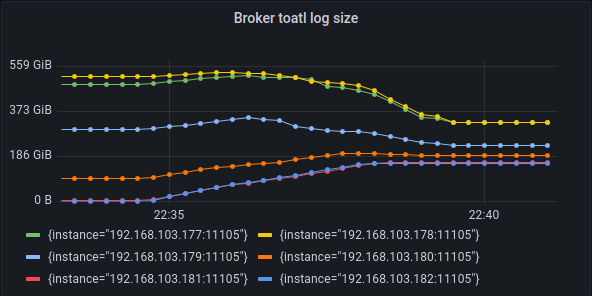
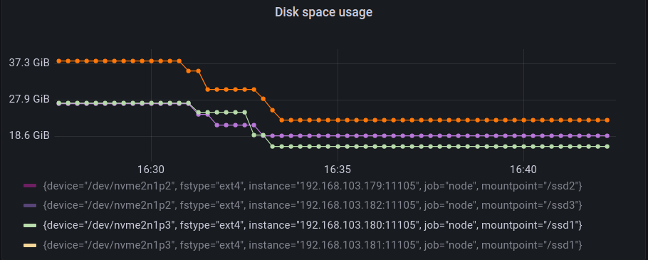

# 磁碟空間限制實驗

這個測試展示目前的搬移成本估計以及限制 [(#1604)](https://github.com/skiptests/astraea/pull/1604) 
能在進行負載平衡的途中，計算其可能產生的成本，以及對其做限制

## 測試情境

我們透過專案內的 [WebAPI](https://github.com/skiptests/astraea/blob/7596f590ae0f0ec370a6e257c10cc2aeb5fb5bf4/docs/web_server/web_api_topics_chinese.md#%E5%BB%BA%E7%AB%8B-topic) 工具來對測試叢集產生一個 Leader 數量不平衡的情境，主要的原因如下:

* leader為主要寫入資料的partition, 當leader在數量在節點間不平衡時，可能會導致某些節點的寫入流量特別大
* leader為預設讀取資料的partition, 當leader在數量在節點間不平衡時，可能會導致某些節點的讀取流量特別大
* leader不平衡時可能會在某些節點會同時有大量的連線


## 叢集硬體環境

下圖為網路示意圖：

```
                                     [500 Mbits Router]
                                    ┌──────────────────┐
               [10 Gbits Switch]    │                  │
   ┌─────┬─────┬─────┬─────┬─────┬──┴──┬──┬──┬──┬──┐   │
   B1   B2    B3    B4    B5    B6   P1 P2 P3 P4 P5 Balancer
```

每個機器負責執行的軟體：

* B1: Kafka Broker, Zookeeper, Prometheus, Node Exporter
* B2: Kafka Broker, Node Exporter
* B3: Kafka Broker, Node Exporter
* B4: Kafka Broker, Node Exporter
* B5: Kafka Broker, Node Exporter
* B6: Kafka Broker, Node Exporter
* P1: Performance Tool, Node Exporter
* P2: Performance Tool, Node Exporter
* P3: Performance Tool, Node Exporter
* P4: Performance Tool, Node Exporter
* P5: Performance Tool, Node Exporter
* Balancer: 執行 Astraea Balancer 的機器

下表為 B0, B1, B2, B3, B4, B5, P1 的硬體規格：

| 硬體項目 | 型號                                                         |
| -------- | ------------------------------------------------------------ |
| CPU      | Intel i9-12900K CPU 3.2G(5.2G)/30M/UHD770/125W               |
| 主機板   | 華碩 ROG STRIX Z690-G GAMING WIFI(M-ATX/1H1P/Intel 2.5G+Wi-Fi 6E)14+1相數位供電 |
| 記憶體   | 美光Micron Crucial 32GB DDR5 4800                            |
| 硬碟     | 威剛XPG SX8200Pro 1TB/M.2 2280/讀:3500M/寫:3000M/TLC/SMI控 * 3 |
| 網路卡   | XG-C100C [10Gigabit埠] RJ45單埠高速網路卡/PCIe介面           |

下表為執行 Astraea Balancer 的設備之硬體規格：

| 硬體項目 | 型號                                                 |
| -------- | ---------------------------------------------------- |
| CPU      | 11th Gen Intel(R) Core(TM) i7-11700K @ 3.60GHz       |
| 記憶體   | KLEVV DIMM DDR4 Synchronous 2667 MHz (0.4 ns) 16GB*2 |
| 主機板   | MAG B560 TOMAHAWK WIFI (MS-7D15)                     |

## 叢集軟體環境

這個實驗中包含：

* 6 個 Apache Kafka Broker 節點（version 3.4.0）。
  * 各個節點包含 3 個 log dir，每個有 844GB 空間的 SSD
* 1 個 kraft controller 節點（version 3.4.0）。
* 5 個 Performance Tool 施打資料

以下為建構環境的步驟：

### 建立 Kafka 叢集

請依照上述的環境建立叢集，您可以使用專案內的 
[./docker/start_zookeeper.sh](https://github.com/skiptests/astraea/blob/7596f590ae0f0ec370a6e257c10cc2aeb5fb5bf4/docs/run_zookeeper.md) 和
[./docker/start_broker.sh](https://github.com/skiptests/astraea/blob/7596f590ae0f0ec370a6e257c10cc2aeb5fb5bf4/docs/run_kafka_broker.md) 來建立叢集。

## 效能資料攝取

整個實驗的效能指標數據源自每個 Kafka Broker 的 JMX 資訊，這些資訊透過 jmx_exporter 輸出成 Prometheus 能夠接受的格式，
接著以 Grafana 繪圖觀察。實驗過程中我們也有關心實際硬體資源的使用情況，這部分我們透過在每個硬體設備啟動的 node exporter 和 Prometheus，
進行底層硬體效能資料的攝取。

您可以使用專案內的 
[./docker/start_node_exporter.sh](https://github.com/skiptests/astraea/blob/7596f590ae0f0ec370a6e257c10cc2aeb5fb5bf4/docs/run_node_exporter.md),
[./docker/start_prometheus.sh](https://github.com/skiptests/astraea/blob/7596f590ae0f0ec370a6e257c10cc2aeb5fb5bf4/docs/run_prometheus.md) 和
[./docker/start_grafana.sh](https://github.com/skiptests/astraea/blob/7596f590ae0f0ec370a6e257c10cc2aeb5fb5bf4/docs/run_grafana.md) 來建構監控環境。

本次實驗所使用的 Dashboard 可以在[這裡](resources/experiment_1_grafana-1663659783116.json)找到

## 執行實驗

1. 首先取得 Astraea Project

```script
git clone https://github.com/skiptests/astraea.git
cd astraea
```

2. 接著執行 Astraea Web Service，Astraea Web Service 提供一系列的功能，能幫助我們對 Kafka 進行管理和操作。

3. 執行 `./gradlew run --args="web --bootstrap.servers <broker-addresses>"` 來使用 web service，其中 `<broker-addresses>` 是
   Kafka 對外服務的網路位置。

4. 完成後執行 

```shell
curl -X POST http://localhost:8001/topics \
  -H "Content-Type: application/json" \
  -d '{ "topics": [ { "name":"imbalance-topic", "partitions": 250, "replicas": 2, "probability": 0.5 } ] }'
```

對 web service 請求建立一個 leader 數量不平衡的 topic，其名為 `imbalance-topic`，在這個情境中我們設定其有250個leader，replica備份數量為2，總共500 個 partitions。 
打開 Grafana Dashboard，能夠看到每個節點有著類似下圖的 Leader 數量分佈。



5. 接着要開始對叢集輸入資料，我們在 P1 設備上執行下面的指令以啓動 [Astraea Performance Tool](https://github.com/skiptests/astraea/blob/7596f590ae0f0ec370a6e257c10cc2aeb5fb5bf4/docs/performance_benchmark.md)

```shell
./start_app.sh performance --bootstrap.servers 192.168.103.177:25655 --topics imbalance-topic --run.until 5m --producers 10 --consumers 0 --value.size 10KiB --configs acks=0
```


### 未套用成本限制

1. 等待producer打完資料後，執行下面指令來針對leader進行負載平衡

```shell
curl -X POST http://localhost:8001/topics \
  -H "Content-Type: application/json" \
  -d '{
  	"timeout": "30s",
  	"balancer": "org.astraea.common.balancer.algorithms.GreedyBalancer",
  	"balancerConfig": {
  	  "shuffle.tweaker.min.step": "1",
  	  "shuffle.tweaker.max.step": "10"
 	 },
  	"clusterCosts": [
        {
        	"cost": "org.astraea.common.cost.ReplicaLeaderCost",
        	"weight": 1
        }
    ]
}'
```

執行負載平衡後，可以發現leader數量已經平衡


觀察broker上的log資料量的變化，可以發現每個broker在搬移後，持有的log資料量有變接近的狀況




###　針對節點套用磁碟空間的成本限制

搬移前的分佈:


1. 等待producer打完資料後，進行下面指令，這次不同的是會對其broker可用空間進行限制，將broker4限制搬移過程中最多只能佔用50GB，使用costConfig來對其做限制

```shell
curl -X POST http://localhost:8001/topics \
  -H "Content-Type: application/json" \
  -d '{
  	"timeout": "30s",
  	"balancer": "org.astraea.common.balancer.algorithms.GreedyBalancer",
  	"balancerConfig": {
  	  "shuffle.tweaker.min.step": "1",
  	  "shuffle.tweaker.max.step": "10"
 	 },
  	"clusterCosts": [
        {
        	"cost": "org.astraea.common.cost.ReplicaLeaderCost",
        	"weight": 1
        }
    ],
    "costConfig": {
    	"max.broker.total.disk.space": "4:80GB"
    }
}'
```


執行負載平衡後，可以發現leader數量已經平衡，除了受到限制的broker4，因為資料量的限制導致沒辦法移入更多partition


搬移後的狀況分佈如下，可以明顯的看出broker3因為磁碟資料量的限制(沒辦法移出太多資料量)，leader數量沒辦法與其他broker平衡


而從資料量變化可以明顯的看出，broker4(橘色)明顯的被限制住，使其不會佔用太多磁碟空間(從原本的70GB到搬移過程中大約佔用到51GB)


### 針對套用data path磁碟空間的成本限制

搬移前的分佈:


1. 等待producer打完資料後，進行下面指令，這次不同的是會對其broker可用空間進行限制，將broker4的/tmp/log-folder-1限制搬移過程中最多只能佔用35GB，使用costConfig來對其做限制

```shell
curl -X POST http://localhost:8001/topics \
  -H "Content-Type: application/json" \
  -d '{
  	"timeout": "30s",
  	"balancer": "org.astraea.common.balancer.algorithms.GreedyBalancer",
  	"balancerConfig": {
  	  "shuffle.tweaker.min.step": "1",
  	  "shuffle.tweaker.max.step": "10"
 	 },
  	"clusterCosts": [
        {
        	"cost": "org.astraea.common.cost.ReplicaLeaderCost",
        	"weight": 1
        }
    ],
    "costConfig": {
    	"max.broker.path.disk.space":"4-/tmp/log-folder-1:35GB"
    }
}'
```


執行負載平衡後，可以發現leader數量已經平衡，除了受到限制的broker4，因為資料量的限制導致沒辦法移入更多partition


搬移後的狀況分佈如下，可以明顯的看出broker3因為磁碟資料量的限制(沒辦法移出太多資料量)，leader數量沒辦法與其他broker平衡


而從資料量變化可以明顯的看出，broker3(橘色)明顯的被限制住，使其不會佔用太多磁碟空間(從原本的30.9GB到28.5GB)

