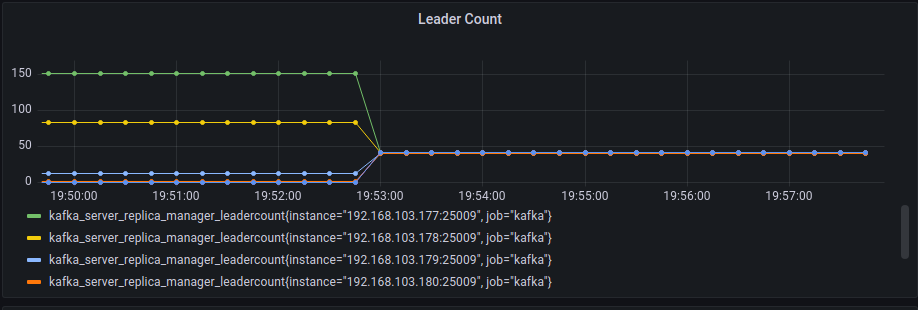
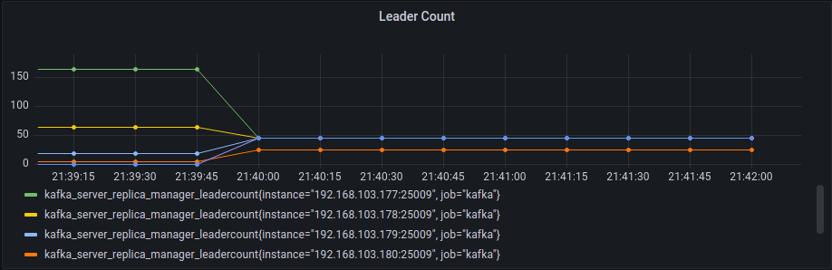

# Partition Leader限制實驗

這個測試展示目前的搬移成本估計以及限制 [#1780](https://github.com/skiptests/astraea/pull/1780)
能在進行負載平衡的過程中，計算其broker會持有多少partition leader，並且對其做限制

## 測試情境

* 我們透過專案內的 [WebAPI](https://github.com/skiptests/astraea/blob/7596f590ae0f0ec370a6e257c10cc2aeb5fb5bf4/docs/web_server/web_api_topics_chinese.md#%E5%BB%BA%E7%AB%8B-topic) 工具來對測試叢集產生一個負載不平衡的情境

* 本實驗報告會在搬移的過程中對broker可以持有的leader數量做限制，並且對比有做限制與不做leader數量限制的差異


## 叢集硬體環境

下圖為網路示意圖：

```
                                     [500 Mbits Router]
                                    ┌──────────────────┐
               [10 Gbits Switch]    │                  │
   ┌─────┬─────┬─────┬─────┬─────┬──┘                  │
   B1   B2    B3    B4    B5    B6                  Balancer
```

每個機器負責執行的軟體：

| server/client   | broker1                                            | broker2~6                   | Balancer              |
| --------------- | -------------------------------------------------- | --------------------------- | --------------------- |
| 執行的工具/軟體 | Kafka Broker, Zookeeper, Prometheus, Node Exporter | Kafka Broker, Node Exporter | 執行 Astraea Balancer |

下表為 B0, B1, B2, B3, B4, B5 的硬體規格：

| 硬體項目 | 型號                                                         |
| -------- | ------------------------------------------------------------ |
| CPU      | Intel i9-12900K CPU 3.2G(5.2G)/30M/UHD770/125W               |
| 主機板   | 華碩 ROG STRIX Z690-G GAMING WIFI(M-ATX/1H1P/Intel 2.5G+Wi-Fi 6E)14+1相數位供電 |
| 記憶體   | 美光Micron Crucial 32GB DDR5 4800                            |
| 硬碟     | 威剛XPG SX8200Pro 1TB/M.2 2280/讀:3500M/寫:3000M/TLC/SMI控 * 3 |
| 網路卡   | XG-C100C [10Gigabit埠] RJ45單埠高速網路卡/PCIe介面           |

下表為執行 Astraea Balancer 的設備之硬體規格：

| 硬體項目 | 型號                                                 |
| -------- | ---------------------------------------------------- |
| CPU      | 11th Gen Intel(R) Core(TM) i7-11700K @ 3.60GHz       |
| 記憶體   | KLEVV DIMM DDR4 Synchronous 2667 MHz (0.4 ns) 16GB*2 |
| 主機板   | MAG B560 TOMAHAWK WIFI (MS-7D15)                     |

## 叢集軟體環境

這個實驗中包含：

* 6 個 Apache Kafka Broker 節點（version 3.4.0）。
  * 各個節點包含 3 個 log dir，每個有 844GB 空間的 SSD
* 1 個 kraft controller 節點（version 3.4.0）。

以下為建構環境的步驟：

### 建立 Kafka 叢集

請依照上述的環境建立叢集，您可以使用專案內的 
[./docker/start_contoller.sh](https://github.com/skiptests/astraea/blob/main/docs/run_kafka_broker.md#broker-with-kraft) 來建立叢集

## 效能資料攝取

整個實驗的效能指標數據源自每個 Kafka Broker 的 JMX 資訊，這些資訊透過 jmx_exporter 輸出成 Prometheus 能夠接受的格式，
接著以 Grafana 繪圖觀察。實驗過程中我們也有關心實際硬體資源的使用情況，這部分我們透過在每個硬體設備啟動的 node exporter 和 Prometheus，
進行底層硬體效能資料的攝取。

您可以使用專案內的 
[./docker/start_node_exporter.sh](https://github.com/skiptests/astraea/blob/7596f590ae0f0ec370a6e257c10cc2aeb5fb5bf4/docs/run_node_exporter.md),
[./docker/start_prometheus.sh](https://github.com/skiptests/astraea/blob/7596f590ae0f0ec370a6e257c10cc2aeb5fb5bf4/docs/run_prometheus.md) 和
[./docker/start_grafana.sh](https://github.com/skiptests/astraea/blob/7596f590ae0f0ec370a6e257c10cc2aeb5fb5bf4/docs/run_grafana.md) 來建構監控環境。

本次實驗所使用的 Dashboard 可以在[這裡](resources/experiment_1_grafana-1663659783116.json)找到

## 執行實驗

1. 首先取得 Astraea Project

```script
git clone https://github.com/skiptests/astraea.git
cd astraea
```

2. 接著執行 Astraea Web Service，Astraea Web Service 提供一系列的功能，能幫助我們對 Kafka 進行管理和操作。

3. 執行 `./gradlew run --args="web --bootstrap.servers <broker-addresses>"` 來使用 web service，其中 `<broker-addresses>` 是
   Kafka 對外服務的網路位置。

4. 完成後執行 

```shell
curl -X POST http://localhost:8001/topics \
  -H "Content-Type: application/json" \
  -d '{ "topics": [ { "name":"imbalance-topic", "partitions": 250, "replicas": 2, "probability": 0.2 } ] }'
```

對 web service 請求建立一個負載不平衡的 topic，其名為 `imbalance-topic`，在這個情境中我們設定其有250個leader，replica備份數量為2，總共500 個 partitions。 


### 未套用成本限制

1. 執行下面指令來針對進行負載平衡

```shell
curl -X POST http://localhost:8001/balancer \
    -H "Content-Type: application/json" \
      -d '{
       "timeout":"30s",
       "balancer":"org.astraea.common.balancer.algorithms.GreedyBalancer",
       "balancerConfig":{
          "shuffle.tweaker.min.step":"1",
          "shuffle.tweaker.max.step":"10"
       },
       "clusterCosts":[
          {
             "cost":"org.astraea.common.cost.ReplicaLeaderCost",
             "weight":1
          }
       ],
       "moveCosts":[
          "org.astraea.common.cost.ReplicaLeaderCost"
       ]
    }'
```


觀察broker上的leader數量的變化，可以發現每個broker在搬移後，持有的partition leader數量有變接近的狀況




broker上leader數量變化:

| broker id                      | 1    | 2    | 3    | 4    | 5    | 6    |
| ------------------------------ | ---- | ---- | ---- | ---- | ---- | ---- |
| before partition leader number | 152  | 84   | 12   | 2    | 0    | 0    |
| after partition leader number  | 42   | 42   | 41   | 41   | 42   | 42   |


### 針對節點套用Leader數量的成本限制


1. 進行下面指令，這次不同的是會對其broker可持有的leader進行限制，將broker4限制搬移過程最多只能持有25個leader，使用costConfig來對其做限制

```shell
curl -X POST http://localhost:8001/balancer \
  -H "Content-Type: application/json" \
  -d '{
       "timeout":"60s",
       "balancer":"org.astraea.common.balancer.algorithms.GreedyBalancer",
       "balancerConfig":{
          "shuffle.tweaker.min.step":"1",
          "shuffle.tweaker.max.step":"10"
       },
       "clusterCosts":[
          {
             "cost":"org.astraea.common.cost.ReplicaLeaderCost",
             "weight":1
          }
       ],
       "moveCosts":[
          "org.astraea.common.cost.ReplicaLeaderCost"
       ],
       "costConfig":{
          "max.broker.total.leader.number":"4:25"
       }
    }'
```


觀察broker上的leader數量的變化，可以發現每個broker在搬移後，持有的partition leader數量有變接近的狀況，以及broker4由於成本限制，導致broker最多只能持有25個partition leader




broker上leader數量變化:

| broker id                      | 1    | 2    | 3    | 4    | 5    | 6    |
| ------------------------------ | ---- | ---- | ---- | ---- | ---- | ---- |
| before partition leader number | 111  | 92   | 20   | 9    | 9    | 9    |
| after partition leader number  | 45   | 45   | 45   | 25   | 45   | 45   |

### 
