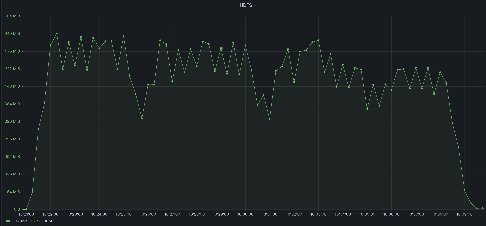

# Connector backup 效能測試

本次實驗之目的是測量 [backup](../../../connector/src/main/java/org/astraea/connector/backup) 工具裡的
[Exporter.java](../../../connector/src/main/java/org/astraea/connector/backup/Exporter.java) 與
[Importer.java](../../../connector/src/main/java/org/astraea/connector/backup/Importer.java) 執行效能與運行期間的穩定度

## 測試環境

### 硬體規格

本次實驗使用3台實體機器（M1,M2 and M3)，其中 M1 與 M2 機器的規格為下表所示

| 硬體      | 名稱                                            |
|---------|-----------------------------------------------|
| CPU     | intel i7-13700K                               |
| MB      | ASUS PRIME Z790-P WIFI CSM                    |
| RAM     | Corsair PLATINUM 32G(16G*2) DDR5-5600         |
| DISK    | ADATA XGP SX8200Pro 1TB M.2 2280 PCIe SSD * 2 |
| Coolers | Cooler Master MasterLiquid ML240L V2 ARGB     |
| Power   | Cooler Master New GX Gold 850W                |
| Network | XG-C100C PCIE 10GBase PCIe Network Adapter    |

M3 機器規格如下

| 硬體      | 名稱                                            |
|---------|-----------------------------------------------|
| CPU     | intel i7-11700K                               |
| MB      | GIGABYTE Z590M GAMING X                       |
| RAM     | Kingston 32g(16g*2) DDR4-3200                 |
| DISK    | ADATA XGP SX8200Pro 1TB M.2 2280 PCIe SSD * 2 |
| Coolers | CRYORIG H7                                    |
| Power   | Antec NE550G Gold 550W                        |
| Network | XG-C100C PCIE 10GBase PCIe Network Adapter    |

### 網路拓普

```
 switch(10G)
┌─────┬─────┐
M1    M2    M3
```

### 軟體版本

| 軟體                    | 版本(/image ID)                    |
|-----------------------|----------------------------------|
| OS                    | ubuntu-20.04.3-live-server-amd64 |
| Zookeeper version     | 3.8.0                            |
| Apache Kafka version  | 3.4.0                            |
| Apache Hadoop version | 3.3.4                            |
| Java version          | OpenJDK 11                       |
| Docker version        | 20.10.22, build 3a2c30b          |
| prometheus version    | v2.32.1                          |

### 作業系統硬碟分割

| 硬碟     | partition1 | partition2                 |
|--------|------------|----------------------------|
| Disk 1 | 50G /home  | (rest) (for service usage) |
| Disk 2 | 50G /home  | (rest) (for service usage) |

### 實驗執行服務

| Service       | M1  | M2  | M3  |
|---------------|-----|-----|-----|
| Zookeeper     | V   |     |     |
| Kafka Broker  | V   |     |     |
| Kafka Worker  |     | V   |     |
| Hadoop        |     |     | V   |
| Node Exporter | V   | V   | V   |
| Prometheus    | V   |     |     |
| Grafana       | V   |     |     |

## 測試情境

模擬將 Kafka Broker 其中一個 topic 備份至 hadoop 當中，此 topic 有8個 partition 並包含 500GB 的資料。

測試方式：先將測試資料寫入至 kafka 當中，並在 worker 中啟用 exporter 工具將資料寫入 hadoop當中。

Exporter 效能參數如以下表格所示

| key           | value |
|---------------|-------|
| task.max      | 3     |
| size          | 500MB |
| roll.duration | 3s    |

## 測試結果

connector 在500GB的情境下，從第一筆資料寫入到最後一筆資料寫入完成時間總共經歷 16分57秒 的時間。

並且在本專案建立的 worker 中，預設的 heap size 會發生 `OutOfMemory` 的問題，在手動變更 heap 的 max size 可以避免這問題。

下圖為 hadoop 在寫入時段的寫入速度狀況，平均寫入速度大概會在 300~600 這區間波動



## 結論

| 大小    | 類型   | 速度(Mib) | 時間     |
|-------|:-----|---------|--------|
| 100GB | Sink | 400~580 | 3m17s  |
| 500GB | Sink | 329~641 | 16m57s |


