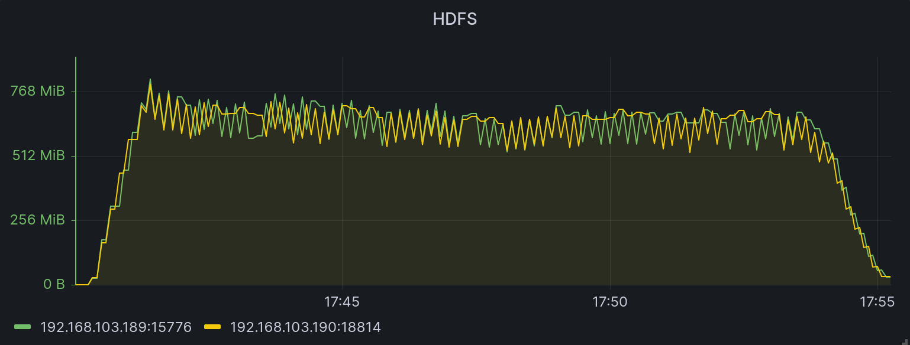

# Connector backup 效能測試

本次實驗之目的是測量 [backup](../../../connector/src/main/java/org/astraea/connector/backup) 工具裡的
[Exporter.java](../../../connector/src/main/java/org/astraea/connector/backup/Exporter.java) 與
[Importer.java](../../../connector/src/main/java/org/astraea/connector/backup/Importer.java) 執行效能與運行期間的穩定度

## 測試環境

### 硬體規格

本次實驗使用3台實體機器（M1,M2 and M3)，三台機器的規格均為下表所示

| 硬體      | 名稱                                    |
|---------|---------------------------------------|
| CPU     | intel i7-13700K                       |
| MB      | ASUS PRIME Z790-P WIFI                |
| RAM     | Corsair PLATINUM 32G(16G*2) DDR5-5600 |
| DISK    | ADATA SX8200PNP                       |
| Coolers |                                       |
| Power   |                                       |
| Network |                                       |

### 網路拓普

```
 switch(10G)
┌─────┬─────┐
M1    M2    M3
```

### 軟體版本

| 軟體                     | 版本(/image ID)                    |
|------------------------|----------------------------------|
| OS                     | ubuntu-20.04.3-live-server-amd64 |
| Astraea revision       |                                  |
| Zookeeper version      | 3.8.0                            |
| Apache Kafka version   | 3.4.0                            |
| Apache Hadoop version  | 3.3.4                            |
| Java version           | OpenJDK 11                       |
| Docker version         | 20.10.22, build 3a2c30b          |
| grafana image ID       |                                  |
| prometheus version     | v2.32.1                          |
| node exporter image ID |                                  |

### 作業系統硬碟分割

| 硬碟     | partition1 | partition2                 |
|--------|------------|----------------------------|
| Disk 1 | 50G /home  | (rest) (for service usage) |
| Disk 2 | 50G /home  | (rest) (for service usage) |

### 實驗執行服務

| Service       | M1  | M2  | M3  |
|---------------|-----|-----|-----|
| Zookeeper     | V   |     |     |
| Kafka Broker  | V   |     |     |
| Kafka Worker  |     | V   |     |
| Hadoop        |     |     | V   |
| Node Exporter | V   | V   | V   |
| Prometheus    | V   |     |     |
| Grafana       | V   |     |     |

## 測試情境

模擬將 Kafka Broker 其中一個 topic 備份至 hadoop 當中，此 topic 有8個 partition 並包含 100GB 的資料。

測試方式：先將測試資料寫入至 kafka 當中，並在 worker 中啟用 exporter 工具將資料寫入 hadoop當中。

Exporter 效能參數如以下表格所示

| key           | value |
|---------------|-------|
| task.max      | 1     |
| size          | 100MB |
| roll.duration | 100ms |

## 測試結果

connector 從第一筆資料寫入到最後一筆資料寫入完成時間是 `17:18:18 ~ 17:26:44`，一共經歷 8分26秒 的時間。
下圖為 hadoop 在寫入時間的資料寫入狀況



以本圖來說，在 hadoop 的平均寫入速度大概會維持在 200Mib ~ 250Mib 這區間段，
從 kafka node disk 讀取的狀況來說，也可以觀察到在 backup 的過程中讀取速度基本維持在 230Mib ~ 250Mib。


## 結論

| 大小   | 類型   | 速度(Mib) | 時間    |
|------|:-----|---------|-------|
| 10gb | Sink | 230~250 | 8m26s |


