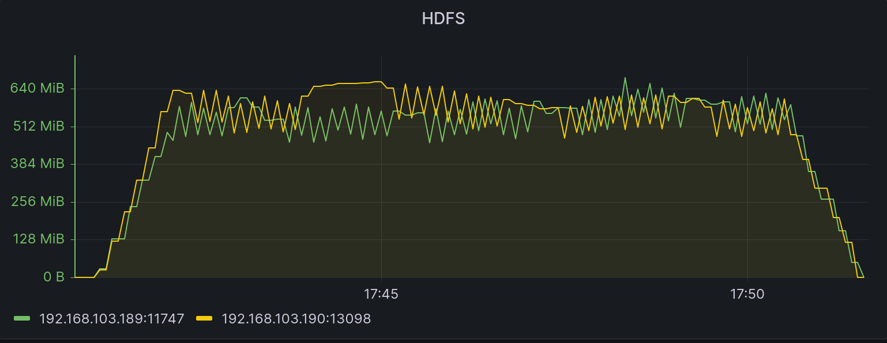

# Connector backup 效能測試

本次實驗之目的是測量 [backup](../../../connector/src/main/java/org/astraea/connector/backup) 工具裡的
[Exporter.java](../../../connector/src/main/java/org/astraea/connector/backup/Exporter.java) 與
[Importer.java](../../../connector/src/main/java/org/astraea/connector/backup/Importer.java) 執行效能與運行期間的穩定度

## 測試環境

### 硬體規格

本次實驗使用6台實體機器（M1,M2,M3,...,M6)，6臺機器的規格如下表所示

| 硬體      | 名稱                                              |
|---------|-------------------------------------------------|
| CPU     | intel i9-12900K                                 |
| MB      | MSI Z690 CARBON WIFI                            |
| RAM     | TEAM T-FORCE Vulcan 32G(16G*2) DDR5-5200 (CL40) |
| DISK    | ADATA XGP SX8200Pro 2TB M.2 2280 PCIe SSD * 2   |
| Coolers | NZXT Kraken Z53 240mm Liquid Cooler             |
| Power   | SeaSonic Focus GX-850(850w)                     |
| Network | Marvell AQtion 10Gbit Network Adapter           |

### 網路拓普

```
              switch(10G)
┌─────┬──────┬──────┬──────┬──────┐
M1    M2     M3     M4     M5     M6
```

### 軟體版本

| 軟體                    | 版本(/image ID)                    |
|-----------------------|----------------------------------|
| OS                    | ubuntu-20.04.3-live-server-amd64 |
| Zookeeper version     | 3.8.0                            |
| Apache Kafka version  | 3.4.0                            |
| Apache Hadoop version | 3.3.4                            |
| Java version          | OpenJDK 11                       |
| Docker version        | 20.10.22, build 3a2c30b          |
| prometheus version    | v2.32.1                          |

### 作業系統硬碟分割

| 硬碟     | partition1 | partition2                 |
|--------|------------|----------------------------|
| Disk 1 | 50G /      | (rest) (for service usage) |
| Disk 2 | 50G /home  | (rest) (for service usage) |

### 實驗執行服務

| Service       | M1 | M2 | M3 | M4 | M5 | M6 |
|---------------|----|----|----|----|----|----|
| Zookeeper     | V  |    |    |    |    |    |
| Kafka Broker  | V  | V  |    |    |    |    |
| Kafka Worker  |    |    | V  | V  |    |    |
| HDFS namenode |    |    |    |    | V  |    |
| HDFS datanode |    |    |    |    | V  | V  |
| Node Exporter | V  | V  | V  | V  | V  | V  |

## 測試情境

模擬將 Kafka Broker 其中一個 topic 備份至 hadoop 當中，此 topic 有100個 partition 並包含 500GB 的資料。

測試方式：先將測試資料寫入至 kafka 當中，並在 worker 中啟用 exporter 工具將資料寫入 hadoop當中。

Exporter 效能參數如以下表格所示

| key                | value |
|--------------------|-------|
| task.max           | 3     |
| size               | 500MB |
| roll.duration      | 10s   |
| writer.buffer.size | 100MB |

## 測試結果

connector 在500GB的情境下，從第一筆資料寫入到最後一筆資料寫入完成時間總共經歷約15分鐘左右的時間。

下圖為 hadoop 在寫入時段的寫入速度狀況，平均寫入速度大概會在 550 ~ 700 MB 這區間波動


這邊附上 hdfs 透過以下指令從 M3, M4 機器同時往 M5, M6 機器持續寫入資料的速度變化圖，可以觀察到 exporter 與 hadoop
fs 指令的表現狀況保持相同水準。

`/bin/hadoop fs -D dfs.blocksize=134217728 -D dfs.replication=1
-D dfs.client.use.datanode.hostname=true
-put /dev/zero hdfs://192.168.103.189:10281/testfile188`



## 結論

| 大小    | 類型   | 速度(MiB)   | 時間   |
|-------|:-----|-----------|------|
| 500GB | Sink | 550 ~ 700 | 約15m |


