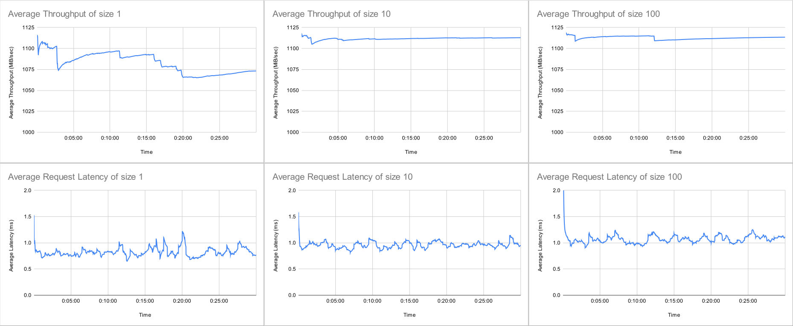

# Strict Cost Dispatcher 測試

此次實驗目的是量測 interdependent message 對效能的影響。對使用 Astraea Partitioner 的使用者來說，也許有些 record 需要被送到同一個 partition ，因此 Astraea Partitioner 提供了 [interdependent](../README.md#Astraea Dispatcher "Interdependent Message" 功能) 的機制。

## 測試環境

### 硬體規格

實驗使用6台實體機器，以下皆以代號表示，分別是 B1, B2, B3, B4, B5, C1 ，六台實體機器規格均相同

| 硬體       | 品名                                                         |
| ---------- | ------------------------------------------------------------ |
| CPU        | Intel i9-12900K 3.2G(5.2G)/30M/UHD770/125W                   |
| 主機板     | 微星 Z690 CARBON WIFI(ATX/1H1P/Intel 2.5G+Wi-Fi 6E)          |
| 記憶體     | 十銓 T-Force Vulcan 32G(16G*2) DDR5-5200 (CL40)              |
| 硬碟       | 威剛XPG SX8200Pro 2TB/M.2 2280/讀:3500M/寫:3000M/TLC/SMI控 * 2 |
| 散熱器     | NZXT Kraken Z53 24cm水冷排/2.4吋液晶冷頭/6年/厚:5.6cm        |
| 電源供應器 | 海韻 FOCUS GX-850(850W) 雙8/金牌/全模組                      |
| 網卡       | Marvell AQtion 10Gbit Network Adapter                        |

### 網路拓樸

```
          switch(10G)
┌─────┬─────┬─────┬─────┬─────┐
B1    B2    B3    B4    B5    C1
```

### 軟體版本

| 軟體                   | 版本(/image ID)                          |
| ---------------------- | ---------------------------------------- |
| 作業系統               | ubuntu-20.04.3-live-server-amd64         |
| Astraea revision       | 08b4e32f31091a3de69775db5442eb631deca550 |
| Zookeeper version      | 3.7.1                                    |
| Apache Kafka version   | 3.2.1                                    |
| Java version           | OpenJDK 11                               |
| Docker version         | 20.10.17, build 100c701                  |
| grafana image ID       | b6ea013786be                             |
| prometheus version     | v2.32.1                                  |
| node-exporter image ID | 1dbe0e931976                             |

作業系統硬碟切割

| 硬碟   | partition1 | partition2                   |
| ------ | ---------- | ---------------------------- |
| 硬碟一 | 50G /      | (rest) (Kafka log directory) |
| 硬碟二 | 50G /home  | (rest) (Kakfa log directory) |

實驗執行軟體

| 執行軟體                 |  B1  |  B2  |  B3  |  B4  |  B5  |  C1  |
| ------------------------ | :--: | :--: | :--: | :--: | :--: | :--: |
| Zookeeper                |  V   |      |      |      |      |      |
| Kakfa Broker             |  V   |  V   |  V   |  V   |  V   |      |
| Node Exporter            |  V   |  V   |  V   |  V   |  V   |      |
| Prometheus               |      |      |      |      |  V   |      |
| Grafana                  |      |      |      |      |  V   |      |
| Astraea Performance tool |      |      |      |      |      |  V   |

## 測試情境

在 server 端資源充足的情況下，使用 [performance tool](../../performance_benchmark.md) 來測量 producer 的發送吞吐與延遲，比較不同 interdependent size 的影響。

測試方式是：實驗進行 3 次，開 60 partitions 的 topic 。在 C1 上，使用 [Astraea performance tool](../../performance_benchmark.md) 發送資料，設計上是每 n 筆 record 會發送到同一個 partition 上，n 是使用者指定的數，這裡分別使 n = 1, 10, 100，觀察 [Astraea performance tool](../../performance_benchmark.md) 輸出的吞吐量與平均發送延遲。

1. `--interdependent.size 1`
2. `--interdependent.size 10`
3. `--interdependent.size 100`

```bash
# Run StrictCostDispatcher with no interdependent
REVISION=08b4e32f31091a3de69775db5442eb631deca550 docker/start_app.sh performance \
--bootstrap.servers 192.168.103.185:9092,192.168.103.186:9092,192.168.103.187:9092,192.168.103.188:9092 \
--value.size 10KiB \
--producers 4 \
--consumers 0 \
--run.until 30m \
--topics testing \
--report.path /home/kafka/hong/report \
--interdependent.size 1 \
--partitioner org.astraea.common.partitioner.StrictCostDispatcher

# Run StrictCostDispatcher with interdependent 10 records
REVISION=08b4e32f31091a3de69775db5442eb631deca550 docker/start_app.sh performance \
--bootstrap.servers 192.168.103.185:9092,192.168.103.186:9092,192.168.103.187:9092,192.168.103.188:9092 \
--value.size 10KiB \
--producers 4 \
--consumers 0 \
--run.until 30m \
--topics testing \
--report.path /home/kafka/hong/report \
--interdependent.size 10 \
--partitioner org.astraea.common.partitioner.StrictCostDispatcher

# Run StrictCostDispatcher with interdependent 100 records
REVISION=08b4e32f31091a3de69775db5442eb631deca550 docker/start_app.sh performance \
--bootstrap.servers 192.168.103.185:9092,192.168.103.186:9092,192.168.103.187:9092,192.168.103.188:9092 \
--value.size 10KiB \
--producers 4 \
--consumers 0 \
--run.until 30m \
--topics testing \
--report.path /home/kafka/hong/report \
--interdependent.size 100 \
--partitioner org.astraea.common.partitioner.StrictCostDispatcher
```

## 測試結果

從平均吞吐的折線圖來觀察，吞吐量平均都超過 1000 (MiB/sec) 。雖然差距不大 (約4%)，但觀察到有使用 `interdependent` 的實驗表現較好。

從平均延遲來看，使用 `interdependent` 的延遲會上升，預設的 `StrictCostDispatcher` 是使用延遲判斷，`interdependent` 的限制也讓平均延遲有所增加。

另外，比較[先前的實驗結果](StrictCostDispatcher_1)，會發現延遲的數據有極大的差異，[先前的實驗](StrictCostDispatcher_1) 延遲落在 \~200 ms ，但這次的實驗延遲落在 ~1 ms，主要原因是 [PR 711](https://github.com/skiptests/astraea/pull/711) 修改了數據的紀錄方式，從原本的手動計算，改成從 producer api 直接抓取相關數據，所以這次實驗的延遲才會和[先前實驗](StrictCostDispatcher_1)有很大的差距。



## 結論

在資源充足的環境下，使用 Strict Cost Dispatcher 時，使用 interdependent message

* 吞吐增加 (約4%)
* 平均延遲會上升。

## 相關

[高壓下使用 interdependent 實驗](StrictCostDispatcher_3.md)
