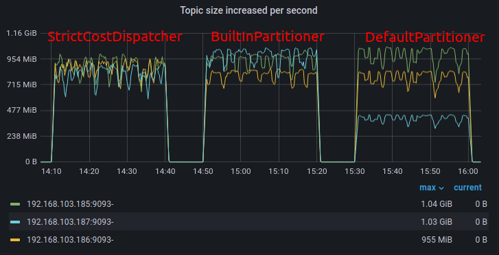
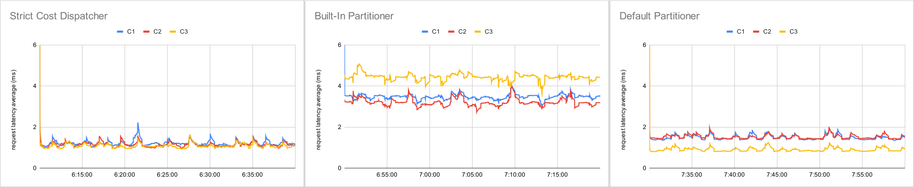

# Strict Cost Dispatcher 與 Built-In Partitioner 比較

此次實驗目的是量測 [StrictCostDispatcher](../../../common/src/main/java/org/astraea/common/partitioner/StrictCostDispatcher.java) 和 Kafka 的 `BuiltInPartitioner` ，在 **partition 分佈不平衡**的狀況下，觀察 record 的分佈、吞吐量的差異、發送延遲的差異。

## 測試環境

### 硬體規格

實驗使用6台實體機器，以下皆以代號表示，分別是 B1, B2, B3, C1, C2, C3 ，六台實體機器規格均相同

| 硬體       | 品名                                                         |
| ---------- | ------------------------------------------------------------ |
| CPU        | Intel i9-12900K 3.2G(5.2G)/30M/UHD770/125W                   |
| 主機板     | 微星 Z690 CARBON WIFI(ATX/1H1P/Intel 2.5G+Wi-Fi 6E)          |
| 記憶體     | 十銓 T-Force Vulcan 32G(16G*2) DDR5-5200 (CL40)              |
| 硬碟       | 威剛XPG SX8200Pro 2TB/M.2 2280/讀:3500M/寫:3000M/TLC/SMI控 * 2 |
| 散熱器     | NZXT Kraken Z53 24cm水冷排/2.4吋液晶冷頭/6年/厚:5.6cm        |
| 電源供應器 | 海韻 FOCUS GX-850(850W) 雙8/金牌/全模組                      |
| 網卡       | Marvell AQtion 10Gbit Network Adapter                        |

### 網路拓樸

```
          switch(10G)
┌─────┬─────┬─────┬─────┬─────┐
B1    B2    B3    C1    C2    C3
```

### 軟體版本

| 軟體                   | 版本(/image ID)                                              |
| ---------------------- | ------------------------------------------------------------ |
| 作業系統               | ubuntu-20.04.3-live-server-amd64                             |
| Astraea revision       | 5003f424e9cef4d27bbc56621d6e42f19a687a61                     |
| Zookeeper version      | 3.8.0                                                        |
| Apache Kafka version   | 3.3.1                                                        |
| Java version           | OpenJDK 11                                                   |
| Docker version         | 20.10.21, build baeda1f (B1)<br>20.10.17, build 100c701 (B2, B3, C1, C2, C3) |
| grafana image ID       | 99169ddb2b0b                                                 |
| prometheus version     | v2.32.1                                                      |
| node-exporter image ID | 1dbe0e931976                                                 |

作業系統硬碟切割

| 硬碟   | partition1 | partition2                   |
| ------ | ---------- | ---------------------------- |
| 硬碟一 | 50G /      | (rest) (Kafka log directory) |
| 硬碟二 | 50G /home  | (rest) (Kakfa log directory) |

實驗執行軟體

| 執行軟體                 |  B1  |  B2  |  B3  |  C1  |  C2  |  C3  |
| ------------------------ | :--: | :--: | :--: | :--: | :--: | :--: |
| Zookeeper                |  V   |      |      |      |      |      |
| Kakfa Broker             |  V   |  V   |  V   |      |      |      |
| Node Exporter            |  V   |  V   |  V   |      |      |      |
| Prometheus               |      |      |  V   |      |      |      |
| Grafana                  |      |      |  V   |      |      |      |
| Astraea Performance tool |      |      |      |  V   |  V   |  V   |

## 測試情境

 模擬 topic-partition 在叢集中分佈不平均的情境。當我們的叢集新增 broker 時，partition 不會自動平衡到各個 broker 上，這時我們也許會增加原本 topic 的 partition 數量，來讓這個 topic 在各個 broker 上都有 partition。以下的 partition 分佈，是在一連串的 "新增節點" 與 "增加 partition" 操作下，得出的 partition 分佈。

1. B1 上線
2. 建立 topic `testing-1` ，12 個 partition
3. B2 上線
4. 建立 topic `testing-2`，24 個 partition
5. 增加 topic `testing-1`，12 個 partition
6. B3 上線
7. 建立 topic `testing-3`，36 個partition 
8. 增加 topic `testing-1`，12 個 partition
9. 增加 topic `testing-2`，12 個 partition

這一連串的操作會讓我們得出以下不平衡的 partition 分佈

| # of partitioins |  B1  |  B2  |  B3  |
| ---------------- | :--: | :--: | :--: |
| testing-1        |  22  |  10  |  4   |
| testing-2        |  16  |  16  |  4   |
| testing-3        |  12  |  12  |  12  |

測試方式：會在 3 台伺服器 (C1, C2, C3) 上，分別執行 [Performance tool](../../performance_benchmark.md) ，分別往 `testing-1`、`testing-2`、`testing-3` 發送 record。

```bash
# C1 run StrictCostDispatcher sending record to topic "testing-1"
JMX_PORT=7091 REVISION=5003f424e9cef4d27bbc56621d6e42f19a687a61 \
docker/start_app.sh performance \
--bootstrap.servers 192.168.103.185:9092,192.168.103.186:9092,192.168.103.187:9092 \
--value.size 10KiB \
--value.distribution fixed \
--producers 4 \
--consumers 0 \
--run.until 30m \
--topics testing-1 \
--report.path /home/kafka/hong/report \
--partitioner org.astraea.common.partitioner.StrictCostDispatcher
# C2 run StrictCostDispatcher sending record to topic "testing-2"
JMX_PORT=7091 REVISION=5003f424e9cef4d27bbc56621d6e42f19a687a61 \
docker/start_app.sh performance \
--bootstrap.servers 192.168.103.185:9092,192.168.103.186:9092,192.168.103.187:9092 \
--value.size 10KiB \
--value.distribution fixed \
--producers 4 \
--consumers 0 \
--run.until 30m \
--topics testing-2 \
--report.path /home/kafka/hong/report \
--partitioner org.astraea.common.partitioner.StrictCostDispatcher
# C3 run StrictCostDispatcher sending record to topic "testing-3"
JMX_PORT=7091 REVISION=5003f424e9cef4d27bbc56621d6e42f19a687a61 \
docker/start_app.sh performance \
--bootstrap.servers 192.168.103.185:9092,192.168.103.186:9092,192.168.103.187:9092 \
--value.size 10KiB \
--value.distribution fixed \
--producers 4 \
--consumers 0 \
--run.until 30m \
--topics testing-3 \
--report.path /home/kafka/hong/report \
--partitioner org.astraea.common.partitioner.StrictCostDispatcher
```

測試完 `StrictCostDispatcher` 後，測試 `BuiltInPartitioner` 

```bash
# C1 run BuiltInPartitioner sending record to topic "testing-1"
JMX_PORT=7091 REVISION=5003f424e9cef4d27bbc56621d6e42f19a687a61 \
docker/start_app.sh performance \
--bootstrap.servers 192.168.103.185:9092,192.168.103.186:9092,192.168.103.187:9092 \
--value.size 10KiB \
--value.distribution fixed \
--producers 4 \
--consumers 0 \
--run.until 30m \
--topics testing-1 \
--report.path /home/kafka/hong/report \
--configs partitioner.ignore.keys=true
# C2 run BuiltInPartitioner sending record to topic "testing-2"
JMX_PORT=7091 REVISION=5003f424e9cef4d27bbc56621d6e42f19a687a61 \
docker/start_app.sh performance \
--bootstrap.servers 192.168.103.185:9092,192.168.103.186:9092,192.168.103.187:9092 \
--value.size 10KiB \
--value.distribution fixed \
--producers 4 \
--consumers 0 \
--run.until 30m \
--topics testing-2 \
--report.path /home/kafka/hong/report \
--configs partitioner.ignore.keys=true
# C3 run BuiltInPartitioner sending record to topic "testing-3"
JMX_PORT=7091 REVISION=5003f424e9cef4d27bbc56621d6e42f19a687a61 \
docker/start_app.sh performance \
--bootstrap.servers 192.168.103.185:9092,192.168.103.186:9092,192.168.103.187:9092 \
--value.size 10KiB \
--value.distribution fixed \
--producers 4 \
--consumers 0 \
--run.until 30m \
--topics testing-3 \
--report.path /home/kafka/hong/report \
--configs partitioner.ignore.keys=true
```

然後測試 `DefaultPartitioner`

```bash
# C1 run DefaultPartitioner sending record to topic "testing-1"
JMX_PORT=7091 REVISION=5003f424e9cef4d27bbc56621d6e42f19a687a61 \
docker/start_app.sh performance \
--bootstrap.servers 192.168.103.185:9092,192.168.103.186:9092,192.168.103.187:9092 \
--value.size 10KiB \
--value.distribution fixed \
--producers 4 \
--consumers 0 \
--run.until 30m \
--topics testing-1 \
--report.path /home/kafka/hong/report
# C2 run DefaultPartitioner sending record to topic "testing-2"
JMX_PORT=7091 REVISION=5003f424e9cef4d27bbc56621d6e42f19a687a61 \
docker/start_app.sh performance \
--bootstrap.servers 192.168.103.185:9092,192.168.103.186:9092,192.168.103.187:9092 \
--value.size 10KiB \
--value.distribution fixed \
--producers 4 \
--consumers 0 \
--run.until 30m \
--topics testing-2 \
--report.path /home/kafka/hong/report
# C3 run DefaultPartitioner sending record to topic "testing-3"
JMX_PORT=7091 REVISION=5003f424e9cef4d27bbc56621d6e42f19a687a61 \
docker/start_app.sh performance \
--bootstrap.servers 192.168.103.185:9092,192.168.103.186:9092,192.168.103.187:9092 \
--value.size 10KiB \
--value.distribution fixed \
--producers 4 \
--consumers 0 \
--run.until 30m \
--topics testing-3 \
--report.path /home/kafka/hong/report
```


## 測試結果

從每個 broker 的吞吐量來看，`StrictCostDispatcher` 訊息平衡的分佈在各個 broker 上，每個 broker 取得的訊息量不會差距太大，`StrictCostDispatcher` 之所以能夠將訊息分送的平均，原因其一是

1. `StrictCostDispatcher` 內部邏輯是用 "對每個 broker 的延遲" 來選擇 broker，選擇完才接著選擇(該 broker 內的) partition 發送訊息，第二個原因是
2. `StrictCostDispatcher` 會給 "延遲較高的 broker" 少一點訊息，在此環境上，broker 端網路接收頻寬總和 和 client 端網路發送頻寬總和 都是 30 gbps，所以在訊息發送上只要有一點不平衡 (e.g. 發送的訊息 B1 比 B2 多 1gbps)，都有可能讓訊息堆積(讓延遲變高)，改變訊息的分佈。

`BuiltInPartitioner` 的訊息也平均分佈在各個 broker 上，`BuiltInPartitioner` 的算法是把 partition 中，最長的"排隊"長度 - partition "排隊"長度，作為選中該 partition 的機率。比如說，以 `testing-2` 來舉例，`testing-2` partition 分佈 16 partition 在 B1、16 partition 在 B2、4 partition 在 B3

| # of partitioins |  B1  |  B2  |  B3  |
| ---------------- | :--: | :--: | :--: |
| testing          |  16  |  16  |  4   |

假如發送到 B1, B2 的 partition 的訊息，都堆積 5 筆，發送到 B3 的訊息沒有堆積，那麼最長的"排隊"長度是 5，所以，B1, B2 每個 partition 有 1 的權重被選到，B3 每個 partition 有 6 的權重被選到，所以 **選擇到 B1 的機率** 比 **選擇到 B2 的機率** 比 **選擇到 B3 的機率** 是 16 : 16 : 24。因為 B1, B2 持有的 partition 數量多，所以需要一定數量的訊息堆積，發送到 B3 的機率才會高過 B1, B2，因為 `BuiltInPartitioner` 是以 partition 為考量來做選擇，所以 partition 分佈對 BuiltInPartitioner 是有一定影響的。

另外，在多次執行後發現，`BuiltInPartitioner` 每次對 broker 的發送量都不固定，以這次的實驗為例，發送到 B2 的訊息量最少，發送到 B3 的訊息量最多。從 client 端的觀點來看也是，這次的實驗中，觀察到的發送比重**大約**如下表

| Average throughput | B1   | B2      | B3      |
| ------------------ | ---- | ------- | ------- |
| C1 (`testing-1`)   | 293  | **333** | 299     |
| C2 (`testing-2`)   | 312  | 224     | **335** |
| C3 (`testing-3`)   | 341  | 247     | **349** |

上面的數字是 client 端分別對各個 broker 的平均吞吐量， 多次執行的結果不固定，不固定的原因猜測可能是 `BuiltInPartitioner` 之間的"決策"會互相"影響"，最後走到不同的動態平衡。而就這一次的實驗，訊息總量較多發送到 B3，較少發送到 B2。

`DefaultPartitioner` 隨機選擇 partition 發送，所以吞吐量也會和 partition 分佈直接相關。



從 client 端的發送延遲來看，兩者的發送延遲都穩定，而 `StrictCostDispatcher` 維持比較低的 request latency average，在這次實驗中 `StrictCostDispatcher` 也是參考這項指標來選擇 partition 的。`BuiltInPartitioner` 的平均發送延遲較高，甚至比 Default Partitioner 還高，雖然 `DefaultPartitioner` 發送的資料量不如 `BuiltInPartitioner` 多。

`DefaultPartitioner` 有較低的延遲，其中又以 C3 的延遲較另外兩者低，推測是因為 C3 發送的 topic 是 `testing-3`， partition 分佈較為平均，有較多的 record 可以發往較不忙碌的 broker (B3)。



## 結論

|                       | StrictCostDispatcher             | BuiltInPartitioner | DefautlPartitioner            |
| --------------------- | -------------------------------- | ------------------ | ----------------------------- |
| partition  分佈不均時 | 按 broker 選擇，不受分佈不均影響 | 可以有效平衡訊息量 | 訊息量和 partition 分佈正相關 |
| 發送延遲              | 1.5 ms 附近                      | 延遲較高           | 1.5 ms 附近，且有高低之分     |

