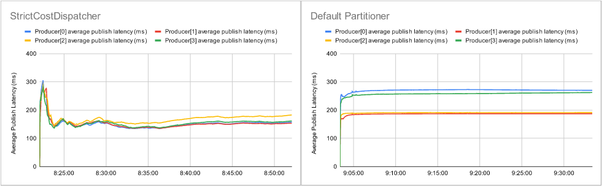

# Strict Cost Dispatcher 測試


## 測試環境

* 5台電腦 (B1~B3, C1, B6)
  * CPU: Intel i9-12900K 3.2G(5.2G)/30M/UHD770/125W
  * 主機板: 微星 Z690 CARBON WIFI(ATX/1H1P/Intel 2.5G+Wi-Fi 6E)
  * 記憶體: 十銓 T-Force Vulcan 32G(16G*2) DDR5-5200 (CL40)
  * 硬碟*2: 威剛XPG SX8200Pro 2TB/M.2 2280/讀:3500M/寫:3000M/TLC/SMI控
  * 散熱器: NZXT Kraken Z53 24cm水冷排/2.4吋液晶冷頭/6年/厚:5.6cm
  * 電源供應器: 海韻 FOCUS GX-850(850W) 雙8/金牌/全模組
  * 網卡: Marvell AQtion 10Gbit Network Adapter


* 網路拓樸

```
                 switch(1G)  
                ┌──────────┐
    switch(10G) │      switch(10G)
   ┌─────┬─────┬┴────┐     │
   B1    B2    B3    C1    B6
```

* 作業系統：ubuntu-20.04.3-live-server-amd64
  * 硬碟一：
    * 50G /
    * (rest) (Kafka log directory)

  * 硬碟二：
    * 50G /home
    * (rest) (Kafka log directory)

* Astraea version (C1): Pull Request #599 commit: 28e4f1555cd67c19a4fbdaa71118e89293eca6d5
* Astraea version (B1~B3, B6): commit: e8077e7ab1e4a4eb39ed09f056bc87890fa77dbe

| Repository                          | TAG     | Image ID     |
| :---------------------------------- | ------- | :----------- |
| ghcr.io/skiptests/astraea/zookeeper | 3.7.1   | 4e4b5697a83d |
| ghcr.io/skiptests/astraea/broker    | 3.2.1   | 499323543dd1 |
| prom/node-exporter                  | latest  | 1dbe0e931976 |
| grafana/grafana-oss                 | latest  | cd0f3efb1eb1 |
| prom/prometheus                     | v2.32.1 | a3d385fc29f9 |

* 每個電腦負責執行的軟體
  * B1: Kakfa Broker, Zookeeper, Prometheus, Node Exporter
  * B2: Kafka Broker, Node Exporter
  * B3: Kafka Broker, Node Exporter
  * B6: Kafka Broker, Node Exporter
  * C1: Astraea Performance tool

## 測試情境

開一個 30 partitions 的 topic ，在 C1 上，使用 [Astraea performance tool](../performance_benchmark.md) 發送資料，觀察 [Astraea performance tool](../performance_benchmark.md) 輸出的平均發送延遲。

```bash
java -Dcom.sun.management.jmxremote.port=9999 -Dcom.sun.management.jmxremote.authenticate=false -Dcom.sun.management.jmxremote.ssl=false -jar request599.jar performance --bootstrap.servers 192.168.103.185:9092,192.168.103.186:9092,192.168.103.187:9092,192.168.103.176:9092 --value.size 10KiB --producers 4 --consumers 0 --partitions 30 --run.until 30m --topic chia --report.path ./report
```

## 測試結果

StrictCostDispatcher 平均延遲：163.8416256 ms

Kafka Default Partitioner 平均延遲：227.8229692 ms

延遲降低 28.0837985% 



## 結論

觀察網路拓樸，1. C1 -> B6 會經過 3 台交換機，按理說延遲會相較其他三台(B1~B3)高。2. C1 -> B6 的網路頻寬只有 1Gbit/sec，發超過 1Gbit/sec 的話訊息會堆積，會讓發送延遲提高。

StrictCostPartitioner 根據節點平均延遲來分送訊息，也因此減少發送到 B6 的訊息，使得在此情境下，平均延遲勝過 Kafka Default Partitioner。
