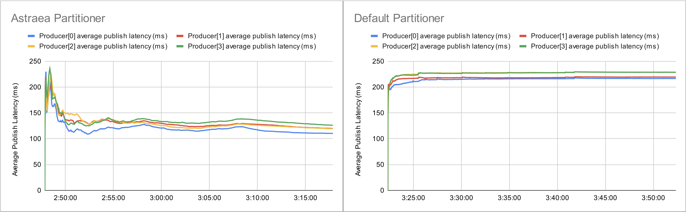
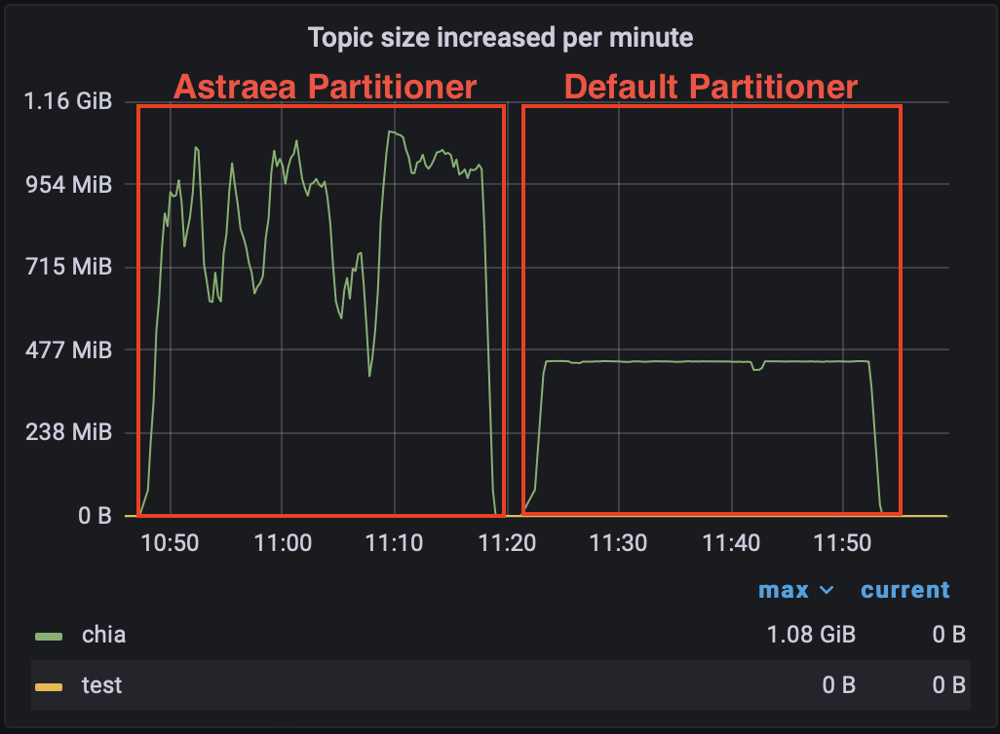

# Strict Cost Dispatcher 測試

此次實驗目的是驗證 Astraea partitioner 可以有效避免選到狀況較差的的節點，相比之下，Kafka partitioner則會被狀況較差的節點拖慢整體效能。

## 測試環境

### 硬體規格

實演使用6台實體機器，以下皆以代號表示，分別是 B1, B2, B3, B4, M1, C1 ，六台實體機器規格均相同

| 硬體       | 品名                                                         |
| ---------- | ------------------------------------------------------------ |
| CPU        | Intel i9-12900K 3.2G(5.2G)/30M/UHD770/125W                   |
| 主機板     | 微星 Z690 CARBON WIFI(ATX/1H1P/Intel 2.5G+Wi-Fi 6E)          |
| 記憶體     | 十銓 T-Force Vulcan 32G(16G*2) DDR5-5200 (CL40)              |
| 硬碟       | 威剛XPG SX8200Pro 2TB/M.2 2280/讀:3500M/寫:3000M/TLC/SMI控 * 2 |
| 散熱器     | NZXT Kraken Z53 24cm水冷排/2.4吋液晶冷頭/6年/厚:5.6cm        |
| 電源供應器 | 海韻 FOCUS GX-850(850W) 雙8/金牌/全模組                      |
| 網卡       | Marvell AQtion 10Gbit Network Adapter                        |

### 網路拓樸

```
                 switch(1G)  
                ┌────────────────┐
    switch(10G) │            switch(10G)
   ┌─────┬─────┬┴────┬─────┐     │
   B1    B2    B3    M1    C1    B4
```

### 軟體版本

| 軟體                   | 版本(/image ID)                          |
| ---------------------- | ---------------------------------------- |
| 作業系統               | ubuntu-20.04.3-live-server-amd64         |
| Astraea revision       | 75bcc3faa39864d5ec5f5ed530346184e79fc0c9 |
| Zookeeper version      | 3.7.1                                    |
| Apache Kafka version   | 3.2.1                                    |
| Java version           | OpenJDK 11                               |
| Docker version         | 20.10.17, build 100c701                  |
| grafana image ID       | b6ea013786be                             |
| prometheus version     | v2.32.1                                  |
| node-exporter image ID | 1dbe0e931976                             |

作業系統硬碟切割

| 硬碟   | partition1 | partition2                   |
| ------ | ---------- | ---------------------------- |
| 硬碟一 | 50G /      | (rest) (Kafka log directory) |
| 硬碟二 | 50G /home  | (rest) (Kakfa log directory) |

實驗執行軟體

| 執行軟體                 |  B1  |  B2  |  B3  |  B4  |  M1  |  C1  |
| ------------------------ | :--: | :--: | :--: | :--: | :--: | :--: |
| Zookeeper                |  V   |      |      |      |      |      |
| Kakfa Broker             |  V   |  V   |  V   |  V   |      |      |
| Node Exporter            |  V   |  V   |  V   |  V   |      |      |
| Prometheus               |      |      |      |      |  V   |      |
| Grafana                  |      |      |      |      |  V   |      |
| Astraea Performance tool |      |      |      |      |      |  V   |

## 測試情境

叢集中一台broker，網路延遲較高、且網路頻寬較低的情境下，使用 [performance tool](../performance_benchmark.md) 來測試 producer 發送的延遲。

參考上面的網路拓樸，B4 在本實驗中是延遲較高、且網路頻寬較低的 broker ，而

1. C1 -> B4 會經過 3 台交換機，按理說延遲會相較其他三台(B1~B3)高。
2. C1 -> B4 的網路頻寬只有 1Gbit/sec，發超過 1Gbit/sec 的話訊息會堆積，會讓發送延遲提高。

預期 Astraea Partitioner 可以避開 B4 進行資料發送。

測試方式是：開一個 60 partitions 的 topic ，在 C1 上，使用 [Astraea performance tool](../performance_benchmark.md) 發送資料，觀察 [Astraea performance tool](../performance_benchmark.md) 輸出的平均發送延遲。

```bash
# Run StrictCostDispatcher
REVISION=75bcc3faa39864d5ec5f5ed530346184e79fc0c9 docker/start_app.sh performance \
--bootstrap.servers 192.168.103.185:9092,192.168.103.186:9092,192.168.103.187:9092,192.168.103.188:9092 \
--value.size 10KiB \
--producers 4 \
--consumers 0 \
--partitions 60 \
--run.until 30m \
--topic chia \
--report.path /home/kafka/hong/report \
--partitioner org.astraea.app.partitioner.StrictCostDispatcher

# Run Default Partitioner
REVISION=75bcc3faa39864d5ec5f5ed530346184e79fc0c9 docker/start_app.sh performance \
--bootstrap.servers 192.168.103.185:9092,192.168.103.186:9092,192.168.103.187:9092,192.168.103.188:9092 \
--value.size 10KiB \
--producers 4 \
--consumers 0 \
--partitions 60 \
--run.until 30m \
--topic chia \
--report.path /home/kafka/hong/report
```

## 測試結果

Astraea Partitioner 平均延遲：119.0140341 ms

Kafka Default Partitioner 平均延遲：223.9688098 ms

平均延遲降低約 46.8613356% 



Astraea Partitioner 平均吞吐：868.125 MiB/second

Kafka Partitioner 平均吞吐：438.39 MiB/second

平均吞吐提升：約 1.98 倍



## 結論

StrictCostPartitioner 根據節點平均延遲來分送訊息，也因此減少發送到 B4 （狀況較差節點）的訊息，使得在此情境下，

1. **平均延遲**較 Kafka Default Partitioner 低約 46.86%
2. **平均吞吐**較 Kafka Default Partitioner 高約 1.98 倍
