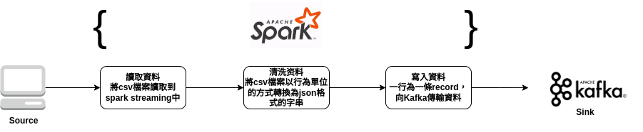

Astraea etl 中文文件
===

Astraea etl 的目標是構建 kafka-spark-delta 的資料傳輸通道。目前支持的功能爲讀取csv檔案透過 spark streaming 轉入 kafka topic。

### 系統架構

spark -> kafka 將csv檔案透過 spark streaming 轉入 kafka topic，包括讀取資料，清洗資料與寫入資料。該模組分爲三個部分。
1. 讀取資料： spark streaming 會讀取source path 下所有csv檔案，並將其轉化為dataframe。
2. 清洗資料： dataframe 以行為單位，通過將json convertor 封裝進 udf 的方式，將資料變為 json 格式字串的集合。
3. 寫入資料： 將轉化為 json 格式的資料以一行對應一條 record 的方式，發送到kafka中指定的topic。record的key為table的primary key，value 為轉換為json 字串的csv row。



### Astraea etl 使用

Astraea etl 通過讀取[property file](../../config/spark2kafka.properties) 來獲取系統運行時可能需要的資訊。
以下是property中參數簡介

|       參數名稱        | 說明                                                                          |  預設值  |
|:-----------------:|:----------------------------------------------------------------------------|:-----:|
|    source.path    | (必填) 資料來源路徑                                                                 |   無   |
|   column.names    | (必填) csv table的欄位名稱及該欄位對應的屬性 For example:sA=string,sB=integer,sC=boolean... |   無   |
|   primary.keys    | (必填) csv table中的primary key. For example:sA=string,sB=integer,sC=boolean... |   無   |
| bootstrap.servers | (必填) 欲連接的Kafka server address                                               |   無   |
|    topic.name     | (必填) 欲發往的topic name                                                         |   無   |
|    checkpoint     | (必填) spark checkpoint 存放路徑                                                  |   無   |
| topic.partitions  | (選填) 目標topic的partition數量                                                    |  15   |
|  topic.replicas   | (選填) 目標topic的replica數量                                                      |   1   |
|   topic.configs   | (選填) 配置kafka的其他參數 For example: compression.type\=lz4                        |   無   |

#### 使用範例

專案內的工具都有整合到`container`中，使用者利用docker運行，可方便管理，使用前請注意兩件事情：

1. 確認自己的Kafka server ip與spark master ip，並且Kafka與spark 有正常運作，關於啟動Kafka 可參考 [run_kafka_broker](run_kafka_broker.md)。
2. 可使用 [Astraea GUI](../gui/README.md) 來建構測試用途的 `topics`。

使用`docker`執行`start_etl`,以下爲範例

```bash 
# Run Spark-submit
./docker/start_etl.sh master=spark://192.168.103.189:8080 \
property.file=/home/kafka/spark2kafkaTest/spark2kafka.properties
```

### Astraea etl 實驗

experiments 資料夾中收錄不同版本的實驗紀錄，主要使用 [performance tool](../performance_benchmark.md) 測試並紀錄數據。

* [2022 Dec26](experiments/etl_1.md), 測試 spark->kafka 模組功能及替換[Strict Cost Dispatcher](./strict_cost_dispatcher.md) 的影響 (Astraea revision: [be8c3ffdf35ab0651dfc1a33b5552fd7e3381069](https://github.com/skiptests/astraea/tree/be8c3ffdf35ab0651dfc1a33b5552fd7e3381069))