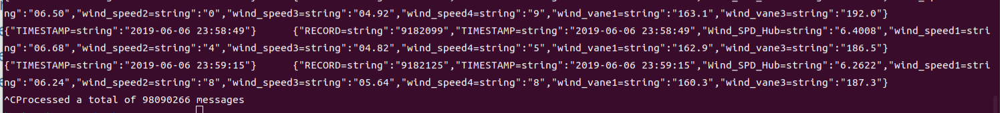
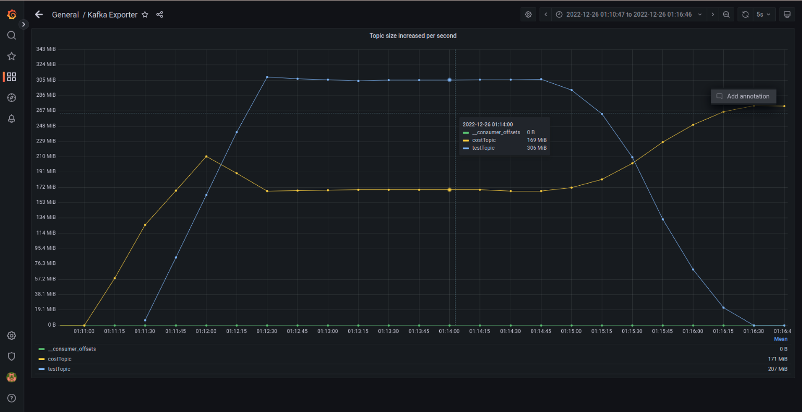

# etl 測試

此次實驗目的主要是測試 Astraea etl 的三個部分，包括測試 
1. 10GB 資料需要多少時間跑完 
2. 檢查 input output 資料的一致性,例如資料筆數,抽檢資料是否一致
3. 替換 spark 中的 kafka partitioner 再次測試效能,看有沒有變好

## 測試環境

### 硬體規格

實驗使用6台實體機器，以下皆以代號表示，分別是 B1, B2, B3, B4, M1, C1 ，六台實體機器規格均相同

| 硬體       | 品名                                                         |
| ---------- | ------------------------------------------------------------ |
| CPU        | Intel i9-12900K 3.2G(5.2G)/30M/UHD770/125W                   |
| 主機板     | 微星 Z690 CARBON WIFI(ATX/1H1P/Intel 2.5G+Wi-Fi 6E)          |
| 記憶體     | 十銓 T-Force Vulcan 32G(16G*2) DDR5-5200 (CL40)              |
| 硬碟       | 威剛XPG SX8200Pro 2TB/M.2 2280/讀:3500M/寫:3000M/TLC/SMI控 * 2 |
| 散熱器     | NZXT Kraken Z53 24cm水冷排/2.4吋液晶冷頭/6年/厚:5.6cm        |
| 電源供應器 | 海韻 FOCUS GX-850(850W) 雙8/金牌/全模組                      |
| 網卡       | Marvell AQtion 10Gbit Network Adapter                        |

### 網路拓樸

```
          switch(10G)
┌─────┬─────┬─────┬─────┬─────┐
B1    B2    B3    S1    S2    C1
```

### 軟體版本

| 軟體                   | 版本(/image ID)                            |
| ---------------------- |------------------------------------------|
| 作業系統               | ubuntu-20.04.3-live-server-amd64         |
| Astraea revision       | 75bcc3faa39864d5ec5f5ed530346184e79fc0c9 |
| Zookeeper version      | 3.8.0                                    |
| Apache Kafka version   | 3.3.1                                    |
| Java version           | OpenJDK 11                               |
| Docker version         | 20.10.17, build 100c701                  |
| grafana image ID       | b6ea013786be                             |
| prometheus version     | v2.32.1                                  |
| node-exporter image ID | 1dbe0e931976                             |

實驗執行軟體

| 執行軟體                  |  B1  |  B2  |  B3  |  S1  |  S2  |  C1  |
| ------------------------ | :--: | :--: | :--: | :--: | :--: | :--: |
| Spark master             |      |      |      |  V   |      |      |
| Spark worker             |      |      |      |  V   |  V   |      |
| Zookeeper                |  V   |      |      |      |      |      |
| Kafka Broker             |  V   |  V   |  V   |      |      |      |
| Node Exporter            |  V   |  V   |  V   |      |      |      |
| Prometheus               |      |      |  V   |      |      |      |
| Grafana                  |      |      |  V   |      |      |      |
| Astraea Performance tool |      |      |      |      |      |  V   |

## 測試情境

整個實驗分爲兩種情景，在普通情景下測試與在kafka叢集中一臺broker，網路延遲較高、且網路頻寬較低的不平衡情境下進行測試。

測試流程：兩種情景都需要首先啓動spark cluster。可以參考[start_spark](../../run_spark.md)啓動spark cluster.


### 普通情景

在普通情景下，只會用到上述的五臺機器{B1， B2， B3， S1， S2}。本情景將測試10GB 資料需要多少時間跑完與檢查 input output 資料的一致性。

#### 測試10GB資料需要多少時間跑完

```bash
# Run Spark-submit
./docker/start_etl.sh master=spark://192.168.103.189:8080 \
property.file=/home/kafka/spark2kafkaTest/spark2kafka.properties
```

從圖中可以看出10GB的資料處理完畢需要花費2分55秒


#### 檢查 input output 資料的一致性

10GB資料共98090266筆資料。


當資料經過etl處理完畢發往指定topic後。通過subscribe topic來消費所有該topic下的資料，以測定資料是否有缺失。
可以看到資料的筆數是相同的。


抽查對比consumer到的資料，各欄位資料內容也與原資料一致，所以資料一致性方面未發現問題。


### 不平衡情景

在該情景下會用到上述的全部六臺機器，同時B1， B2， B3的網路頻寬將被設置爲2.5G以確保etl效能的變化在叢集高負載的情況下會有較明顯的體現。 
其中C1將被用來向B1發送資料，以確保B1處在高負載的狀態。

使用default partitioner進行測試
不替換時總共花費了4min處理完畢數據



替換 spark 中的 kafka partitioner進行測試
替換partitioner後的花費5min處理完畢數據 


所以結論替換partitioner後反而變成了負優化，進一步觀察分布在各Broker partition的offset。處在負載最重的B1的partitions反而吃到了最多的資料。這與設想的不符合，這一問題還需要再探究其發生原因。


## 結論

在普通情景下，擁有兩個worker的spark cluster中，使用standalone mode 啓動 astraea etl ，處理資料的平均速率爲58.5MB/s。

在不平衡情境下，替換partitioner後的效能對比。

| 吞吐/延遲比較 | default partitioner | strict partitioner | 改善                         |
| ------------- |---------------------|--------------------| ---------------------------- |
| 吞吐量        | 42.7 MB/second   | 34.1 MiB/second | 平均吞吐提升：約 0.80 倍     |
