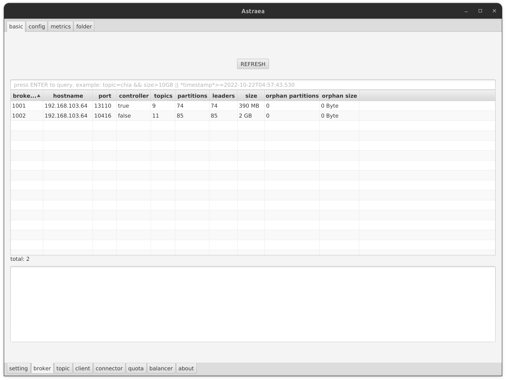
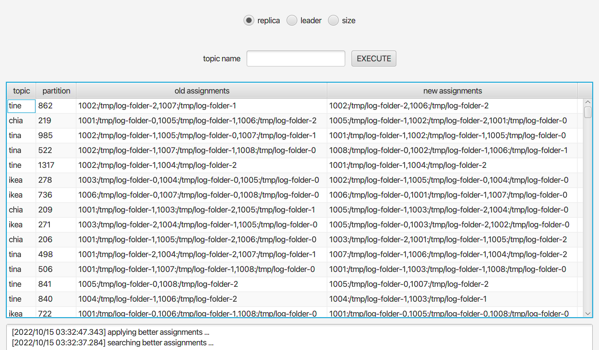
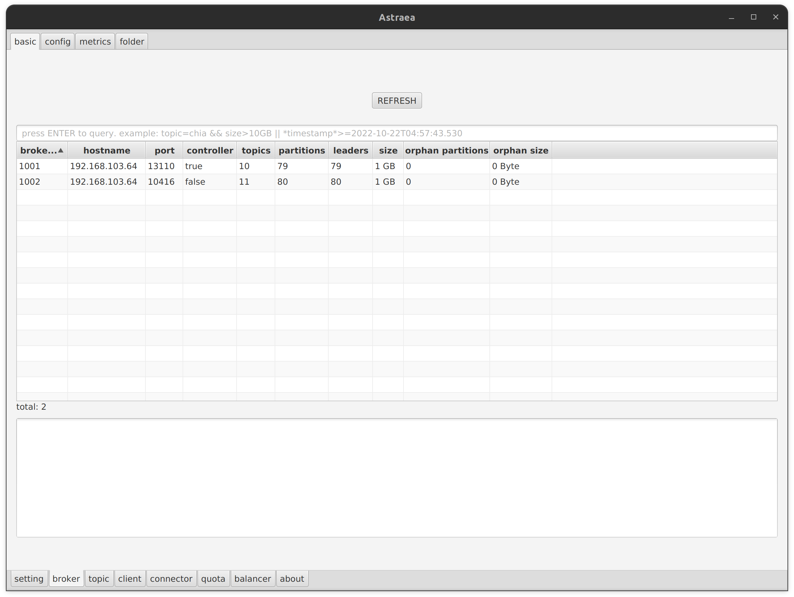

### balancer

`Balancer` 實裝了 Astraea 研製的負載平衡演算法，可快速方便的依照使用者指定的目標來負載平衡叢集。
以下圖為例，可注意到叢集中的節點`1001`明顯負擔了過多的`partitions`

因此我們以平衡`replica`為目標來運行負載平衡，如下圖，Astraea balancer 會在一定時間內嘗試組合各種`replicas`配置，並且在其中選擇最佳的配置

Astraea balancer 運行結束後，可以從下圖看到節點`1001`所負責的`replicas`已經平衡到其他節點，同時 Astraea balancer 也不會製造出另一個負載過重的節點

#### 負載平衡策略：
1. `replica`: 以平衡節點之間的`replicas`數量為目標
2. `leader`：以平衡節點之間的`replica leaders`數量為目標
3. `size`：以平衡節點之間的資料量為目標