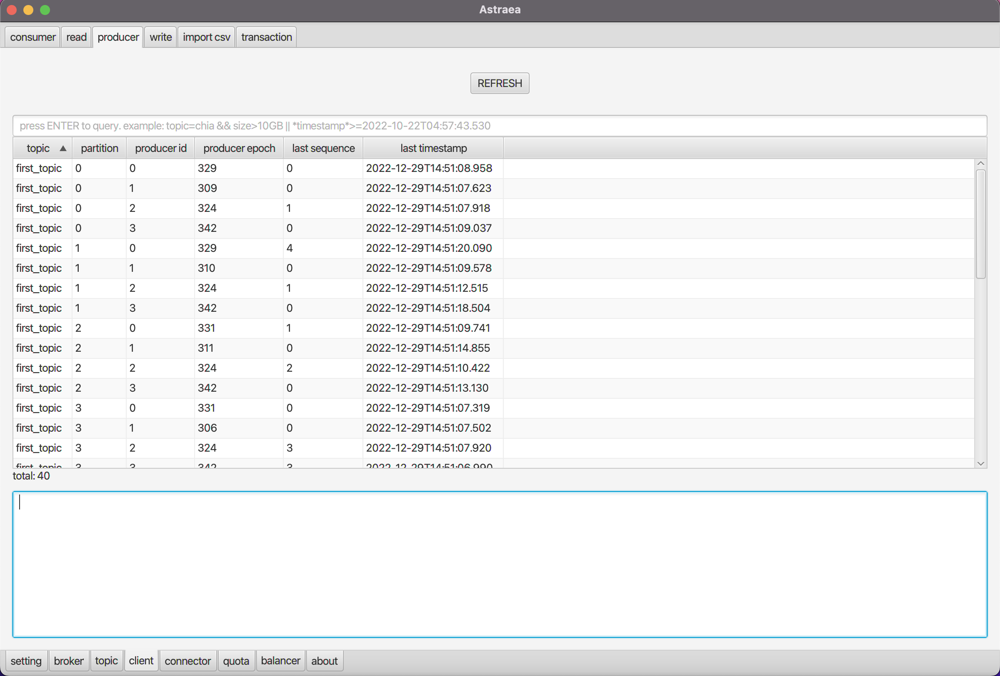

### client

`client` 頁面提供您查詢 `consumer` `producer` `transaction` 的資訊

- [consumer](#consumer)
- [producer](#producer)
- [transaction](#transaction)

## consumer

`consumer` 提供您查詢 consumer groups 的資訊，預設搜尋所有 consumer，您可以透過搜尋欄位過濾 `group id` 或是 `topic 名稱`，如下圖是顯示有訂閱 tina 的 consumers

## producer

`producer` 提供您查詢 producer 的資訊，預設搜尋所有 producer，您可以透過搜尋欄位過濾 `topic 名稱`，如下圖示顯示有寫資料到 tina 的 producers

**注意：只有idempotent producer 的資訊可供查詢**

## transaction

`transaction` 提供您查詢 transaction 的資訊，預設搜尋所有 transaction，您可以透過搜尋欄位過濾 `topic 名稱`或是 `transaction id` ，如下圖是顯示有涉及 tina 的交易狀態

