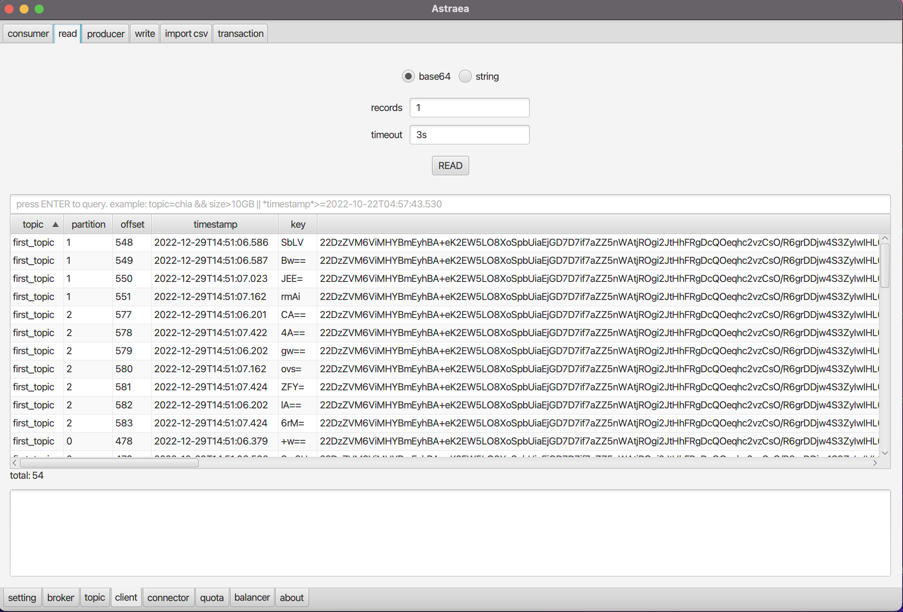

### client

`client` 頁面提供您查詢 `consumer` `read` `producer` `write` `import csv` `transaction` 的資訊

- [consumer](#consumer)
- [read](#read)
- [producer](#producer)
- [write](#write)
- [import csv](#import-csv)
- [transaction](#transaction)

## consumer

`consumer` 提供您查詢 consumer groups 的資訊

## read

`read` 提供您讀取 `records`
- 編碼選擇：`base64` `string`
- `records`：讀取數量
- `timeout`：逾時秒數

## producer

`producer` 提供您查詢 producer 的資訊

**注意：只有idempotent producer 的資訊可供查詢**

## write

`write` 提供您發送資料的能力
- `topic`：指定發送之目標 `topic`
- `partition`：指定發送之目標 `partition`
- `key`：發送之 `key`
- `value`：發送之 `value`

## import csv

`import csv` 提供您讀取 csv 資料並匯入 `topic` 中

讀取檔案
- `lines`：指定讀取行數上限
- `open` ：選取欲讀取之檔案

完成讀取後
- 透過勾選下方 `enable` 進行設定，點擊 `PUSH` 寫入資料。
- `topic`：寫入之目標 `topic`
- `format`：格式選擇 `csv` `json`

範例：讀取檔案後套用以下設定

套用後如下圖所示，可以讀取到剛寫入的資料

## transaction

`transaction` 提供您查詢 transaction 的資訊

