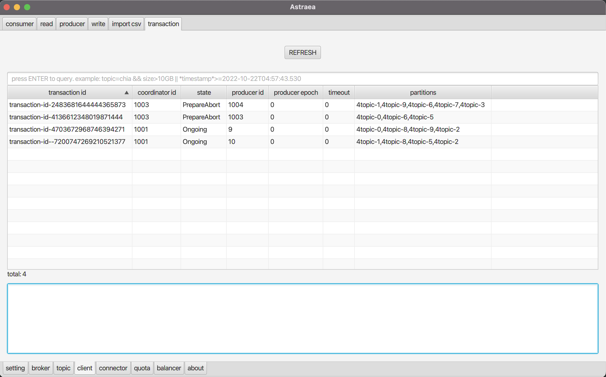

### client

`client` 頁面提供您:
* 查詢 `consumer` `producer` `transaction` 的資訊。
* 使用`read`頁面來查看讀取數據的狀況
* 使用`write`頁面來寫入 `Key\Value` 數據到指定的`topic`和`partition`。

- [consumer](#consumer)
- [read](#read)
- [producer](#producer)
- [write](#write)
- [import csv](#import-csv)
- [transaction](#transaction)

## consumer
`consumer` 提供您查詢 consumer 的資訊
* 可以透過搜尋欄，增加查詢條件（支援Regex) 

## read
`read` 提供您調閱 `topic` 資料
* 可以透過搜尋欄，增加查詢條件（支援Regex)
* records：預期取得多少幾筆資料
* timeout：可以等待多久時間（直到資料回傳）

## producer

`producer` 提供您查詢 producer 的資訊
* 可以透過搜尋欄，增加查詢條件（支援Regex)

***注意：只有 idempotent producer 的資訊可供查詢** ([Idempotent Producer介紹](https://kafka.apache.org/documentation/#producerconfigs_enable.idempotence))

## write
`write` 提供您單筆 `Key\Value` 寫入指定的`topic` 和 `partition`

## import csv

`import csv` 提供您讀取 csv 資料並匯入 `topic` 中

讀取檔案
- `lines`：指定讀取行數上限
- `open` ：選取欲讀取之檔案

完成讀取後
- 透過勾選下方 `enable` 進行設定，點擊 `PUSH` 寫入資料。
- `topic`：寫入之目標 `topic`
- `format`：格式選擇 `csv` `json`

範例：讀取檔案後套用以下設定

套用後如下圖所示，可以讀取到剛寫入的資料

## transaction
`transaction` 提供您查詢 transaction 的資訊
* 可以透過搜尋欄，增加查詢條件（支援Regex)
