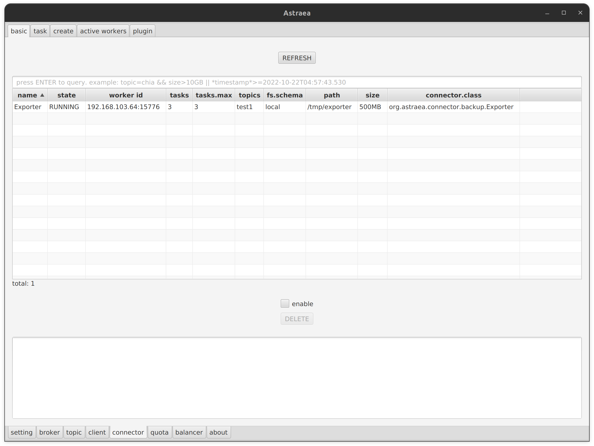
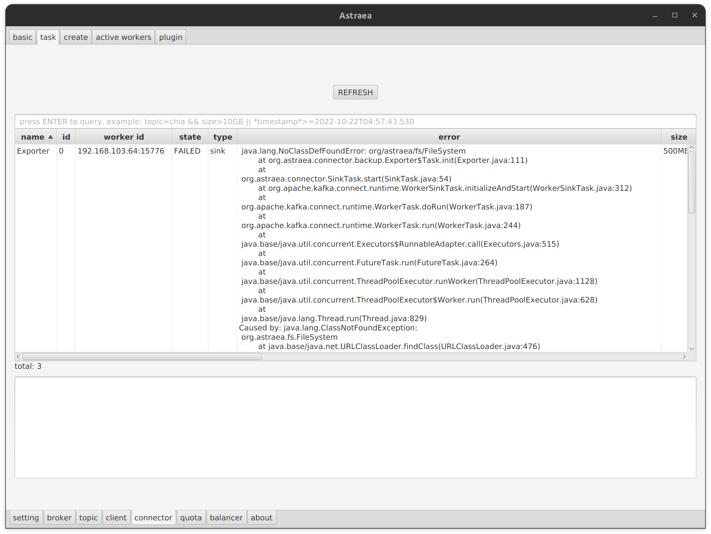
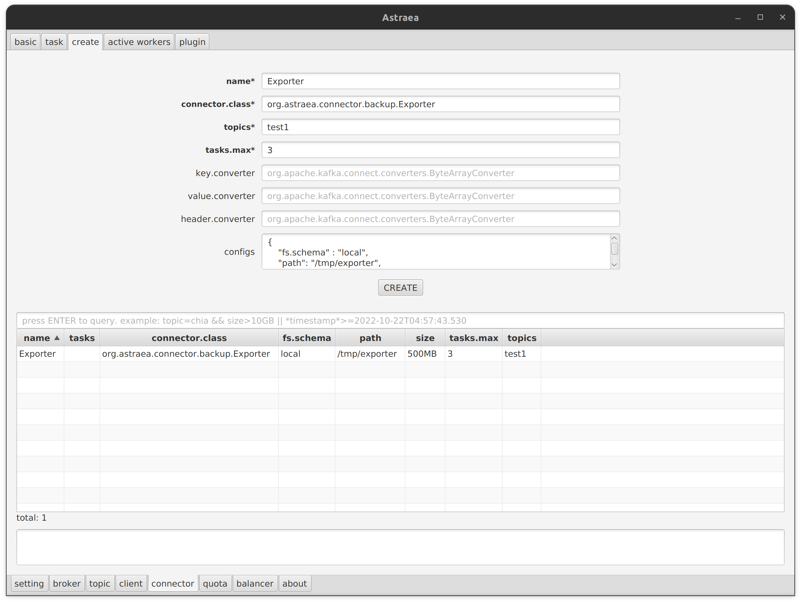
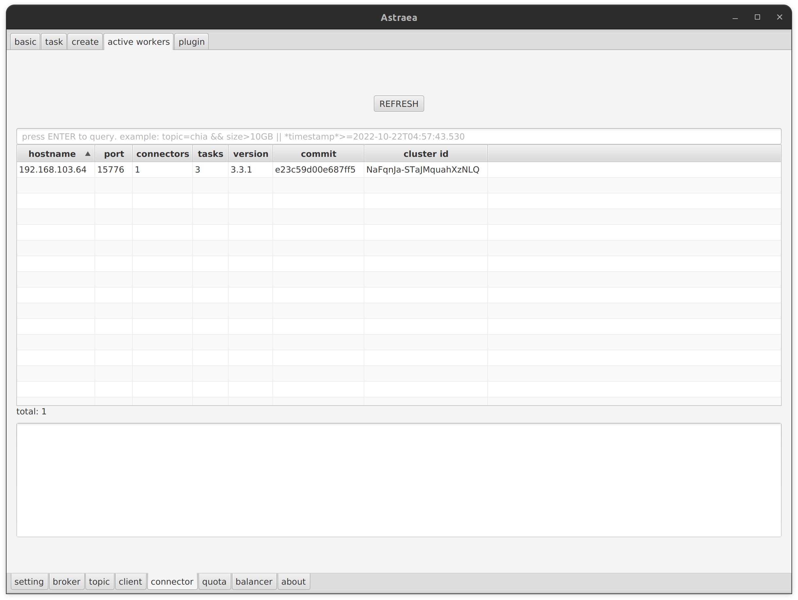
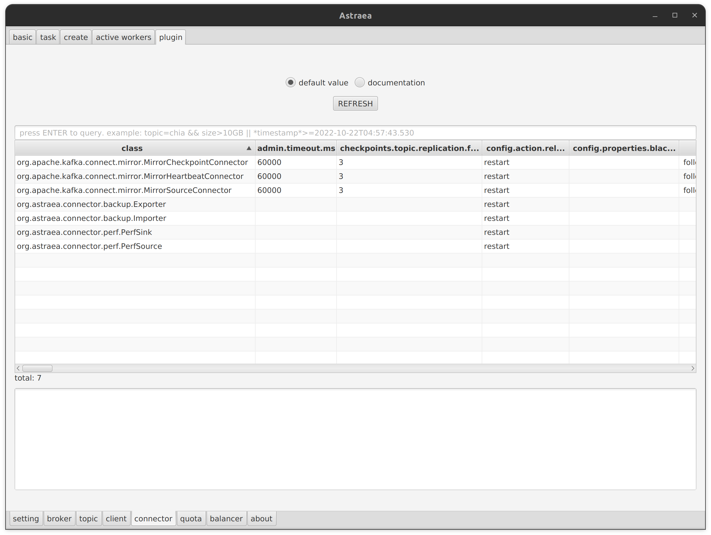
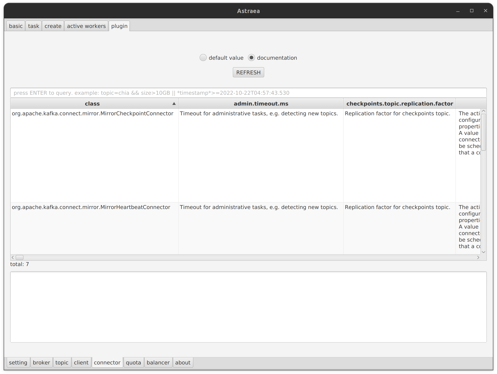

### connector

在最初設定中有填入`worker`相關資訊，即可以在此區域檢視與管理`worker`

此專案建立之`worler`預設`plugin`位置在`tmp/worker-plugins`

- [basic](#basic)
- [task](#task)
- [create](#create)
- [active workers](#active-workers)
- [plugin](#plugin)

### basic

檢視當前`worker`所執行中的`connector`其名稱、狀態與參數內容，如需要可以在此頁面刪除`connector`

### task

當下`worker`所執行之`task`創建資訊與其當下統計之狀態

當`task`有出現`error`時，會在`error` field 展示其 exception 內容

*因缺少`jar`檔，因此出現錯誤並顯示在 `error` field中*

### create

可以透過 gui 在此 `worker`創建所需要之`connector`，創建完成時會在下方顯示創造出來的`connector`

提醒：Kafka 預設會使用 `json convert`來處理 records，因此如果使用本專案的`backup`工具，
需要將 `converter`設定為 `org.apache.kafka.connect.converters.ByteArrayConverter`

### active workers

顯示當下所執行之 `worker`，包含資訊有執行`connector`,`task`數量、版本與`cluster id`等資訊

### plugin

可以檢視此`worker`以安裝之`plugin`資訊與其文件，兩者都可以透過`query`進行搜尋與過濾

*此`worker`所有可使用之`plugin`與相關資訊*

*`plugin`的其說明文件，有其所需之參數之說明*