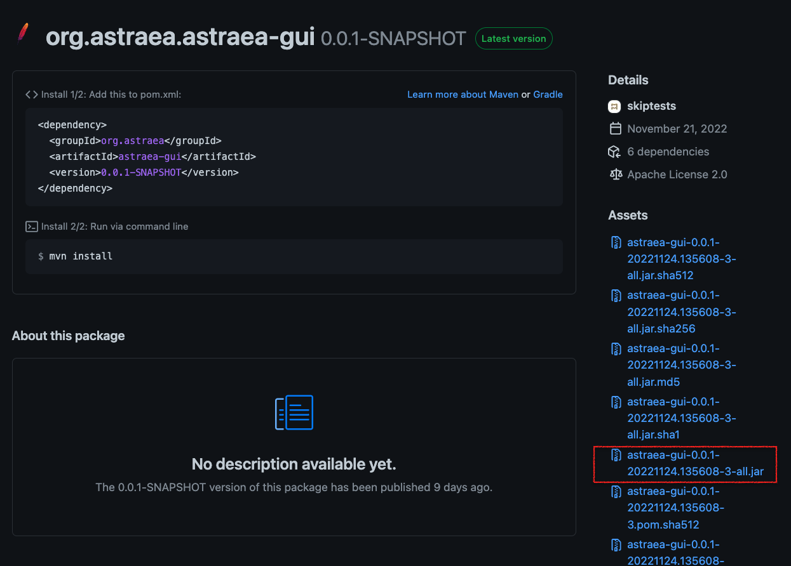

### 準備環境和下載 Astraea GUI

1. (如果環境已可運行`JavaFX`則跳過此步驟) 下載 [Azul JRE FX 11](https://www.azul.com/downloads/?version=java-11-lts&os=windows&architecture=x86-64-bit&package=jre-fx)


2. 下載 `Astraea GUI` 可執行檔，進到[Astraea GUI 可執行檔頁面](https://github.com/skiptests/astraea/packages/1725262)後搜尋結尾為`-all.jar`的檔案



3. 運行 `Astraea GUI`

```shell
{JRE_HOME}/bin/java -jar astraea-gui-0.0.1-20220928.102654-3-all.jar
```
