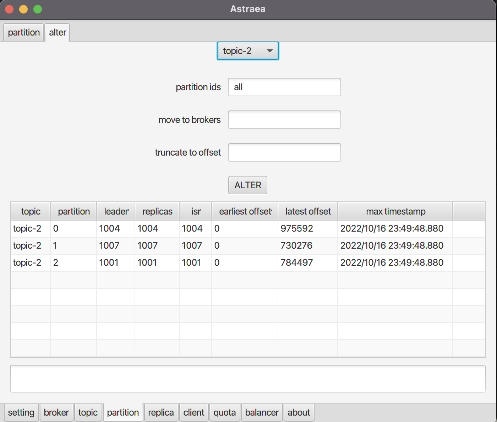

### partition

可以在此頁面取得各`topic`的`partition`資訊，並搬移`partition`至指定`broker`

*顯示出所有`topic`的個`partition`資料*

*指定所有名稱結尾是1的`topic`*

搬移`partition`時，需要先選擇特定`topic`，此時會列出此`topic`旗下所有的`partition`

`partitions` 可以填寫要變更的`partition ids`，或者保留`all`代表要變更所有`partitions`。`move to brokers`可填寫要擺放`partitions`的目標節點。`truncate to offset`則可以填寫要截短資料的位置

下圖把`topic-2`的所有`partition`移至節點`1001`，並且將`offset: 100`之前的資料都截斷 

