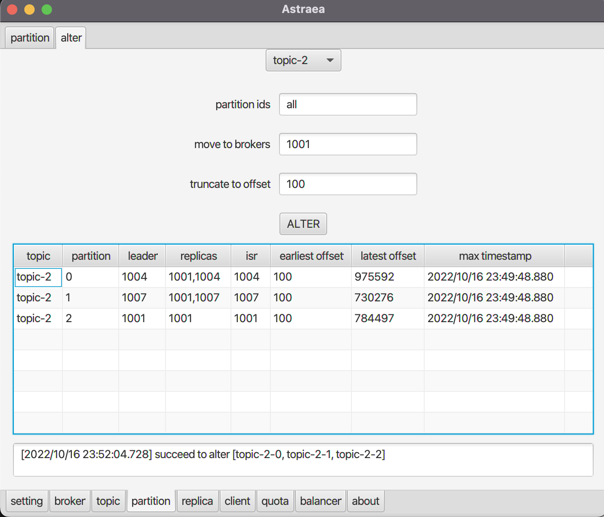

### partition

可以在此頁面取得各`topic`的`partition`資訊，並搬移特定`partition`

*顯示出所有`topic`的個`partition`資料*

*指定所有名稱結尾是1的`topic`*

搬移`partition`時，需要先選擇特定`topic`，此時會列出此`topic`旗下所有的`partition`

選定要搬移的`partition`與其搬移`broker`跟`truncate`數，點擊`ALTER`後即可看到
此工具執行搬移後的結果

*把`partition 2`移至`id`為 1002的`broker`，並且更新其`earliest offset`為100*