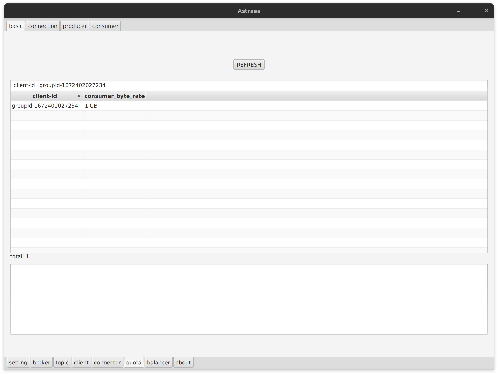
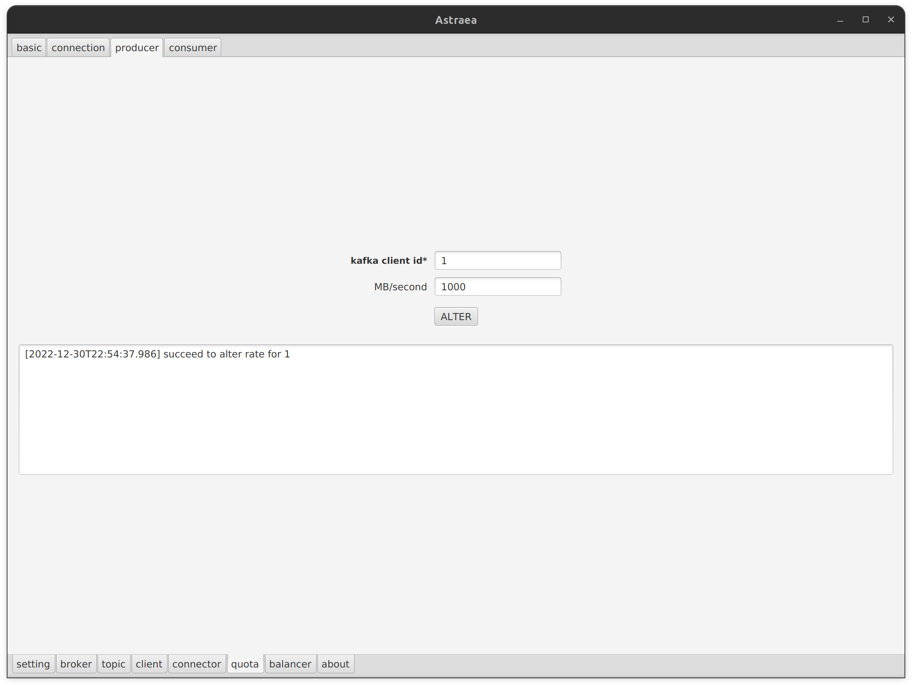
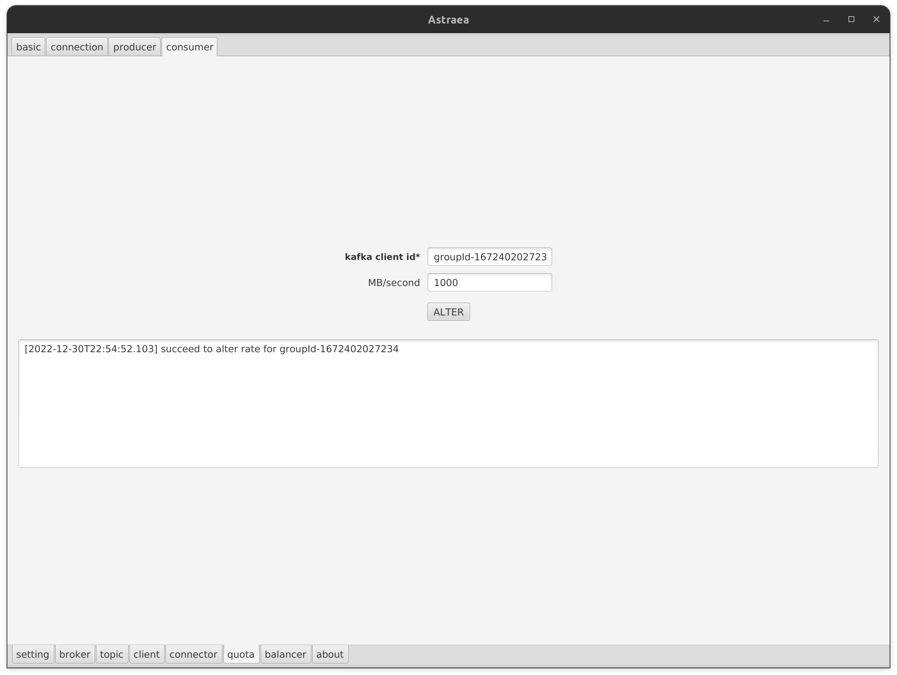
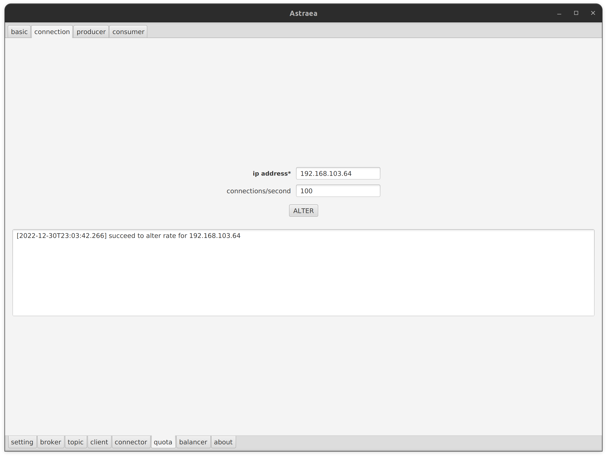

### 調閱及設定 quota

`quota` 頁面提供您調閱及設定 `quota`

- [調閱 quota](#調閱-quota) `basic`
- [設定 quota](#設定-quota) `alter`

## 調閱 quota

`basic` tab 中，您可以查詢當前所設定的 `quotas`

您也可以透過搜尋欄位查詢指定 `client id`

## 設定 quota

`alter` tab 中，提供您動態針對不同資源設下使用上限，目前支援三種資源：
1. `producer`：寫入速度
2. `connection`：連線數
3. `consumer`：讀取速度

如下圖分別針對 `producer` 和 `consumer` 設定讀寫上限

下圖則是針對指定 `ip` 限制它單位時間能建立的連線數量

