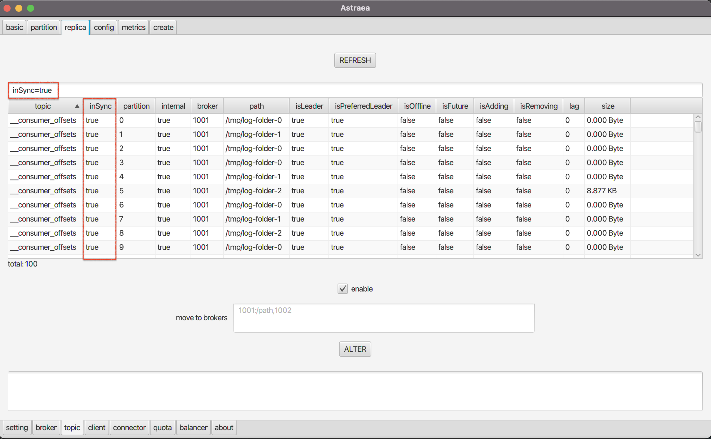
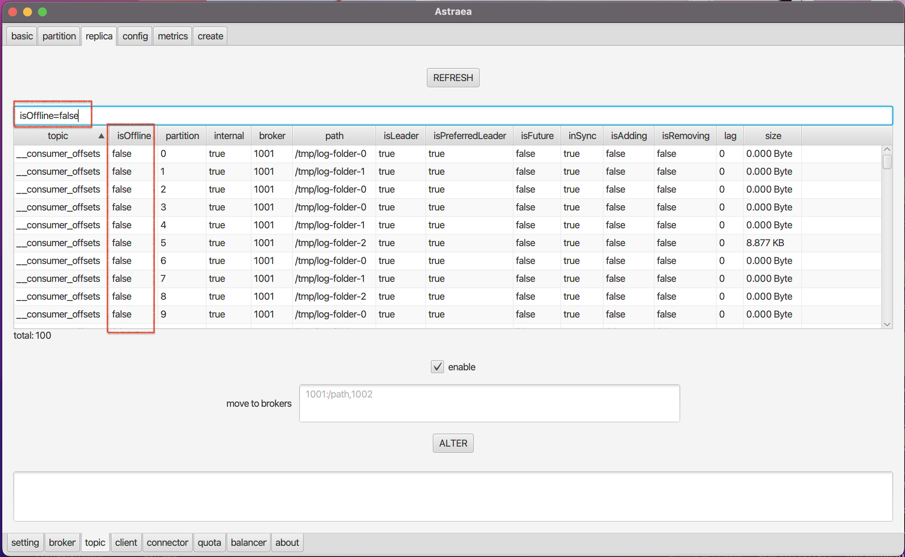
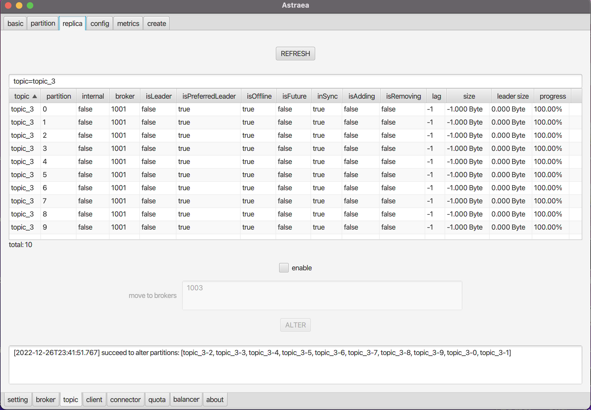

### 查詢 replicas
- [replicas 基本資訊](#調閱-replicas-基本資訊) 
- [replicas 搬移](#搬移-replicas) 

## 調閱 replicas 基本資訊
`Replica` 頁面提供您查詢 `kafka replica` 的資訊
* 預設會查詢所有 `replicas` , 並且印出所有資訊 

* 可以透過搜尋欄，增加查詢條件（支援Regex)
* Ex: 下圖查詢`InSync=true` 的`replica`

* Ex: 下圖查詢`isOffice=false` 的`replica`

## 搬移 replicas
下方的`move to broker`提供您將`replica` 搬移到不同的broker上
* 參考 [Run Kafka Broker](https://github.com/skiptests/astraea/blob/main/docs/run_kafka_broker.md) 來建立多個Brokers 
1. 使用者可以透過搜尋欄，增加查詢條件（支援Regex),來選出要搬移的replica 
2. 按enable確認後,在按ALTER進行搬移

