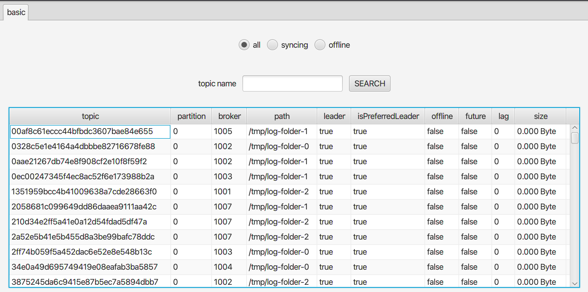
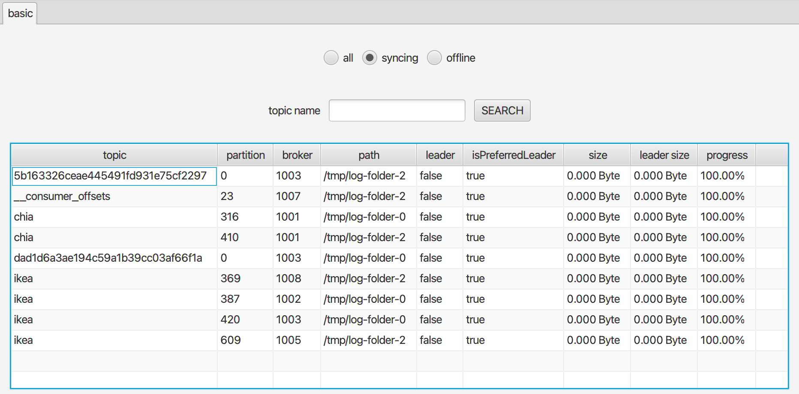
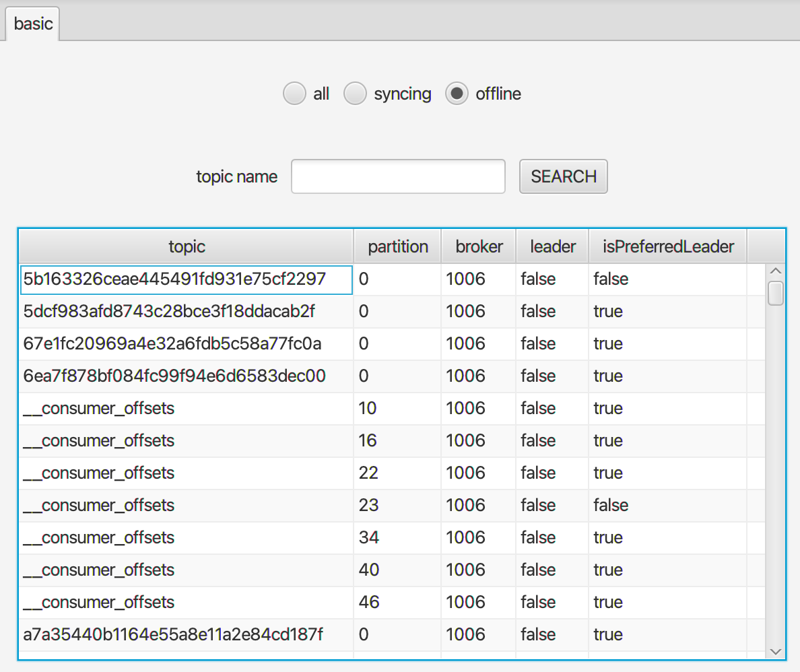

### 查詢 replicas

`Replica` 頁面提供您查詢 `kafka replica` 細節的功能，如下圖預設會查詢所有 `replicas` 並且印出所有資訊

搜尋欄位可以接受 `wildcard` 來查找指定的 `topics`，另外您也可以只搜尋特殊狀況的 `replicas`，例如下圖只列出 `out-of-sync replicas`

最後您也可以查看有哪些 `replicas` 正處於離線狀態，如下圖：

