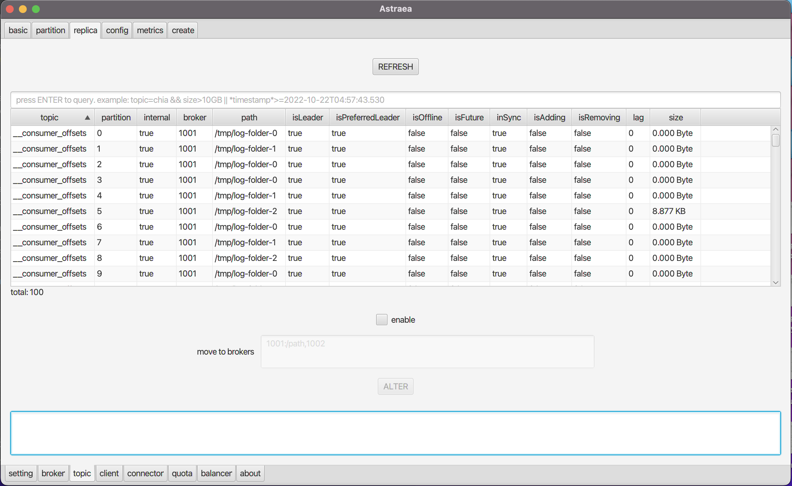

### 查詢 replicas
- [replicas 基本資訊](#調閱-replicas-基本資訊) `Replica`
- [replicas 搬移](#搬移-replicas) `move to brokers`

## 調閱 replicas 基本資訊
`Replica` 頁面提供您查詢 `kafka replica` 的資訊
* 預設會查詢所有 `replicas` , 並且印出所有資訊 

* 可以透過搜尋欄，增加查詢條件（支援Regex)
* Ex: 下圖查詢`InSync=true` 的`replica`

* Ex: 下圖查詢`isOffice=false` 的`replica`

## 搬移 replicas
下方的`move to broker`提供您將`replica` 搬移到不同的broker上
* 參考 [Run Kafka Broker](https://github.com/skiptests/astraea/blob/main/docs/run_kafka_broker.md) 來建立多個Brokers
* 重複執行相同的命令可以產生多個broker (需要相同的 zookeeper.connect)

* Brokers

* replica搬移成功的畫面 (搬移至broker:1003)

