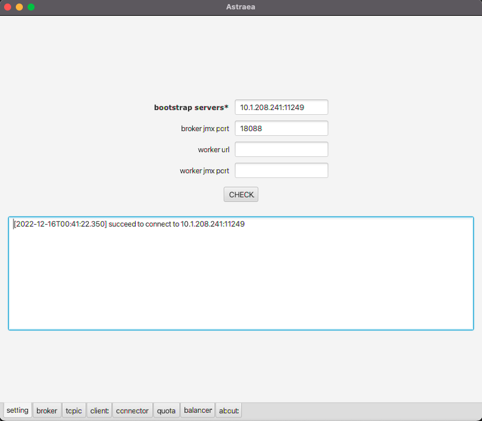

### 設定 Astraea GUI

Astraea GUI 使用 Kafka APIs 與 JMX APIs 來協助管理叢集，因此使用 Astraea GUI 的第一步是先設定`bootstrap servers` 和 `jmx port`，如下圖：

*`bootstrap servers(必要欄位)` : bootstrap的IP, 讓 Astraea GUI 發送 admin request,可參考[Run Kafka Broker](https://github.com/skiptests/astraea/blob/main/docs/run_kafka_broker.md)

*`jmx port(非必要欄位)`: jmx Port , 叢集如果有開啟對外的`jmx`服務，建議設定`jmx port` , Astraea GUI 可透過`jmx`提供豐富的`metrics`查詢功能。可參考 [Run Kafka Broker](https://github.com/skiptests/astraea/blob/main/docs/run_kafka_broker.md)

*`worker url(非必要欄位)` : worker的IP, 讓 Astraea GUI 取得 worker以及connector的相關資訊:可參考 [Run Kafka Worker](https://github.com/skiptests/astraea/blob/main/docs/run_kafka_worker.md)

*`worker jmx port(非必要欄位)` : worker jmx Port

**最後，當您設定好上述資訊後，千萬別忘了點擊`CHECK`來檢查填寫的資訊，如果該些資訊能提供正常的連線服務，下方`console`會顯示出成功連線的資訊。**