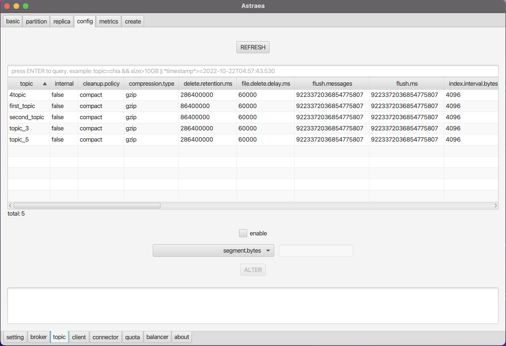

### 調閱及設定 topic

`topic` 頁面提供您調閱及設定 `topic`

#### 調閱
- [topic 基本資訊](#調閱-topic-基本資訊) `basic`
- [topic 配置](#調閱-topic-配置) `config`
- [topic 指標](#調閱-topic-指標) `metrics`

#### 設定
- [建立 topic](#建立-topic) `create`
- [修改 topic](#修改-topic) `alter`
- [刪除 topic](#刪除-topic) `delete`

## 調閱 topic 基本資訊
`basic` 提供您查詢 topic 的資訊。

* 可以透過搜尋欄，增加查詢條件（支援Regex) Ex: 下圖查詢`number of partition = 10` 的`topic`

## 調閱 topic 配置
`config` 提供您查詢 topic 的參數設定，您可以透過搜尋欄位過濾參數的名稱，如下圖查詢有關 segment 的參數
* 各項屬性的意義 , 請參考 [Kafka官方網站](https://docs.confluent.io/platform/current/installation/configuration/topic-configs.html#confluent-key-schema-validation).

## 調閱 topic 指標
`metrics` 提供您查詢 JVM metrics 的能力。
* 上方為各項指標您可以透過搜尋欄位過濾 
* 下圖查詢為各個 `topic` 的 `MessagesInPerSec` 指標
* 各項指標的意義 , 請參考 [Monitoring Kafka](https://docs.confluent.io/platform/current/kafka/monitoring.html#monitoring-ak)

## 建立 topic
`create` 提供您建立 topic 的能力，如下圖建立名稱為 first_topic 的 `topic`
 * 建立出的 Topic , 我們目前提供三個屬性的設定
   (Ex:`clean.policy`, `compression.type`, `delete.retention.ms` 可以用下拉式選單調整)
 * 各項屬性代表的意義 , 請參考 [Kafka官方網站](https://docs.confluent.io/platform/current/installation/configuration/topic-configs.html#confluent-key-schema-validation).

## 修改 topic
`alter` 提供您動態更新 topic 的能力。
* 透過搜尋欄位過濾出指定的 `topic` 後，將 `compression.type` 修改為 `lz4` 演算 
* 下拉式選單可以修改各項屬性
* 各項屬性代表的意義 , 請參考 [Kafka官方網站](https://docs.confluent.io/platform/current/installation/configuration/topic-configs.html#confluent-key-schema-validation).

## 刪除 topic
`Basic` 頁面提供您刪除 topic 的功能。
* 透過搜尋欄位過濾出要刪除的 `topic` 
* 點選 `enable`的按鈕
* 刪除該 `topic`

