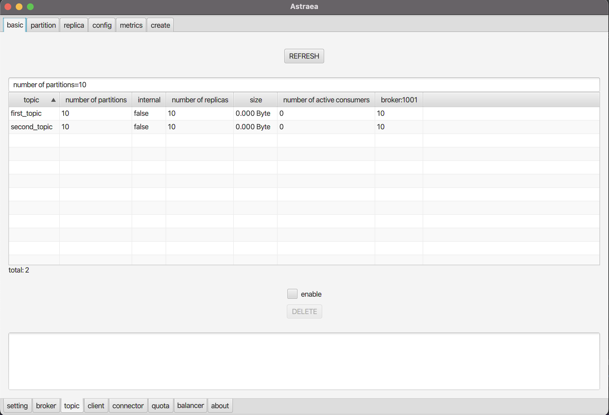
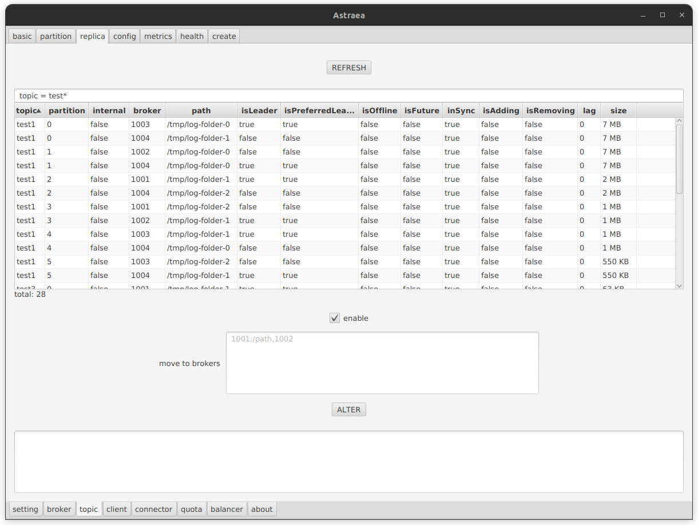
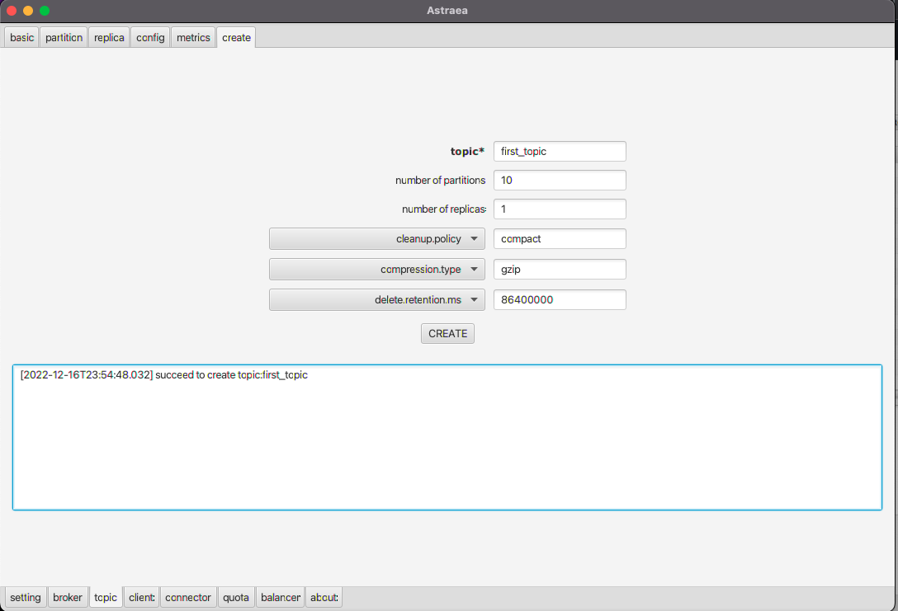

### 調閱及設定 topic

`topic` 頁面提供您調閱及設定 `topic`

#### 各頁面連結
- [topic 基本資訊](#調閱-topic-基本資訊) `basic`
- [partition 資訊](#調閱-partition-資訊) `partition`
- [replica 資訊](#調閱-replica-資訊) `replica`
- [topic 配置](#調閱-topic-配置) `config`
- [topic 指標](#調閱-topic-指標) `metrics`
- [partition 下線情形](#調閱下線-partition) `health`
- [建立 topic](#建立-topic) `create`

## 調閱 topic 基本資訊
`basic` 提供您
1. 查詢 topic 的資訊
2. 刪除指定 `topic`

* 可以透過搜尋欄，增加查詢條件（支援Regex) Ex: 下圖查詢`number of partition = 10` 的`topic`

* 篩選後的`topic`可以透過勾選`enable`後，點擊下方`DELETE`按鈕進行刪除

## 調閱 partition 資訊
`partition` 提供您
1. 查詢 `partition` 的資訊
2. 增加指定 `topic`的 `partition` 
3. 截斷指定 `partiton`的 `offset`

* 透過勾選下方 `enable` 進行設定，點擊 `ALTER` 套用。

範例：篩選`topic=test1 && partition=0`套用以下設定

套用後如下圖所示

## 調閱 replica 資訊
`replica` 提供您
1. 查詢 `replica` 的資訊
2. 搬移 `replica` 到指定 `broker` 或 `path`

* 透過勾選下方 `enable` 進行設定，點擊 `ALTER` 套用。

範例：篩選`topic=test1`套用以下設定

套用後如下圖所示

## 調閱 topic 配置
`config` 提供您查詢 topic 的參數設定，您可以透過搜尋欄位過濾參數的名稱，如下圖查詢有關 segment 的參數
各項屬性的意義 , 請參考 [Kafka官方網站](https://docs.confluent.io/platform/current/installation/configuration/topic-configs.html#confluent-key-schema-validation).

* 透過勾選下方 `enable` 進行設定，點擊 `ALTER` 套用。

範例：篩選`topic=test1`套用以下設定

套用後如下圖所示

## 調閱 topic 指標
`metrics` 提供您查詢 JVM metrics 的能力。
* 上方為各項指標您可以透過搜尋欄位過濾 
* 下圖查詢為各個 `topic` 的 `MessagesInPerSec` 指標
* 各項指標的意義 , 請參考 [Monitoring Kafka](https://docs.confluent.io/platform/current/kafka/monitoring.html#monitoring-ak)

## 調閱下線 partition
`health` 提供您查詢下線的 `partition`

## 建立 topic
`create` 提供您建立 topic 的能力，如下圖建立名稱為 first_topic 的 `topic`
 * 建立出的 Topic , 我們目前提供三個屬性的設定
   (Ex:`clean.policy`, `compression.type`, `delete.retention.ms` 可以用下拉式選單調整)
 * 各項屬性代表的意義 , 請參考 [Kafka官方網站](https://docs.confluent.io/platform/current/installation/configuration/topic-configs.html#confluent-key-schema-validation).

