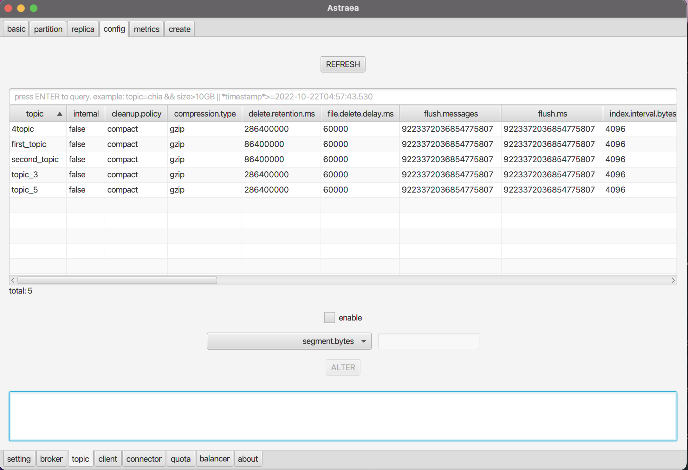
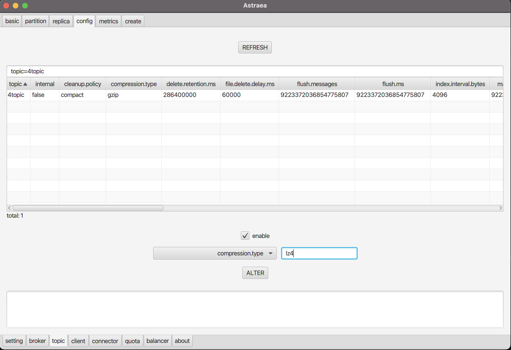

### 調閱及設定 topic

`topic` 頁面提供您調閱及設定 `topic`

#### 調閱
- [topic 基本資訊 `basic`](#調閱 topic 基本資訊)
- [topic 配置 `config`](#調閱 topic 配置)
- [topic 指標 `metrics`](#調閱 topic 指標)

#### 設定
- [建立 topic `create`](#建立 topic)
- [修改 topic `alter`](#修改 topic)
- [刪除 topic `delete`](#刪除 topic)

## 調閱 topic 基本資訊
`basic` 提供您查詢 topic 的資訊，您可以透過搜尋欄位過濾 topic 名稱，如下圖查詢名稱中帶有 test 的 `topic`

## 調閱 topic 配置
`config` 提供您查詢 topic 的參數設定，您可以透過搜尋欄位過濾參數的名稱，如下圖查詢有關 segment 的參數

## 調閱 topic 指標
`metrics` 提供您查詢 JVM metrics 的能力，上方為各項指標，您可以透過搜尋欄位過濾 topic 名稱，如下圖查詢名稱中帶有 test 的 `topic` 的 `MessagesInPerSec` 指標

## 建立 topic
`create` 提供您建立 topic 的能力，如下圖建立名稱為 test5 的 `topic`

## 修改 topic
`alter` 提供您動態更新 topic 的能力，如下圖，透過下拉式選單選擇要修改的 `topic` 後，將 `partitions` 數量增加至 20 個

## 刪除 topic
`delete` 提供您刪除 topic 的能力，如下圖，透過下拉式選單選擇要刪除的 `topic` 後，刪除該 `topic`

