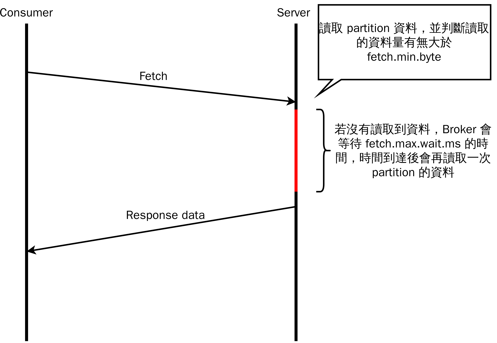

# Kafka Q&A

此文件整理 Kafka 使用上可能會遇到的問題，以及解決方法

1. [單一partition的副本同步速度太慢](#單一partition的副本同步速度太慢)
2. [Consumer poll速度太慢](#consumer-poll速度太慢)
3. [Consumer 的吞吐量會被節點內資料規模差異很大的 partitions 影響](#Consumer 的吞吐量會被節點內資料規模差異很大的 partitions 影響)

## 單一partition的副本同步速度太慢

### 原因

Kafka端處理fetch request時，會有一個迴圈，這個迴圈會在跟os的receive buffer要資料之後還會對這些資料做一些處理，因此每次跟receive buffer poll資料會有一定的時間間隔，而receive buffer預設值是64KB, 若是調大這個buffer size可以讓buffer更慢一點塞滿，也就是說可以讓buffer能放的資料量變更多，塞滿buffer size的時間更長，更加接近每次poll資料的間隔，從而讓fetch的throughput提升

### 解法

調整Broker config中的"replica.socket.receive.buffer.bytes"，建議設定為-1，讓OS來決定buffer size大小

### 副作用

理論上把"replica.socket.receive.buffer.bytes"，調大可以增加throughput沒錯，但是要注意的是，當調大到一定的大小之後，kafka fetch的這端可能會處理的速度比buffer進來的速度還慢，當這個現象發生時，再調大buffer size只會佔用更多的記憶體，而沒辦法再提昇fetch的效能

### 詳細討論

[#1518](https://github.com/skiptests/astraea/issues/1516)

## Consumer poll速度太慢

### 原因

原因跟[單一partition的副本同步速度太慢](#單一partition的副本同步速度太慢)類似，不會一直連續的做fetch，而是fetch一次之後會先做一些處理，因此每次fetch都會有一些間隔

### 解法

調整Consumer config的"receive.buffer.bytes"，建議設定為-1，讓OS來決定buffer size大小

### 副作用

副作用也與[單一partition的副本同步速度太慢](#單一partition的副本同步速度太慢)類似，當buffer size大到consumer來不及處理時，再增加buffer size也沒辦法提升效能，只會佔用額外的記憶體

### 詳細討論

[#1518](https://github.com/skiptests/astraea/issues/1516)

## Consumer 的吞吐量會被節點內資料規模差異很大的 partitions 影響

### 原因

Kafka consumer 吞吐量會被影響的主要原因如下：

* Consumer 讀取資料的邏輯
  * Consumer 靠 fetch request 來讀取分散在各個節點的 partitions 資料，並以 `節點` 為單位來發送 request。而 consumer 會不會對節點發送 fetch request 取決於節點中有沒有 pending request (broker 仍在處理 consumer 的 fetch request)
    * 若節點仍在處理該 consumer 的 request ，則該 consumer 就不會對該節點發送 fetch request
* Broker 讀取資料後的處理方式
  * 處理方式會根據 consumer 所設定的兩個參數有所不同，參數分別為 `fetch.max.wait.ms` 與 `fetch.min.bytes`

#### Example

以下用一個簡單的例子來說明：為何上述說明的主要原因會影響到 consumer 讀取的吞吐量

* Kafka consumer 的參數：[fetch.max.wait.ms](https://kafka.apache.org/documentation/#consumerconfigs_fetch.max.wait.ms) 與 [fetch.min.bytes](https://kafka.apache.org/documentation/#consumerconfigs_fetch.min.bytes) 的預設值為 500ms 與 1byte

Broker 讀取 partition(s) 資料後會去判斷讀取的資料量有無大於 fetch.min.bytes，若低於 fetch.min.byte ，broker 會等待 fetch.max.wait.ms 所設定的時間，等到時間到了 broker 會再去讀一次 partition(s) 的資料

可參照下圖，因為 Kafka 預設的 fetch.min.bytes 為 1 byte ，故可以想成只要有資料 broker 就會馬上將資料 response 給 consumer：

上圖紅線就是影響到 consumer 吞吐量的地方，consumer 發送 fetch request 的頻率被 broker 等待的時間影響

* Consumer 發現 broker 中還有未回覆的 response ，所以不會發送 fetch request 給該 broker

### 解法

* 將 Consumer 端的 `fetch.max.wait.ms` 參數調小
  * `fetch.max.wait.ms` 調小後可以讓 broker 比較快速的回應 consumer， consumer 就能夠再對該 broker 發送 fetch request

### 副作用

* 影響到 broker 服務的頻寬
  * 因為 consumer 發送 fetch request 的頻率上升，broker 端所承受的 request rate 上升，可能會影響到 broker 其他服務的頻寬

### 詳細討論

[#1475](https://github.com/skiptests/astraea/issues/1475)
