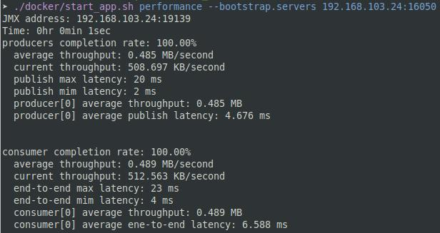

### Performance Benchmark

此工具可產生各種不同類型的資料集來測試讀寫速度、E2E的延遲。資料集包含：

1. 大量小資料寫入
2. 大量大資料寫入
3. 混合型資料寫入
4. 具交易行為的資料寫入

可量測的數據如下：

1. Publish latency : 完成producer request的時間
2. End-to-End latency : 一筆record從producer端到consumer端的時間
3. Consume rate : consumer拉取資料的速率(MB/s)
4. Produce rate : producer送資料的速率(MB/s)

#### Performance Benchmark Configurations

|        參數名稱        | 說明                                                                                                                                                                                                                                                                    |           預設值            |
|:------------------:|:----------------------------------------------------------------------------------------------------------------------------------------------------------------------------------------------------------------------------------------------------------------------|:------------------------:|
| bootstrap.servers  | (必填) 欲連接的Kafka server address                                                                                                                                                                                                                                         |            無             |
|       topics       | (必填) 指定要用來測試讀寫的 topics <br />例如 : --topics test,test1,test2                                                                                                                                                                                                           |            無             |
|     consumers      | (選填) 欲開啟的consumer thread(s)數量                                                                                                                                                                                                                                         |            1             |
|     producers      | (選填) 欲開啟的producer thread(s)數量                                                                                                                                                                                                                                         |            1             |
|     run.until      | (選填) 可選擇兩種結束執行的模式，一種是發送records數量達到設定值，另一種則是執行時間達到設定值，格式為`數值`+`單位`<br />1. 選擇producers要送多少records，範例：發送89000 records 後結束，"--run.until 89000records"<br />2. 選擇producer在給定時間內發送資料，時間單位可以選擇`days`, `day`, `h`, `m`, `s`, `ms`, `us`, `ns`，範例：執行一分鐘後結束， "--run.until 1m"。 |       1000records        |
|      key.size      | (選填) 每筆record key的大小上限                                                                                                                                                                                                                                                |          4Byte           |
|  key.distribution  | (選填) key的分佈，可用的分佈為：`uniform`, `zipfian`, `latest`, `fixed`                                                                                                                                                                                                            |         uniform          |
|     value.size     | (選填) 每筆record value的大小上限                                                                                                                                                                                                                                              |           1KiB           |
| value.distribution | (選填) value的分佈， 可用的分佈為: `uniform`, `zipfian`, `latest`, `fixed`                                                                                                                                                                                                        |         uniform          |
|     prop.file      | (選填) 配置property file的路徑                                                                                                                                                                                                                                               |           none           |
|    partitioner     | (選填) 配置producer使用的partitioner                                                                                                                                                                                                                                         |           none           |
|      configs       | (選填) 給partitioner的設置檔。 設置格式為 "\<key1\>=\<value1\>[,\<key2\>=\<value2\>]*"。 <br />例如: "--configs broker.1001.jmx.port=14338,org.astraea.cost.ThroughputCost=1"                                                                                                         |           none           |
|     throughput     | (選填) 用來限制輸出資料的速度, 範例： "--throughput 2MiB/m", "--throughput 2GB" 預設值是秒 <br/>大小單位: MB, MiB, Kb etc. <br />時間單位: second(s), minute(m), hour(h), day(d) or PT expression(PT30S)                                                                                           |      500 GiB/second      |
|  specify.brokers   | (選填) 指定broker的ID，送資料到指定的broker，若 broker 上有 "目標 topic 的 partition"                                                                                                                                                                                                     |           none           |
| specify.partitions | (選填) 指定要傳送資料的 topic/partitions，多個項目之間可以用逗號隔開，注意這個選項不能和 `specify.brokers` 或 `partitioner` 一起使用                                                                                                                                                                         |           none           |
|    report.path     | (選填) report file的檔案路徑                                                                                                                                                                                                                                                 |           none           |
|   report.format    | (選填) 選擇輸出檔案格式, 可用的格式：`csv`, `json`                                                                                                                                                                                                                                    |           csv            |
|  transaction.size  | (選填) 每個transaction的records數量。若設置1以上，會使用transaction，否則都是一般write                                                                                                                                                                                                        |            1             |
|      group.id      | (選填) 設置 consumer group id                                                                                                                                                                                                                                             | groupId-{Time in millis} |
|     read.idle      | (選填) 讀取端將被終止如果超過這個時間沒有讀取到新的資料                                                                                                                                                                                                                                         |            2秒            |
| interdependent.size | (選填) 每幾筆 record 要發到同一個 partition。(注意：只有 Astraea Dispatcher 可以使用) |            1             |

#### 使用範例

專案內的工具都有整合到`container`中，使用者利用docker運行，可方便管理，使用前請注意兩件事情：

1. 確認自己的Kafka server ip，並且Kafka 有正常運作，關於啟動Kafka 可參考 [run_kafka_broker](run_kafka_broker.md)。
2. 可使用 [Web Service](web_server/README.md) 來建構測試用途的 `topics`

使用`docker`執行`performance benchmark`

```bash 
docker/start_app.sh performance --bootstrap.servers localhost:9092
```

(localhost, 9092 替換成自己Kafka server 的 ip 和 port)



`performance benchmark`可以指定各種參數如資料大小、分佈、執行時間... 等等。全部參數可以參考上述表格。

以下僅列出一些使用範例：

```bash
# 開啟 1 個 producer 打 25 分鐘資料， 1 個 consumer 消費資料
docker/start_app.sh performance --bootstrap.servers localhost:9092 --run.until 25m
```

```bash
# 開啟 1 個 producer ，打 10000 筆資料 且 沒有consumer
docker/start_app.sh performance --bootstrap.servers localhost:9092 --run.until 10000records --consumers 0
```

```bash
# 打50秒資料、每筆大小10KiB、固定大小、使用4個producer threads、10個consumer threads，指定topic名稱，producer送資料前使用 lz4 壓縮演算法
docker/start_app.sh performance --bootstrap.servers localhost:9092 --value.size 10KiB --value.distribution fixed --run.until 50s --producers 4 --consumers 10 --topic partition60Replica1 --compression lz4
```

```bash
# 使用astraea的 partitioner ，傳入config檔案路徑，裡面可以放 partitioner 所需的參數，如jmx port等
docker/start_app.sh performance --bootstrap.servers localhost:9092 --partitioner org.astraea.app.partitioner.smooth.SmoothWeightRoundRobinDispatcher --prop.file ./config
```

```bash
# 使用 partitioner 框架，指定參考 Broker Input 做效能指標，把紀錄輸出到指定路徑。
docker/start_app.sh performance --bootstrap.servers localhost:9092 --partitioner org.astraea.common.partitioner.StrictCostDispatcher --configs org.astraea.common.cost.BrokerInputCost=1 --prop.file ./config --report.path ~/report
```


