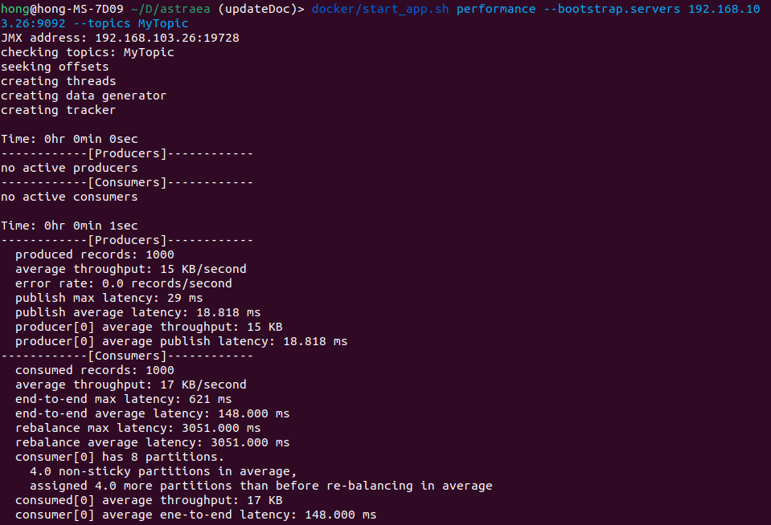

### Performance Benchmark

此工具可產生各種不同類型的資料集來測試讀寫速度、E2E的延遲。資料集包含：

1. 大量小資料寫入
2. 大量大資料寫入
3. 混合型資料寫入
4. 具交易行為的資料寫入

可量測的數據如下：

1. Publish latency : 完成producer request的時間
2. End-to-End latency : 一筆record從producer端到consumer端的時間
3. Consume rate : consumer拉取資料的速率(MB/s)
4. Produce rate : producer送資料的速率(MB/s)
5. Produce record error rate : 發送資料時錯誤的頻率
6. rebalance latency : consumer group 平衡所花的時間
7. consumer assigned partitions : consumer 被 assigned partition 數量、non-sticky partition 數量平均（註1）、數量差平均（註1）

註1：此平均是以 exponential average 計算，反應最新幾次發生的數值。

#### Performance Benchmark Configurations

|             參數名稱             | 說明                                                                                                                                                                                                                                                                    |           預設值            |
|:----------------------------:|:----------------------------------------------------------------------------------------------------------------------------------------------------------------------------------------------------------------------------------------------------------------------|:------------------------:|
|      bootstrap.servers       | (必填) 欲連接的Kafka server address                                                                                                                                                                                                                                         |            無             |
|            topics            | (必填) 指定要用來測試讀寫的 topics <br />例如 : --topics test,test1,test2                                                                                                                                                                                                           |            無             |
|           pattern            | (選填) 利用正則表達式來指定 consumers 訂閱的 pattern topics，使用此參數後 consumers 只會用 pattern 訂閱<br />例如：--pattern p.*<br />若要訂閱多個 pattern 可用 &vert;&vert; 來分隔 ，例如：--pattern a.&vert;&vert;test.                                                                                          |            無             |
|          consumers           | (選填) 欲開啟的consumer thread(s)數量                                                                                                                                                                                                                                         |            1             |
|          producers           | (選填) 欲開啟的producer thread(s)數量                                                                                                                                                                                                                                         |            1             |
|          run.until           | (選填) 可選擇兩種結束執行的模式，一種是發送records數量達到設定值，另一種則是執行時間達到設定值，格式為`數值`+`單位`<br />1. 選擇producers要送多少records，範例：發送89000 records 後結束，"--run.until 89000records"<br />2. 選擇producer在給定時間內發送資料，時間單位可以選擇`days`, `day`, `h`, `m`, `s`, `ms`, `us`, `ns`，範例：執行一分鐘後結束， "--run.until 1m"。 |       1000records        |
|    record.key.table.seed     | (選填) 產生 Record Key 表格內容的亂數產生器種子，當嘗試於多臺設備啟動 Performance Tool 時，可以嘗試給各 Performance Tools 設定一樣的亂數種子，如此一來所有 instance 的 Key Table 會是一樣的長相。當套用不平衡的機率分佈時，這可以使多個 Performance Tool 對當前的 hot key 有共識                                                                            |           隨機值            |
|   record.value.table.seed    | (選填) 產生 Record Value 表格內容的亂數產生器種子，當嘗試於多臺設備啟動 Performance Tool 時，可以嘗試給各 Performance Tools 設定一樣的亂數種子，如此一來所有 instance 的 Value Table 會是一樣的長相。當套用不平衡的機率分佈時，這可以使多個 Performance Tool 對當前的 hot value 有共識                                                                      |           隨機值            |
|           key.size           | (選填) 每筆record key的大小上限                                                                                                                                                                                                                                                |          4Byte           |
|    key.size.distribution     | (選填) key 欄位的大小的分佈，可用的分佈為：`uniform`, `zipfian`, `latest`, `fixed`                                                                                                                                                                                                      |          fixed           |
| key.size.distribution.config | (選填) key 欄位的大小的機率分佈參數，為一連串以逗號相隔的 `key=value` pair，每個機率分佈支援的參數可能不同，可以參考 [機率分佈參數](#機率分佈參數)                                                                                                                                                                              |          fixed           |
|       key.distribution       | (選填) key 的選用分佈，選用不平均的分佈可以做到 Hotspot 或 Skew Load 的效果，可用的分佈為：`uniform`, `zipfian`, `latest`, `fixed`                                                                                                                                                                    |         uniform          |
|   key.distribution.config    | (選填) key 欄位的選擇的機率分佈參數，為一連串以逗號相隔的 `key=value` pair，每個機率分佈支援的參數可能不同，可以參考 [機率分佈參數](#機率分佈參數)                                                                                                                                                                              |          fixed           |
|          value.size          | (選填) 每筆record value的大小上限                                                                                                                                                                                                                                              |           1KiB           |
|      value.distribution      | (選填) value 的分佈， 可用的分佈為: `uniform`, `zipfian`, `latest`, `fixed`                                                                                                                                                                                                       |         uniform          |
|  value.distribution.config   | (選填) value 欄位的選擇的機率分佈參數，為一連串以逗號相隔的 `key=value` pair，每個機率分佈支援的參數可能不同，可以參考 [機率分佈參數](#機率分佈參數)                                                                                                                                                                            |          fixed           |
|          prop.file           | (選填) 配置property file的路徑                                                                                                                                                                                                                                               |           none           |
|         partitioner          | (選填) 配置producer使用的partitioner                                                                                                                                                                                                                                         |           none           |
|           configs            | (選填) 給partitioner的設置檔。 設置格式為 "\<key1\>=\<value1\>[,\<key2\>=\<value2\>]*"。 <br />例如: "--configs broker.1001.jmx.port=14338,org.astraea.cost.ThroughputCost=1"                                                                                                         |           none           |
|          throughput          | (選填) 用來限制輸出資料的速度, 範例： "--throughput 2MiB/m", "--throughput 2GB" 預設值是秒 <br/>大小單位: MB, MiB, Kb etc. <br />時間單位: second(s), minute(m), hour(h), day(d) or PT expression(PT30S)                                                                                           |      500 GiB/second      |
|       specify.brokers        | (選填) 指定broker的ID，送資料到指定的broker，若 broker 上有 "目標 topic 的 partition"                                                                                                                                                                                                     |           none           |
|      specify.partitions      | (選填) 指定要傳送資料的 topic/partitions，多個項目之間可以用逗號隔開，注意這個選項不能和 `specify.brokers` 、`throttle` 或 `partitioner` 一起使用                                                                                                                                                             |           none           |
|         report.path          | (選填) report file的檔案路徑                                                                                                                                                                                                                                                 |           none           |
|        report.format         | (選填) 選擇輸出檔案格式, 可用的格式：`csv`, `json`                                                                                                                                                                                                                                    |           csv            |
|       transaction.size       | (選填) 每個transaction的records數量。若設置1以上，會使用transaction，否則都是一般write                                                                                                                                                                                                        |            1             |
|           group.id           | (選填) 設置 consumer group id                                                                                                                                                                                                                                             | groupId-{Time in millis} |
|          read.idle           | (選填) 讀取端將被終止如果超過這個時間沒有讀取到新的資料                                                                                                                                                                                                                                         |            2秒            |
|     interdependent.size      | (選填) 每幾筆 record 要發到同一個 partition。(注意：只有 Astraea Partitioner 可以使用)                                                                                                                                                                                                      |            1             |
|           monkeys            | (選填) 設定 chaos monkey 的觸發頻率，支援 : `kill`, `add`, `unsubscribe`。<br />觸發頻率單位為 ：day, h, m, s, ms, us, ns<br />範例：`--monkeys kill:3s,add:5s`                                                                                                                               |           none           |
|           throttle           | (選填) 用來指定 topic-partitions 的限流值<br />例如：--throttle a1-0:5MB/s,a2-0:10MB/s,a10-4:30MB/s<br />注意此參數不可與`specify.partitions`、`specify.brokers` 或`partitioner` 一起使用                                                                                                        |           none           |

##### 機率分佈參數

* uniform 分佈參數
  * 無
* zipfain 分佈參數
    * `seed`: 機率分佈背後的亂數產生器採用的種子，預設是一個執行時決定的隨機值。
    * `exponent`: Zipfian 機率分佈的指數參數，數值越高、傾斜趨勢越強烈，預設值是 1。
* latest 分佈參數
    * 無
* fixed 分佈參數
    * 無

#### 使用範例

專案內的工具都有整合到`container`中，使用者利用docker運行，可方便管理，使用前請注意兩件事情：

1. 確認自己的Kafka server ip，並且Kafka 有正常運作，關於啟動Kafka 可參考 [run_kafka_broker](run_kafka_broker.md)。
2. 可使用 [Web Service](web_server/README.md) 來建構測試用途的 `topics`

使用`docker`執行`performance benchmark`

```bash 
docker/start_app.sh performance --bootstrap.servers 192.168.103.26:9092 --topics MyTopic
```

(192.168.103.26, 9092 替換成自己Kafka server 的 ip 和 port)



`performance benchmark`可以指定各種參數如資料大小、分佈、執行時間... 等等。全部參數可以參考上述表格。

以下僅列出一些使用範例：

```bash
# 開啟 1 個 producer 打 25 分鐘資料， 1 個 consumer 消費資料
docker/start_app.sh performance --bootstrap.servers 192.168.103.26:9092 --topics MyTopic --run.until 25m
```

```bash
# 開啟 1 個 producer ，打 10000 筆資料 且 沒有consumer
docker/start_app.sh performance --bootstrap.servers 192.168.103.26:9092 --topics MyTopic --run.until 10000records --consumers 0
```

```bash
# 打50秒資料、每筆大小10KiB、固定大小、使用4個producer threads、10個consumer threads，指定topic名稱，producer送資料前使用 lz4 壓縮演算法
docker/start_app.sh performance --bootstrap.servers 192.168.103.26:9092 --topics MyTopic --value.size 10KiB --value.distribution fixed --run.until 50s --producers 4 --consumers 10 --topics MyTopic --configs compression.type=lz4
```

```bash
# 使用astraea的 partitioner ，傳入config檔案路徑，裡面可以放 partitioner 所需的參數，如jmx port等
docker/start_app.sh performance --bootstrap.servers 192.168.103.26:9092 --topics MyTopic --partitioner org.astraea.common.partitioner.StrictCostPartitioner --prop.file ./config
```

```bash
# 使用 partitioner 框架，指定參考 Broker Input 做效能指標，把紀錄輸出到指定路徑。
docker/start_app.sh performance --bootstrap.servers 192.168.103.26:9092 --topics MyTopic --partitioner org.astraea.common.partitioner.StrictCostPartitioner --configs org.astraea.common.cost.BrokerInputCost=1 --prop.file ./config --report.path ~/report
```

```bash
# 使用 throttle 功能，限制 producers 送進 a1-0 與 a3-1 的資料量在 20MB/s 與 10MB/s 內
docker/start_app.sh performance --bootstrap.servers 192.168.103.26:9092 --topics a1,a2,a3 --producers 5 --consumers 0 --throttle a1-0:20MB/s,a3-1:10MB/s --run.until 5m
```

