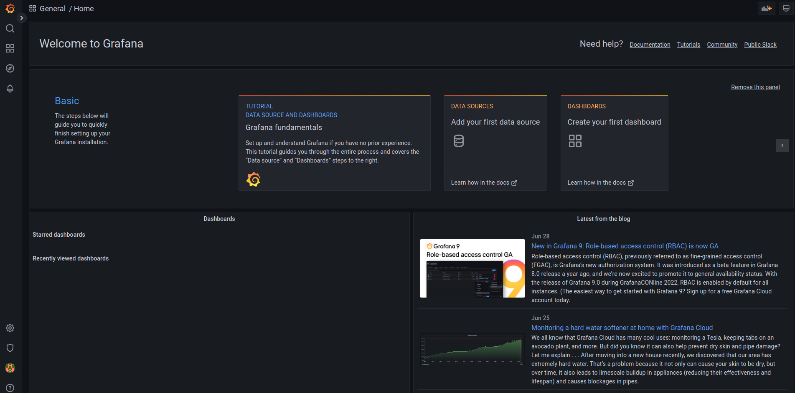

### Run Grafana

[Grafana](https://github.com/grafana/grafana)是一個以圖形化界面呈現服務狀態的開源軟體，使用者可以將資料來源端與Grafana連結，並讓使用者能以圖形化的方式觀看服務、系統一段時間內的數據

#### Start Grafana

此專案有整合Grafana到Docker，利用腳本啟動Grafana container

```bash
./docker/start_grafana.sh start
```

`http://192.168.0.2:3000`為觀看圖形化界面的網頁，預設的username/password為admin/admin

```bash
aa8a47da91a2e0974a38690525f9148c9697f7ffc752611ef06248ffb09ef53a
[INFO] Default username/password for grafana docker image is admin/admin
[INFO] Access Grafana dashboard here:  http://192.168.0.2:3000
```

##### Access Grafana dashboard

進入`http://192.168.0.2:3000`後，會出現下圖


預設的使用者帳號/密碼為admin，登錄後可看到Grafana的界面



#### Add Prometheus DataSource

Grafana是呈現數據的軟體，需要設置資料的來源

如下指令，設置Prometheus的資料來源給Grafana

```bash
./docker/start_grafana.sh add_prom_source <USERNAME>:<PASSWORD> Prometheus http://192.168.0.2:9090
```

資料來源端的描述:

```bash
{
  "datasource": {
    "id": 1,
    "uid": "7jbIw-Tnz",
    "orgId": 1,
    "name": "Prometheus",
    "type": "prometheus",
    "typeLogoUrl": "",
    "access": "proxy",
    "url": "http://192.168.0.2:9090",
    "password": "",
    "user": "",
    "database": "",
    "basicAuth": false,
    "basicAuthUser": "",
    "basicAuthPassword": "",
    "withCredentials": false,
    "isDefault": false,
    "jsonData": {},
    "secureJsonFields": {},
    "version": 1,
    "readOnly": false
  },
  "id": 1,
  "message": "Datasource added",
  "name": "Prometheus"
}
```

