### Run Grafana

[Grafana](https://github.com/grafana/grafana)是一個以圖形化界面呈現服務狀態的開源軟體，使用者可以將資料來源端與Grafana連結，並讓使用者能以圖形化的方式觀看服務、系統一段時間內的數據

#### Start Grafana

此專案有整合Grafana到Docker，利用腳本啟動Grafana container

```bash
./docker/start_grafana.sh start
```

`http://192.168.0.2:3000`為觀看圖形化界面的網頁，預設的username/password為admin/admin

```bash
aa8a47da91a2e0974a38690525f9148c9697f7ffc752611ef06248ffb09ef53a
[INFO] Default username/password for grafana docker image is admin/admin
[INFO] Access Grafana dashboard here:  http://192.168.0.2:3000
```

##### Access Grafana dashboard

進入`http://192.168.0.2:3000`後，會出現下圖


預設的使用者帳號/密碼為admin，登錄後可看到Grafana的界面


#### Add Prometheus DataSource

Grafana是呈現數據的軟體，需要設置資料的來源

##### Add DataSource via CLI

如下指令，設置[Prometheus](./run_prometheus.md)的資料來源給Grafana

```bash
./docker/start_grafana.sh add_prom_source <USERNAME>:<PASSWORD> Prometheus http://192.168.0.2:9090
```

資料來源端的描述:

```bash
{
  "datasource": {
    "id": 1,
    "uid": "7jbIw-Tnz",
    "orgId": 1,
    "name": "Prometheus",
    "type": "prometheus",
    "typeLogoUrl": "",
    "access": "proxy",
    "url": "http://192.168.0.2:9090",
    "password": "",
    "user": "",
    "database": "",
    "basicAuth": false,
    "basicAuthUser": "",
    "basicAuthPassword": "",
    "withCredentials": false,
    "isDefault": false,
    "jsonData": {},
    "secureJsonFields": {},
    "version": 1,
    "readOnly": false
  },
  "id": 1,
  "message": "Datasource added",
  "name": "Prometheus"
}
```

##### Add DataSource via Grafana GUI

因為本專案有提供 Prometheus ，故以匯入 Prometheus 為例，說明如何使用 Grafana GUI 匯入 Data Source

在使用 Grafana 前請先將 Prometheus 開啟，可參考專案的 Prometheus 文件

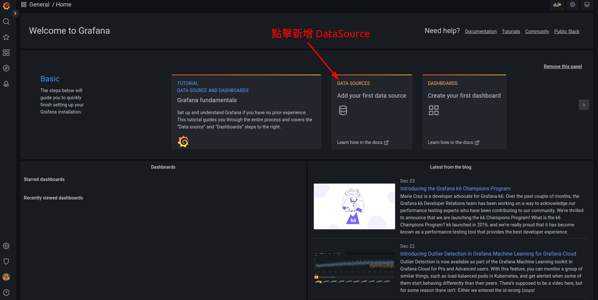

如上圖所示，進入 Grafana 後可以看到 `Data Sources`，點擊後可選擇要新增哪種 Data Source。

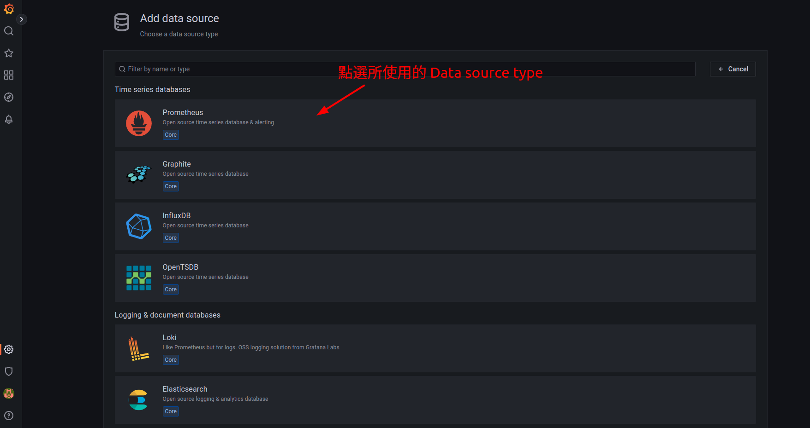

點擊 `Data Source` 後可以看到各種 data source type，點擊 Prometheus 後開始設置

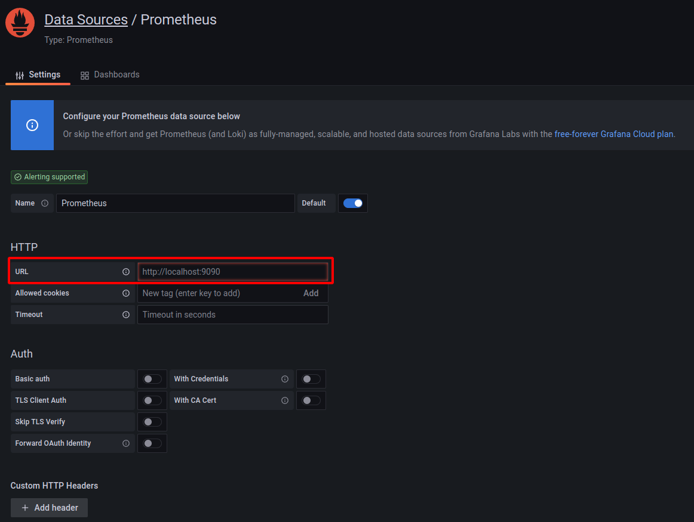

點擊 Prometheus 後開始設置 DataSource，需要設置 `Prometheus 的 URL`，讓 Grafana 可以利用 HTTP 取得 metric 值

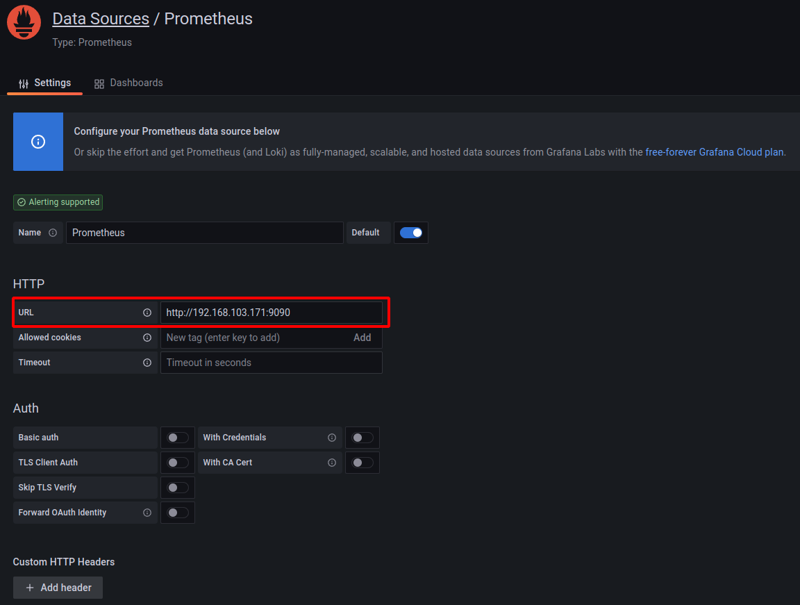

將 Prometheus address 輸入到 URL 後就可以移到網頁下方測試有無連線成功

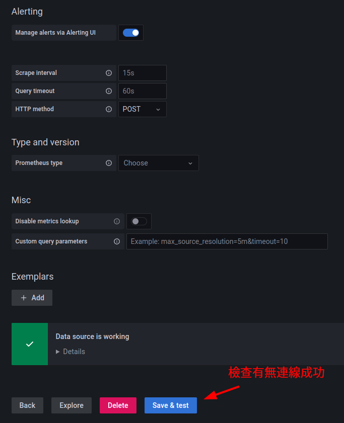

若有連線成功，就可以看到 Data source is working

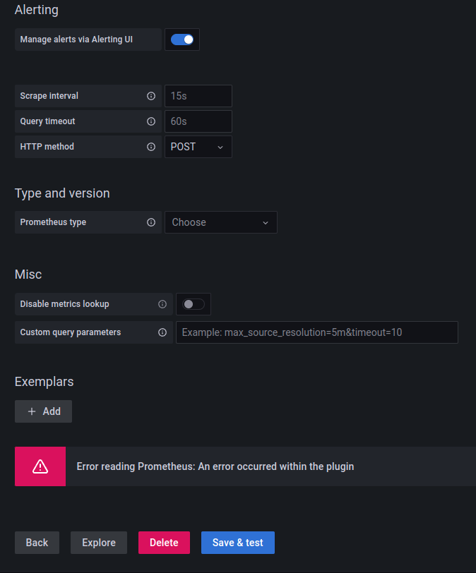

若是連線失敗，就會看到 Error reading Prometheus，可能要去看 Prometheus 的 URL 有沒有輸入錯誤、 Prometheus 有無正常運行等等


連線成功後，就可以去 Dashboard 中 query 希望監控的 metrics 並以圖形化的方式來呈現

### 建立 Dashboard 與 Panel

建立完 DataSource 後，就可以利用 dashboard 來呈現效能相關的圖表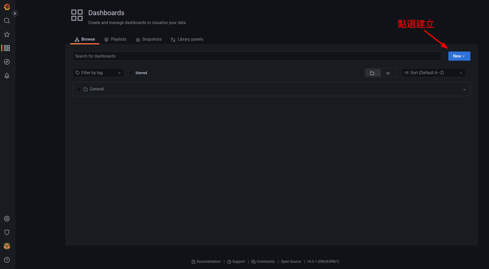

建立一個 new dashboard 後，再建立 new panel 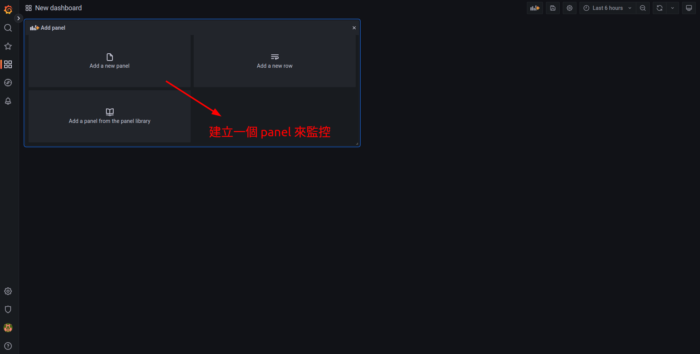

此處的範例以 **Code queries** 為例，在 query 前請先確認 Data source 有選擇 Prometheus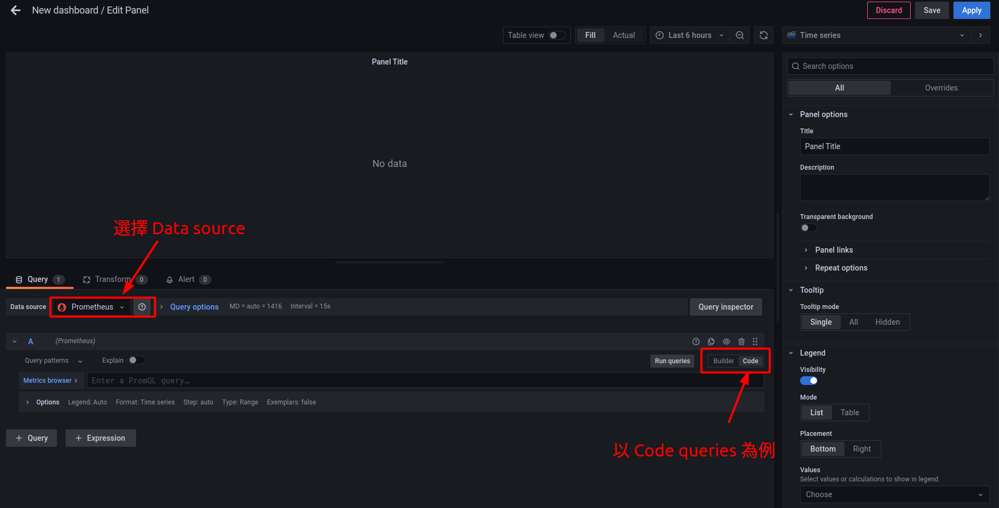

### 利用 query 來建立效能相關圖表

以 **kafka_log_log_size** 這個 metrics 為例

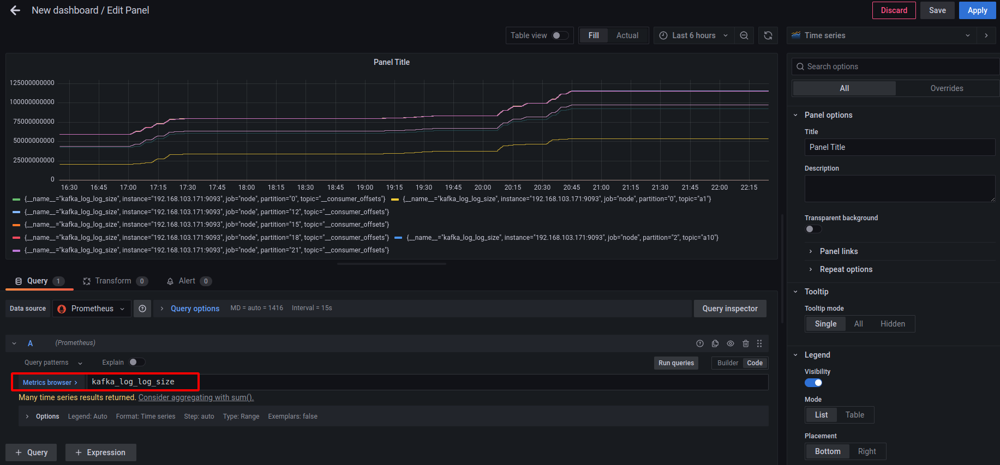

輸入 kafka_log_log_size 後可以在 panel 上看到許多條**線**，每一條**線**代表每一個 topic-partition 在不同時間點時的資料量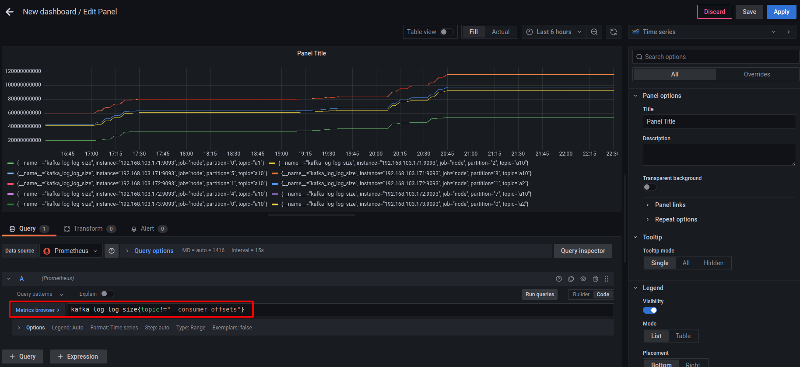

若想忽略 Kafka 的 inner topic ，如 `__consumer_offsets` ，可以將之過濾，這樣在圖表中呈現時就不會出現 inner topic 的 log size

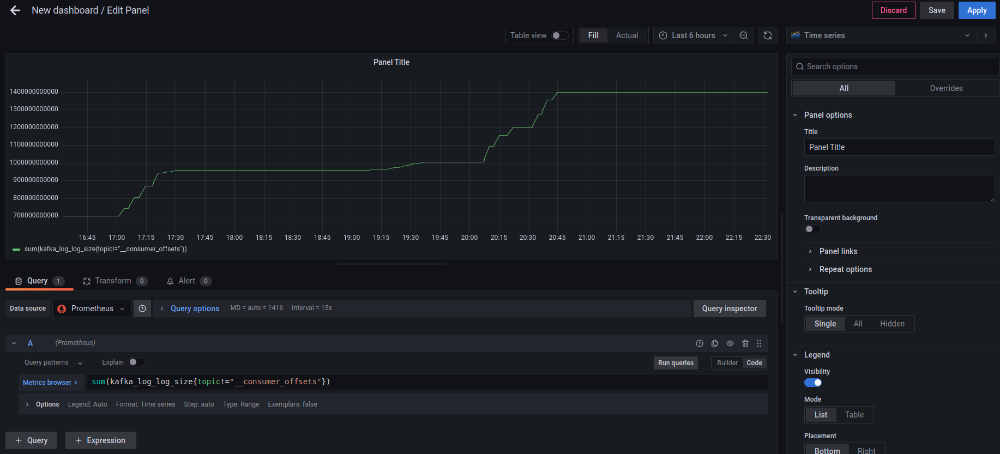

若想看叢集內所有的 log size 加總，可以在前面加上 sum 來呈現
