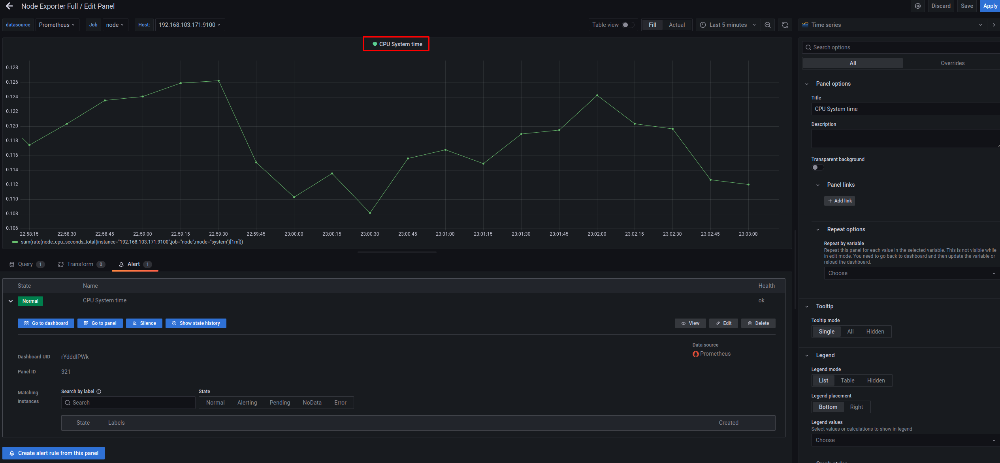

## Grafana readme

- [Run Grafana](#Run-Grafana)
  - [Start Grafana](#Start-Grafana)
    - [Access Grafana dashboard](#Access-Grafana-dashboard)
- [Add Prometheus DataSource](#Add-Prometheus-DataSource)
  - [Add DataSource via CLI](#Add-DataSource-via-CLI)
  - [Add DataSource via Grafana GUI](#Add-DataSource-via-Grafana-GUI)
- [建立 Dashboard 與 Panel](#建立-Dashboard-與-Panel)
  - [新增自定義的 dashboard](#新增自定義的-dashboard)
  - [Import 別人寫好的 dashboard](#Import-別人寫好的-dashboard)
- [利用 query 來建立效能相關圖表](#利用-query-來建立效能相關圖表)
  - [列出特定指標](#列出特定指標)
  - [針對特定 metrics 做處理](#針對特定-metrics-做處理)
    - [過濾不想監控的 topic](#過濾不想監控的-topic)
    - [加總 metrics 的值](#加總-metrics-的值)
    - [新增額外的 Query](#新增額外的-Query)
    - [使用 rate 呈現圖表](#使用-rate-呈現圖表)
    - [修改 y 軸的資料單位](#修改-y-軸的資料單位)
- [監控特定 metrics 數值發出警告](#監控特定-metrics-數值發出警告)
- [發生 alert 的範例](#發生-alert-的範例)

### Run Grafana

[Grafana](https://github.com/grafana/grafana)是一個以圖形化界面呈現服務狀態的開源軟體，使用者可以將資料來源端與Grafana連結，並讓使用者能以圖形化的方式觀看服務、系統一段時間內的數據

#### Start Grafana

此專案有整合Grafana到Docker，利用腳本啟動Grafana container

```bash
./docker/start_grafana.sh start
```

`http://192.168.0.2:3000`為觀看圖形化界面的網頁，預設的username/password為admin/admin

```bash
aa8a47da91a2e0974a38690525f9148c9697f7ffc752611ef06248ffb09ef53a
[INFO] Default username/password for grafana docker image is admin/admin
[INFO] Access Grafana dashboard here:  http://192.168.0.2:3000
```

##### Access Grafana dashboard

利用專案的腳本部署 Grafana 後，console 會顯示可以 access Grafana 的網址，如上例為 `http://192.168.0.2:3000`，進入`http://192.168.0.2:3000`後會出現登入選單，如下圖


預設的使用者帳號/密碼皆為admin，登錄後可看到Grafana的界面


#### Add Prometheus DataSource

Grafana是呈現數據的軟體，需要設置資料的來源，目前有兩種匯入 DataSource 到 Grafana 的方式，分別是

1. Command-Line Interface (CLI)，在 terminal 上輸入指令設置 data source
2. Graphical User Interface (GUI)，在 Grafana 的 GUI 界面設置 data source

##### Add DataSource via CLI

如下指令，設置[Prometheus](./run_prometheus.md)的資料來源給Grafana

```bash
./docker/start_grafana.sh add_prom_source <USERNAME>:<PASSWORD> Prometheus http://192.168.0.2:9090
```

資料來源端的描述:

```bash
{
  "datasource": {
    "id": 1,
    "uid": "7jbIw-Tnz",
    "orgId": 1,
    "name": "Prometheus",
    "type": "prometheus",
    "typeLogoUrl": "",
    "access": "proxy",
    "url": "http://192.168.0.2:9090",
    "password": "",
    "user": "",
    "database": "",
    "basicAuth": false,
    "basicAuthUser": "",
    "basicAuthPassword": "",
    "withCredentials": false,
    "isDefault": false,
    "jsonData": {},
    "secureJsonFields": {},
    "version": 1,
    "readOnly": false
  },
  "id": 1,
  "message": "Datasource added",
  "name": "Prometheus"
}
```

##### Add DataSource via Grafana GUI

因為本專案有提供 Prometheus ，故以匯入 Prometheus 為例，說明如何使用 Grafana GUI 匯入 Data Source

在使用 Grafana 前請先將 Prometheus 開啟，可參考專案的 [Prometheus 文件](./run_prometheus.md) 


1. 如上圖所示，進入 Grafana 後可以看到 `Data Sources`，點擊後可選擇要新增哪種 Data Source。


2. 點擊 `Data Source` 後可以看到各種 data source type，點擊 Prometheus 後開始設置


3. 點擊 Prometheus 後開始設置 DataSource，需要設置 `Prometheus 的 URL`，讓 Grafana 可以利用 HTTP 取得 metric 值


4. 將 Prometheus address 輸入到 URL 後就可以移到網頁下方測試有無連線成功


5. 若有連線成功，就可以看到 Data source is working


6. 若是連線失敗，就會看到 Error reading Prometheus，可能要去看 Prometheus 的 URL 有沒有輸入錯誤、 Prometheus 有無正常運行等等


連線成功後，就可以去 Dashboard 中 query 希望監控的 metrics 並以圖形化的方式來呈現

### 建立 Dashboard 與 Panel

建立完 DataSource 後，就可以利用 dashboard 來呈現效能相關的圖表

dashboard 的建立**有兩種方式**：

1. 自己新增自定義的 dashboard ，可依照使用者想監控的 metrics 來自行建置圖表
2. Import [別人寫好的 dashboard](https://grafana.com/grafana/dashboards/)，廣大的網友們會分享自己使用的 dashboard ，可以依靠匯入 dashboard ID 來 import dashboard

#### 新增自定義的 dashboard


1. 進入 Dashboard 的 GUI 畫面後，點選右上角的 New 來新增一個自定義的 dashboard


2. 建立一個自定義的 dashboard 後，再點擊 Add a new panel 來建立 new panel 


3. 可在方框中輸入 query 的指令，並按下右上角的 Apply 來完成編輯


4. 按下 Apply 後就可以在 Dashboard 中看到剛剛所編輯的 Panel

#### Import 別人寫好的 dashboard

[Grafana Labs](https://grafana.com/grafana/dashboards/) 中有許多人寫好的 dashboard ，可以到網站上取得 ID 來 import dashboard


1. 點擊 Grafana GUI 的 Dashboards 中的 Import 來輸入別人的 dashboard ID，可由上方的網站上查詢自己喜歡的樣式


2. 可在上方圖片欄位中輸入 dashboard ID


3. 在 Grafana Labs 中選擇一個自己要監控的 metrics 中有人寫好的 dashboard，這邊以 **Node Exporter Full** 舉例說明。


4. 進入 Node Exporter Full 的頁面後，可以看到右方有提供 dashboard 可 import 的 ID: 1860


5. 取得 dashboard ID 後，就可以輸入到 Import via grafana.com 欄位內，並按下 Load 按鈕


6. 按下 Load 後會出現上方的畫面，要選擇圈選處的 DataSource 才能抓到 metrics，選擇完後按下 Import


7. 正常 Import 後就可以看到 dashboard 有許多的 metrics 可以看到，詳細的 metrics 物理意義說明可以參考 [Node Exporter](https://github.com/prometheus/node_exporter)

### 利用 query 來建立效能相關圖表

這個 section 會講解如何使用 query 來呈現效能圖表，Grafana 在使用 Prometheus 當作 Data source 時所執行的 query 為 [PQL](https://prometheus.io/docs/prometheus/latest/querying/basics/) ，可到此網站查一些較進階的使用，下面會列出一些較常用的 query 


以下的範例以 **Code queries** 為例，在 query 前請先確認 Data source 有選擇 Prometheus。

#### 列出特定指標

若要在 Grafana 中製作監控特定 metrics 的圖表，必須先確保 Prometheus 能 Scrape 到該 metrics。Prometheus 的 Web UI 可以查詢有沒有 Scrape 該 metrics，詳細可以參考專案的  [Prometheus 文件](./run_prometheus.md) 


在 Prometheus 的 WebUI 中可以看到有許多 metrics 可以選擇，例如現在想要查詢 Kafka log 相關的 metrics ，可以輸入 kafka_log 來查詢

以下會透過 query **kafka_log_log_size** 來當作範例


1. 將 kafka_log_log_size 輸入在 Metrics browser 後可以在 panel 上看到許多條**線**，每一條**線**代表每一個 topic-partition 在不同時間點時的資料量

#### 針對特定 metrics 做處理

Query 了想要監控的 metrics 後，可以將 metrics 做一些處理，例如：過濾掉一些不想監控的 topic、將整個 topic 的 partition log size 加總起來、取一段時間的 rate 來監控，以下會介紹一些簡單的處理來讓監控的資料更好閱讀

##### 過濾不想監控的 topic

若想忽略 Kafka 的 inner topic ，如 `__consumer_offsets` ，可以將之過濾，讓效能圖表能夠更能呈現重點 partition 的 metrics 值


1. 在 Metrics browser 中的 query 後面加上 {topic!="你想過濾的 topic 名稱"}，在圖表中呈現時就不會出現該 topic 的 log size，這邊的範例是以 Kafka 的 inner topic `__consumer_offsets` 來過濾。 

過濾後在圖表上就不會有該 topic 的數據了

##### 加總 metrics 的值

有時候會想觀察每個元件內相同 metrics 的總和，例如：整個 Topic 的 log size、Kafka 叢集內所有 Topic 的 log size


1. 若想看叢集內除了 inner topic 的所有 topics 的 log size 加總，可以在 query 的最前面加上 sum 來呈現。 

##### 新增額外的 Query

Grafana 支援在一個 panel 中新增額外的 query


1. 可以按下左下角的 Query ，可以多監控一個 metrics 


2. 按下 Query 後可以多新增一個 query 欄位，如上圖所示有兩個 query ，綠色框框為 **A** 欄位的 query 、紅色框框為 **B** 欄位的 query。在圖表上會顯示這兩個 query 的 metrics 值

##### 使用 rate 呈現圖表

rate 是用來**計算一段時間(window) 內的 average rate**，以目前 Kafka log size 的例子來看


1. 在 query 欄位中輸入下方指令意味著想觀察 `topic a2` 中 `partition 1` 的 log size 增長速率。

當圖表上的線在 **0 B** 上就代表當時 a2-1 的 log size 沒有增長，也就是沒有 producer 將資料送到該 topic-partition 中。若紀錄到的 metrics 值不為 0，例如 21:10:00 時間的 **15.7 MB/s** 就代表該時間點的 log size 增長速率是以 15.7MB/s 增加

```bash
rate(kafka_log_log_size{topic="a2",partition="1"}[10s])
```

若把 **10s** 調長，就是將 window size 放大，會平均到較久遠的值，如下圖


將 rate 的 window size 調到 1m，可以看到曲線較平滑，因為是取 1m 的平均增長率

##### 修改 y 軸的資料單位

Grafana 提供了單位的換算，可以更清楚的知道目前圖表 y 軸的意義，向下圖的 y 軸是一個很龐大的數字，可以藉由單位轉換直接清楚的了解此 panel 表達的意義


1. 從 Panel 頁面的右方往下滑可以看到 **Standard options**，裡面有一個 Unit 的欄位可以選擇這個 metrics 的單位，選擇了資料的單位後 Grafana 會幫忙轉換單位成較好閱讀的形式


2. 轉換單位後，可以看到 y 軸的資料單位變成人類較好閱讀的 GB 來呈現

**注意：轉換資料單位的時候要小心，在轉換單位的時候要知道 Prometheus scrape 下來的資料單位是多少，單位選擇錯誤的話會導致嚴重的後果 (如此範例，會監測到很奇怪的 log 大小)**，如下圖所示


#### 監控特定 metrics 數值發出警告

Grafana 提供 Alert 功能讓使用者能知道系統哪個時間點發生異常狀態，當 Grafana 監測到系統數據發生異常(如：disk 空間用完、CPU 資源過高......)，會標註異常的時間點警告使用者，讓使用者能馬上看到系統發生的異常

此部份會講解該如何設置 alert 的參數值


1. 到想設置 alert 的 panel 中建立一個 alert rule，點選上圖箭頭所指之處


2. 點選 create alert rule from this panel，來建立 alert rule


2. 開始建立 alert rule，使用者要設置一個觀測的時間範圍，在這個時間範圍內的 metrics 值若有超過 expression 所設置的，就會警告。
   舉例來說：圖上的 (1) 就是收集前五分鐘到現在的 metrics 值。(2) 為使用者想監控的 metrics 值，圖上的範例為一台電腦的 CPU 花費在 system mode 的 rate。
   在設置 alert 前，使用者需要 query 自己想要觀測的 metrics，若還不熟悉 query 可以參考 [前面的教學](#針對特定-metrics-做處理) or [PQL](https://prometheus.io/docs/prometheus/latest/querying/basics/)。


3. 設定完想觀測的 metrics 值與要觀察多久的時間後，上圖方框中的設定是用來設置 metrics 的值超過、低於多少發生 alert。
   此範例先列出在這五分鐘內，若 metrics 的最大值超過 3 就會發出 alert


4. 設定完 Query 與 Expression 後，可以按下 Run queries 來看有沒有成功、所設置的 alert 值在圖表中呈現的位置


5. 前面的步驟都完成後，可以設置監控有無 alert 的頻率以及持續在 pending 狀態多久會轉變成 firing alert。
   以上圖的例子就是每 1 分鐘會去計算有無發生最大值超過 3 的現象，若有就會進入 pending 狀態，若 pending 狀態持續 5 分鐘就會變成 firing state


6. 最後設置 **Rule name**、**Folder**、**Group** 即可，使用者可自行分類這個 alert 要放在哪


7. 設置完後按下右上角的 save ，就可以到 dashboard panel 來觀看



8. 成功設置後可以看到 panel name 前面會有一個愛心，就代表這個 panel 有設置 alert。因為現在觀測的時間 range 內都沒有最大值超過 3 的情況，所以 alert 狀態都一直在 `Normal`

#### 發生 alert 的範例

當 alert 被觸發後，會在 pending 的狀態持續一段時間(Alert Evaluation behavior 中所設置的參數值)，就會在 panel 上警告使用者並將狀態轉成 firing state。

在解說範例前，先說明範例所設置的參數


1. 觀測的時間範圍為**五分鐘**
2. 在這五分鐘內，若 query 出來的 metrics 值最大值超過 3 就會發生 alert
3. 每 10 秒會計算一次有沒有發生 alert，若有發生會將狀態轉換成 pending，pending 狀態持續 1 分鐘會變成 firing state


1. 如上圖，當 max 值超過 3 後，會有 pending 狀態，並以虛線顯示哪個時間點有發生狀態異常


2. 發生 pending 狀態後，若持續發生 alert 事件一段時間(Alert Evaluation behavior 中所設置的參數值)，就會變成 firing 狀態，並以虛線顯示發生 firing state 的時間點


3. 如果在觀測的時間範圍內沒有偵測到發生 alert 的事件，就會將狀態轉回 Normal
   例如：設置 `now-5m to now` 就代表 **5 分鐘前到現在** 都沒有發生 alert 事件就會將狀態轉回 Normal state

