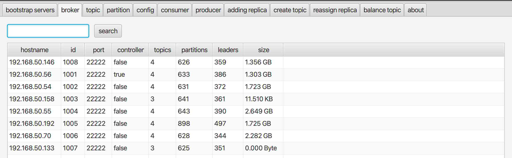
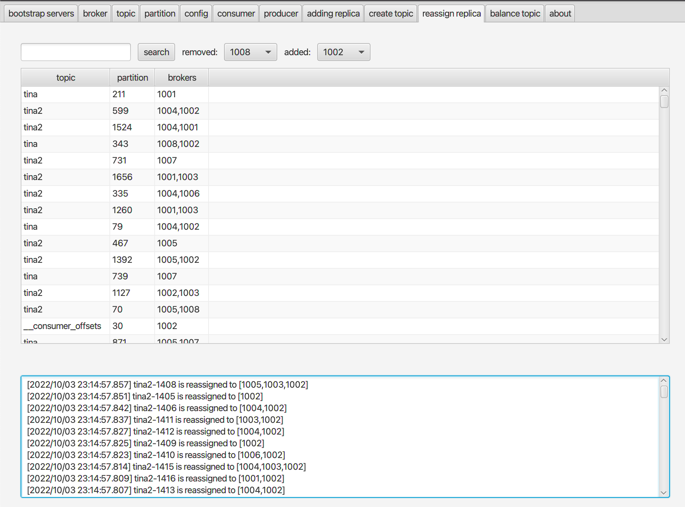
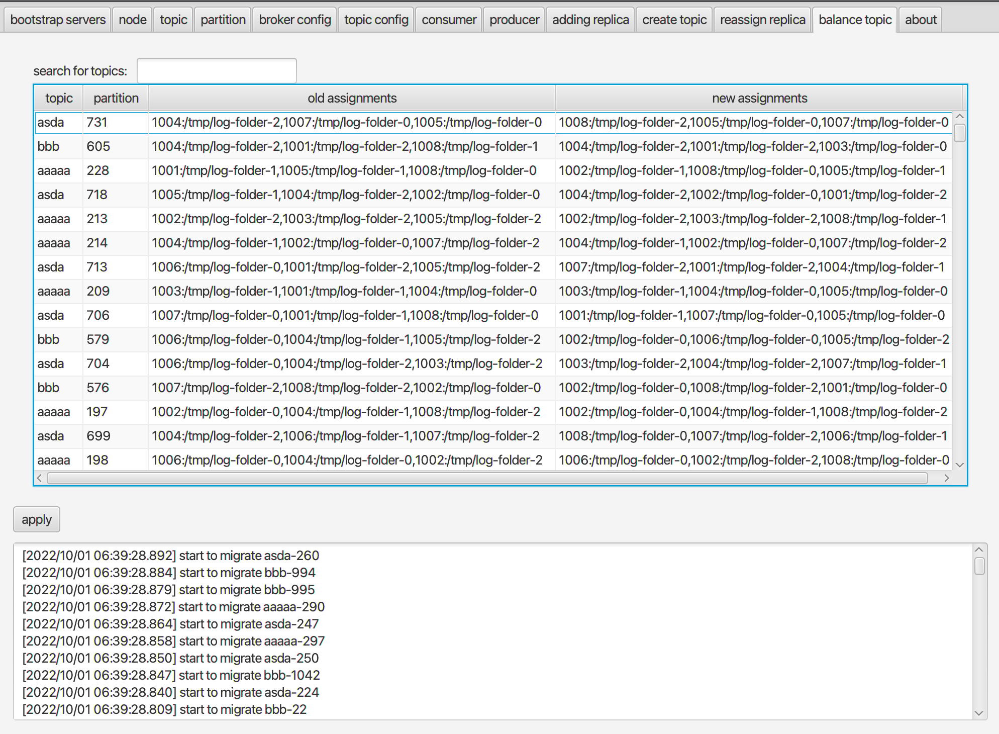

### Astraea GUI

Astraea 提供簡單但實用的 Kafka GUI 工具，讓使用者方便調閱和查詢 Kafka 內部常用的資訊。 Astraea GUI 有幾個特色：

1. 安裝簡單，使用者只需要先安裝 Java 11 + JavaFx，接著就能下載單一執行檔開始操作
2. 操作簡單，每個標籤清楚顯示會呈現的資訊、同時搭配關鍵字搜尋快速調閱相關資訊
3. 原理簡單，全程使用 Kafka 官方 APIs

#### 使用 Astraea GUI

1. (如果環境已可運行`JavaFX`則跳過此步驟) 下載 [Azul JRE FX 11](https://www.azul.com/downloads/?version=java-11-lts&os=windows&architecture=x86-64-bit&package=jre-fx)


2. 下載 `Astraea GUI` 可執行檔，進到[Astraea GUI 可執行檔頁面](https://github.com/skiptests/astraea/packages/1652248)後搜尋結尾為`-all.jar`的檔案


3. 運行 `Astraea GUI`

```shell
{JRE_HOME}/bin/java -jar astraea-gui-0.0.1-20220928.102654-3-all.jar
```

#### 頁面範例
1. 設定`bootstrap servers`


2. 查詢所有 `topics` 與`min`有關的參數


3. 調閱節點 `1007` 的資訊



4. 查看新增的 `replicas` 的同步狀況


5. 刪除/新增 `replicas`，下圖示範如何將將節點`1008`身上所有的partitions移動到節點`1002`



6. 平衡叢集。下圖示範如何依照`replica 數量`來平衡所有`topics`，系統會在一定時間內找尋最佳化配置，上方表格可以看見新舊配置的比較，接著點擊`apply`可套用新的配置

