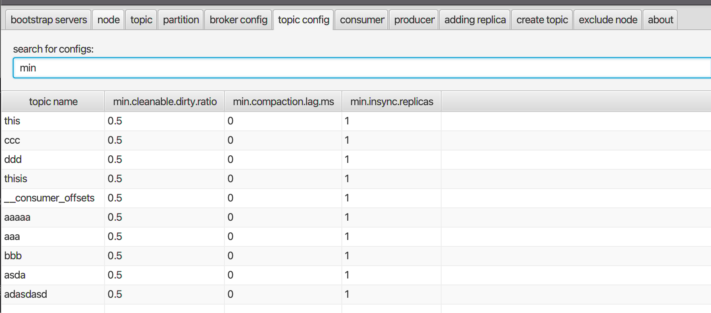
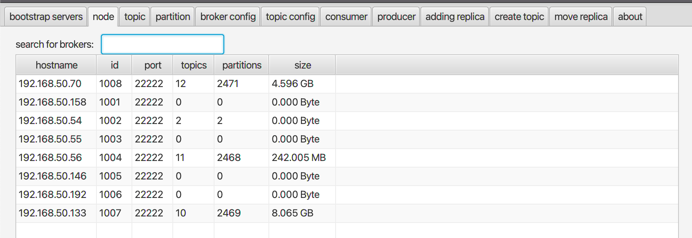

### Run GUI

Astraea 提供簡單但實用的 Kafka GUI 工具，讓使用者方便調閱和查詢 Kafka 內部常用的資訊。 Astraea GUI 有幾個特色：

1. 安裝簡單，使用者只需要先安裝 Java 11，接著就能下載單一執行檔開始操作
2. 操作簡單，每個標籤清楚顯示會呈現的資訊、同時搭配關鍵字搜尋快速調閱相關資訊
3. 原理簡單，全程使用 Kafka 官方 APIs

#### 下載 Astraea GUI

[Astraea GUI 可執行檔頁面](https://github.com/skiptests/astraea/packages/1652248)，進到該頁面後搜尋結尾為`-all.jar`的檔案即是單一可執行的程式

#### 頁面範例

1. 查詢所有 `topics` 與`min`有關的參數

2. 調閱節點 `1007` 的資訊

3. 查看新增的 `replicas` 的同步狀況

