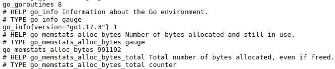

### Run Node Exporter

使用Prometheus監控host上特定的metric(e.g., CPU、硬碟、記憶體......)，需要配合Exporter將host端的port暴露出來

[Node Exporter](https://github.com/prometheus/node_exporter)有此Node exporter提供的可觀察資訊

#### 腳本啟動方式

```bash
./docker/start_node_exporter.sh
```

#### 腳本印出訊息

在`http://192.168.0.2:9100`，可以看到當前node exporter所獲取的host數據

```ba
[INFO] Container ID of node_exporter: d67d5d1daaaaf57792d145a8a8a5bd470207e698c8ca544f3023bdfcac914271
[INFO] node_exporter running at http://192.168.0.2:9100
```

##### 網頁介面

當存取`http://192.168.0.2:9100`後，可以看到下圖的Node Exporter


如下圖，點進去Metrics後，可以看到暴露的資訊(Memory、CPU......)



