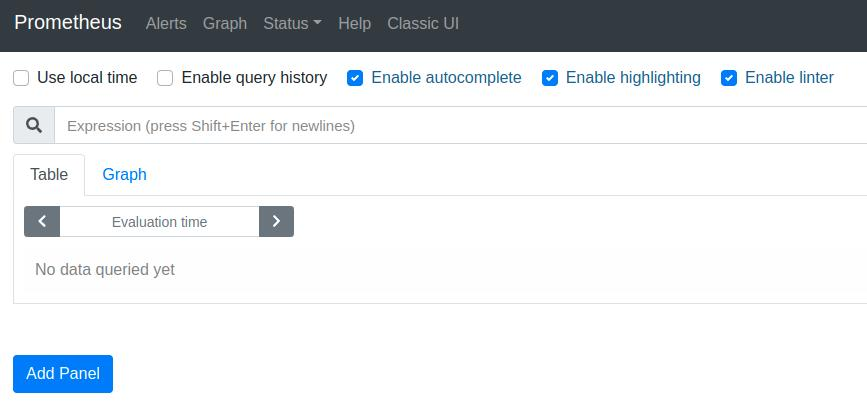
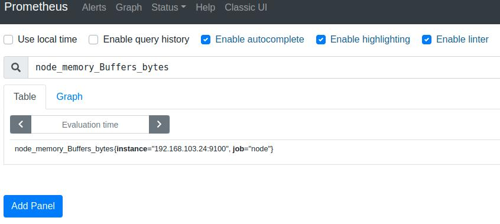
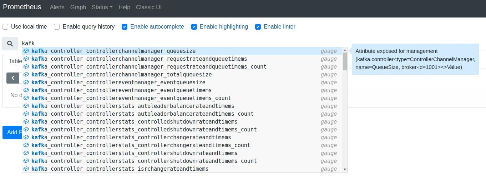
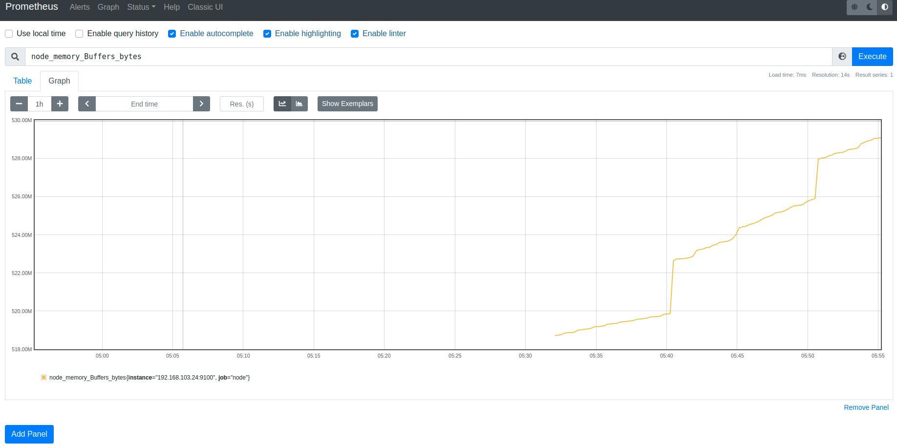

### Prometheus

[Prometheus](https://github.com/prometheus/prometheus)是一個開源專案，以週期性的方式蒐集metrics，並將metrics與timestamps儲存成[時序](https://zh.wikipedia.org/zh-tw/%E6%99%82%E9%96%93%E5%BA%8F%E5%88%97)資料。能夠讓使用者監控目前的系統使用量，並能透過過去與現在的metrics進行趨勢分析，可以提前預測未來什麼時間點對資源進行擴充，也能透過比對分析來了解不同版本的系統運行時資源的使用量。

在進行數據蒐集時，需要先開啟node exporter(refer to node exporter readme)，Prometheus週期性的從node exporter暴露出的address拉取metrics資料。當獲取到metrics後，可以利用Grafana(refer to Grafana readme)以圖形化界面呈現從Prometheus獲取的資料。

#### Start Prometheus

此專案有整合Prometheus到Docker，利用腳本快速部署Prometheus。

專案的腳本: start_node_exporter.sh、start_broker.sh有整合exporter，只要開啟Prometheus添加exporter address就可以輕鬆的觀察到Kafka broker、host端的metrics。

##### 腳本使用 - 配合node exporter

在啟動Prometheus前，請確保有exporter取得exporter address，啟動格式為 start + `exporter address`。

下面範例`192.168.103.24:9100`為node exporter address，`192.168.103.24:16728`為Kafka exporter address。

```
./docker/start_prometheus.sh start 192.168.103.24:9100
```

##### 腳本使用 - 配合Kafka exporter

下面範例`192.168.103.24:16728`為Kafka exporter address。

```
./docker/start_prometheus.sh start 192.168.103.24:16728
```

##### 腳本輸出

```ba
[INFO] =================================================
[INFO] config file: /tmp/prometheus-9090.yml
[INFO] prometheus address: http://192.168.103.24:9090
[INFO] command to run grafana at this host: /home/harry/Documents/astraea/docker/start_grafana.sh start
[INFO] command to add prometheus to grafana datasource: /home/harry/Documents/astraea/docker/start_grafana.sh add_prom_source <USERNAME>:<PASSWORD> Prometheus http://192.168.103.24:9090
[INFO] =================================================
```

##### 監控多個exporter範例

若有多個exporter要監控，則需要以逗號分隔address，假設要監控兩個exporter

```bash
./docker/start_prometheus.sh start 192.168.103.12:12345,192.168.103.13:10000
```

#### Prometheus Web UI

存取腳本輸出的`Prometheus address`，可以看到Prometheus WebUI。



##### Query node exporter metric

若是配合node exporter啟動Prometheus，可以查詢到host端的metric，例如`node_memory_Buffers_bytes`。



##### Query Kafka exporter metric

若是配合Kafka exporter啟動Prometheus，可以查詢到Kafka server的metric，如下圖:



##### Graph 

可以點擊`Graph`以圖形化的方式查看感興趣的metric。



